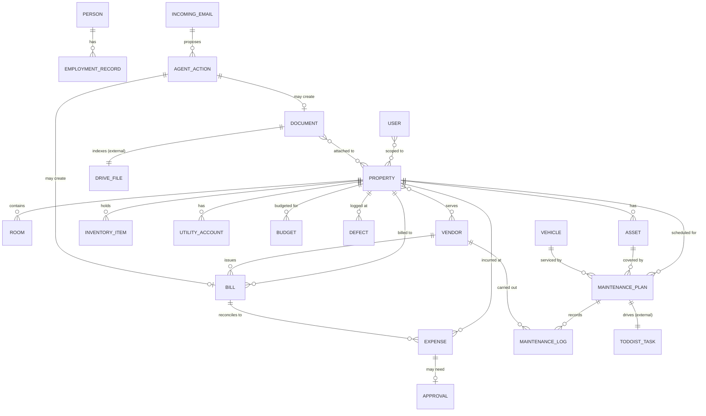
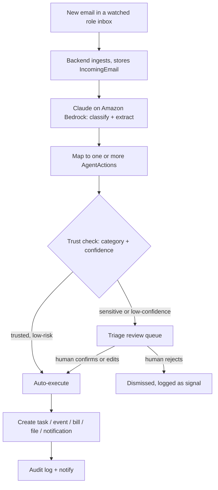
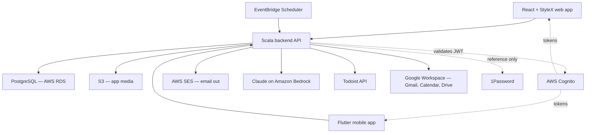

# Kanzen — Household Operations Platform
### End-to-end specification (v3)

A private, in-house platform to run the Kanzen household as a small family office. This version adds the **email-processing agent**, an enriched **Google Calendar** integration, and the **recurring bill schedule**. Stack: Scala backend, React + StyleX web, Flutter mobile, AWS Cognito auth, with deliberate reuse of Todoist and Google Workspace. This document is the build input for Claude Code.

---

## 1. Overview

### Purpose
Give the household one system for the data no existing tool holds well, **connect** it to the tools already in daily use, and put a light agent on top that turns the steady stream of household email — deliveries, bills, bookings, appointments — into tasks, events and records without anyone copying things by hand.

### Guiding principles
- **Reuse over rebuild.** Tasks, calendar, email and document files already have good tools. The platform integrates them; it does not reimplement them.
- **Own the gap.** The platform owns the data no tool holds well — properties, assets, vendors, people, finance, vehicles, maintenance schedules — plus the connective tissue between them.
- **Agent-assisted, human-in-the-loop.** The email agent *proposes*; a person *disposes* — until trust is explicitly granted, per category. Nothing financial executes itself.
- **Single source of truth.** One record per property, person, vendor, bill. External items (a Todoist task, a Drive file, an email) are referenced, never duplicated.
- **Secrets stay out.** No passwords or access codes in the platform — those remain in 1Password, referenced by name.
- **Proactive.** The system surfaces what is about to expire or fall due, and acts on inbound email rather than waiting to be asked.
- **Scoped access.** Each person sees only what their role needs.
- **Low-maintenance.** A stack the team already runs at Hypervolt.

### System map — what we reuse vs what we build

| Capability | Approach |
|---|---|
| **Tasks** | **Todoist** is the system of record; the platform creates, links and reads tasks via its API |
| **Calendar** | **Google Calendar** — a shared household calendar; the platform reads/writes events |
| **Email (mailboxes)** | **Gmail / Google Workspace** — the `kanzen.family` mailboxes and role addresses |
| **Inbound email triage** | **The platform's email agent** — watches the operational role inboxes, classifies, extracts, proposes actions (Gmail API + Claude on Amazon Bedrock) |
| **Document files** | **Google Drive** holds the files; the platform maintains a metadata index over them |
| **Authentication** | **AWS Cognito** |
| **Secrets** | **1Password** — referenced only |
| **Payroll / accounting** | External — out of scope |
| **Notification delivery** | **AWS SES** |
| **The platform itself owns** | Properties & Bibles, assets/inventory, vendors, people/HR, finance (bills, expenses, budgets, approvals), vehicles, maintenance plans, the reminder engine, the email agent, all cross-entity links, the dashboard, the audit log |

---

## 2. Users & roles

Authentication is handled by Cognito; **authorisation (role + property scope) is owned by the platform**.

| Role | Person | Access |
|---|---|---|
| **Principal** | You | Full access incl. the private document index; only approver above spend threshold; sees audit log |
| **Manager** | Lorna (Chief of Staff / EA) | Full operational access except the private index; runs the Triage queue; submits spend for approval |
| **Staff** | Marcia (Housekeeper) | Scoped to assigned property: own tasks, shopping lists, raise issues. No finance, HR or documents |
| **Property-scoped Manager** | Future Singapore lead | Manager access limited to a single property |

The permission model is **role + property scope**, checked server-side on every request.

---

## 3. Information architecture

`Dashboard` · `Triage` · `Properties` · `Tasks` · `People` · `Vendors` · `Finance` · `Documents` · `Vehicles` · `Calendar` · `Directory` · `Settings`

`Tasks` and `Calendar` are integrated views onto Todoist and Google Calendar. `Triage` is the email agent's review queue.

---

## 4. Data model

The platform owns the entities below. Tasks live in Todoist, calendar events in Google Calendar, document files in Drive, emails in Gmail — all referenced by ID.

**Key entities (indicative):**

- **User** — name, email, Cognito subject ID, role, property scope, status.
- **Property** — name, address, type, ownership, jurisdiction (UK / SG), building-management details, status. *Integration refs:* `todoistProjectId`, `googleCalendarId`, `driveFolderId`, `onePasswordVault`.
- **Room**, **Asset**, **InventoryItem**, **UtilityAccount**, **Defect** — the Property Bible contents (as v2).
- **Person**, **EmploymentRecord** — staff records.
- **Vendor** — trade, contacts, rates, contract terms, NDA + insurance status with expiry, rating; many-to-many with Property.
- **MaintenancePlan** — recurring schedule, linked Asset/Vehicle, linked Vendor, expected cost, reminder lead time; owns a recurring Todoist task. **MaintenanceLog** — completed-service history.
- **Bill** — recurring cost: payee/vendor, property, amount, currency (GBP/SGD), frequency, payment method, next due date, reminder lead time. *Agent fields:* `sourceEmailId`, `lastSeenAmount`, `varianceFlag`.
- **Expense** — one-off transaction: property, category, amount, currency, date, payee, receipt (S3), approval status; optional `reconciledBillId`.
- **Budget**, **Approval** — as v2.
- **Document** — `driveFileId`, category, title, naming key, expiry date, access level, polymorphic links.
- **Vehicle** — details, registration, linked documents, maintenance plan, key dates.
- **IncomingEmail** — `gmailMessageId`, mailbox, sender, subject, receivedAt, body reference, attachments, category, `extractedData` (JSON), confidence, status (`new` / `processed` / `needs_review` / `done` / `ignored`).
- **AgentAction** — `incomingEmailId`, type (`create_task` / `create_event` / `create_bill` / `create_expense` / `file_document` / `notify`), `proposedPayload` (JSON), confidence, status (`proposed` / `auto_executed` / `confirmed` / `rejected` / `executed` / `failed`), `decidedBy`, `decidedAt`, `resultEntityRef`.
- **TrustSetting** — per category (optionally per property): routing = `auto` or `review`.
- **SenderRule** *(optional)* — sender pattern → forced category, as a deterministic override.
- **Notification**, **AuditLogEntry** — as v2.

---

## 5. Feature modules

### 5.1 Dashboard
Per role: today's and overdue tasks (Todoist), upcoming maintenance and calendar events, items expiring within 60 days, **pending Triage items**, pending approvals, recent activity, this-month spend vs budget.

### 5.2 Triage — the email agent's review queue
Where a human meets the agent. Lists processed emails needing attention; each row shows the original email, what the agent classified and extracted, and the proposed action(s). For each item: **Confirm**, **Edit then confirm**, or **Reject**. Confirmed actions execute immediately; rejections are logged as signal. A history tab shows everything the agent has done, auto or confirmed. Engine detail is in §6.

### 5.3 Properties
The digital Property Bible, one record per property. Tabs: Overview (incl. linked Todoist project, Google Calendar, Drive folder, 1Password vault) · Rooms & inventory · Assets & systems · Utilities · Maintenance · Defects log · Emergency procedures · Documents. Seed with **Wardian, Apt 5206** and **Singapore**.

### 5.4 Tasks — Todoist integration
Todoist is the system of record. One Todoist project per property; labels for category and vendor. Maintenance plans create and maintain recurring Todoist tasks; completions sync back (webhook, polling fallback) into the MaintenanceLog. Any user can raise an issue from the platform. The platform shows tasks filtered by property, by "maintenance", and overdue, contextualised with platform data.

### 5.5 People
Staff directory: role, jurisdiction, contract and key dates, leave, reviews, emergency contacts, linked documents. Expiry reminders on visas/passes and reviews. Reference to the external payroll bureau.

### 5.6 Vendors
Directory: trade, properties served, contacts, rates, contract terms, **NDA and insurance-on-file status with expiry**, rating, linked maintenance history and bills. The dashboard flags any vendor with property access whose NDA or insurance has lapsed.

### 5.7 Finance
- **Bills — the recurring schedule.** Each bill carries a payee, property, amount, currency, frequency, payment method, next due date and a reminder lead time. The platform rolls the schedule forward and raises a reminder (and, optionally, a Todoist "pay" task) ahead of each due date.
- **Agent reconciliation.** When the email agent identifies an invoice, it matches it against the recurring schedule: the matching bill's `lastSeenAmount` and next due date update, and a **variance flag** is raised if the amount differs materially from the prior. An unmatched invoice that looks recurring is proposed as a new Bill in Triage.
- **Expenses** — one-off transactions, categorised by property, receipts in S3, optionally reconciled to a Bill.
- **Approvals** — above-threshold expenses route to the Principal.
- **Budgets & reporting** — per property and category; spend by property / category / month. Multi-currency GBP/SGD with a display-currency toggle.

### 5.8 Documents — Google Drive index
Files live in the Drive Shared Drive; the platform maintains a metadata index pointing to each `driveFileId`, adding category, expiry date, access level, the naming key, and cross-links. Browsing and editing happen in Drive. The agent can file an email attachment directly into the right property folder and create its index record. App-generated media (inventory photos, receipts) is held in S3.

### 5.9 Vehicles
Registry per vehicle: details, registration, linked documents, a maintenance plan, key-date reminders (insurance, MOT, road tax).

### 5.10 Calendar — Google Calendar integration
The household runs on a shared Google Calendar; the platform reads and writes it via the Calendar API and renders a calendar view. Events come from four sources:
- **The email agent** — bookings, deliveries (as a dated window), and service/contractor appointments extracted from email.
- **Maintenance plans** — scheduled service visits.
- **Manual entry** — anything a person adds directly.
- **Staff leave** — from the People module.

Events are categorised (delivery / booking / appointment / maintenance / leave / travel) and colour-coded. A delivery typically produces **both** a calendar event for the window **and** a Todoist task to receive it. Sync is two-way: changes made in Google Calendar flow back.

### 5.11 Directory
The communications map: every `kanzen.family` mailbox, the role addresses, the property distribution groups, phone numbers. Reference only.

### 5.12 Notifications & reminders
A scheduled job (AWS EventBridge) runs on a short interval: polls the watched mailboxes for the agent, ensures maintenance plans and bill schedules have their tasks and reminders current, surfaces anything expiring within its lead window, sends approval requests and overdue alerts. Delivery via **AWS SES** and the in-app notification centre.

### 5.13 Settings & audit
User and role management, property list, categories, spend threshold, currencies, integration connections, and the **agent trust settings** (per-category `auto` / `review`). **Audit log** — every create/update/delete *and every agent action* with actor and timestamp, visible to the Principal.

---

## 6. Email Agent — engine

The agent turns inbound household email into proposed actions. It watches only the **operational role inboxes** (`deliveries@`, `accounts@`, `house@`, and similar) — never the Principal's personal mailbox.

### Pipeline

Ingestion is by **polling** the Gmail API on a short interval (simple, AWS-only, and a few minutes' latency is fine for a household). Gmail push via Google Cloud Pub/Sub is a later option if lower latency is ever wanted.

Classification and extraction use **Claude on Amazon Bedrock**, called with a structured-output schema so the result is typed JSON. Bedrock keeps email content within the AWS account boundary and is not used to train models — important given the content.

### Categories and action mapping

| Category | Extracted | Proposed actions |
|---|---|---|
| **Delivery** | Property, carrier, item, expected date/window, tracking | Todoist task ("receive delivery at [property]") for the property's staff · calendar event for the window · notification |
| **Bill / Invoice** | Payee, amount, currency, due date, account, property | Reconcile to a recurring Bill (update amount/next due, flag variance) *or* propose a new Bill · file the PDF to Drive · optional Expense draft |
| **Booking** | Venue/provider, date/time, party, reference | Calendar event · task if preparation is needed |
| **Service / appointment** | Vendor, property, date/time, purpose | Calendar event · Todoist task (be present / prepare) · link to the vendor and, if relevant, a maintenance plan |
| **Statement** | Source, period | File to Drive · notification |
| **Official / renewal** | Type, body, deadline | File to Drive · set or refresh an expiry reminder · notification |
| **Other / unclear** | — | No action proposed; sent to Triage for a human |

### Trust model
- Routing is decided by **category plus confidence**. High-confidence, low-risk actions in a category set to `auto` execute immediately and notify. Everything else goes to the Triage queue.
- **Financial records are never auto-committed** — a proposed Bill or Expense always requires human confirmation, regardless of confidence.
- Trust is **earned and configurable.** Categories start in `review`; once a category has proven itself, the Principal or Manager can switch it to `auto` in Settings (e.g. deliveries first).
- Every proposal and decision — auto or human — is written to the audit log. Each created record links back to its source email for traceability.

---

## 7. Integrations

| System | Use | Auth pattern |
|---|---|---|
| **Gmail** | The agent polls the watched role inboxes; reads messages and attachments | Google Cloud service account, domain-wide delegation, narrow scope |
| **Todoist** | Task system of record — create/link/read tasks, sync completions | Household-workspace API token; webhook for completions |
| **Google Calendar** | Shared household calendar — two-way event sync | Same service account; Calendar scope |
| **Google Drive** | Document file store — index files, create folders, file attachments | Same service account; Drive scope |
| **Amazon Bedrock (Claude)** | The agent's classification and extraction | IAM role |
| **AWS Cognito** | Authentication for both clients; enforced MFA | User pool; hosted UI; JWT validated by the backend |
| **AWS SES** | Notification email out | IAM role |
| **1Password** | Referenced only — vault name stored, never a secret | None |

Integration credentials (Todoist token, Google service-account key) live in **AWS Secrets Manager** — distinct from the household's own passwords, which stay in 1Password.

---

## 8. Cross-cutting concerns

- **Authentication** — AWS Cognito user pool with **enforced MFA**; hosted UI; the Scala backend validates the Cognito JWT against the pool's JWKS on every request.
- **Authorisation** — role + property scope enforced server-side in shared middleware.
- **File handling** — app media in S3 behind permission checks; document files governed by Drive permissions plus the index's access levels.
- **Search** — global search across properties, vendors, documents, people, Todoist tasks and processed emails.
- **Audit** — append-only log covering user actions and agent actions alike.
- **Backups** — automated daily RDS snapshots with point-in-time recovery; periodic restore test.

---

## 9. Technical architecture

The stack matches existing Hypervolt projects.

| Layer | Choice |
|---|---|
| **Backend** | **Scala**, following Hypervolt service conventions; a typed-endpoint approach (e.g. Tapir) so the API generates an OpenAPI contract |
| **Web frontend** | **React + StyleX** |
| **Mobile** | **Flutter**, consuming the same API |
| **Database** | **PostgreSQL on AWS RDS** |
| **Auth** | **AWS Cognito** |
| **LLM** | **Claude on Amazon Bedrock** (the email agent) |
| **File storage** | **S3** (app media); Google Drive (document vault) |
| **Email out** | **AWS SES** |
| **Scheduled jobs** | **AWS EventBridge Scheduler** — drives the mailbox poll, reminders and schedule roll-forward |
| **Secrets** | **AWS Secrets Manager** |
| **Hosting** | **AWS** — backend on ECS Fargate (or EKS if that matches Hypervolt's norm); web app on S3 + CloudFront |

### One API, two clients
The React web app and the Flutter mobile app are separate codebases sharing **one backend API**. Define the API once; publish an **OpenAPI contract**; generate a typed client for each (TypeScript, Dart). Web is the full management surface; mobile is the on-the-go surface — dashboard, Triage confirmations, Property Bible and vendor lookups, raising issues, approvals.

---

## 10. Non-functional requirements

- **Security** — encryption in transit and at rest; enforced MFA; least-privilege RBAC; append-only audit log; integration secrets in Secrets Manager; no household secrets stored.
- **Privacy** — the agent watches only designated operational inboxes; email content is processed within the AWS boundary via Bedrock; the private document index is genuinely private to the Principal.
- **Reliability** — daily RDS backups; the household depends on the schedule, reminders and agent being correct.
- **Performance** — single-digit users; responsiveness is the only target.
- **Maintainability** — conventions identical to existing Hypervolt projects; `SPEC.md` and `CLAUDE.md` kept current.
- **Consistency** — web and mobile share the API contract and the design language.

---

## 11. Design direction

Built to the standard the name implies — *kanzen*, done as completely and well as possible. Restrained and content-first; generous whitespace; a tight neutral palette with a single accent; real typographic hierarchy. Quiet, fast, predictable. Light and dark themes. The mobile app follows the same design language as the web app. Benchmark: Apple-grade restraint.

---

## 12. Build plan — milestones

Each milestone is independently shippable.

- **M0 — Foundation.** AWS infra, Cognito with enforced MFA, Scala API skeleton with OpenAPI output, RDS, the React + StyleX web shell, the Flutter app shell, CI/CD. Auth working end-to-end on both clients.
- **M1 — Properties + Todoist.** Property module (the Bibles), maintenance plans, Todoist integration, dashboard. Usable from here.
- **M2 — Calendar + Vehicles.** Google Calendar integration (two-way), the calendar view, vehicles.
- **M3 — People + Vendors + Documents.** Staff and vendor directories, Google Drive document indexing, the expiry/reminder engine on SES.
- **M4 — Finance.** Bills and the recurring schedule, expenses, budgets, approvals, per-property reporting, multi-currency.
- **M5 — Email Agent + Triage.** Gmail ingestion, Bedrock classification/extraction, action mapping, the trust model, the Triage queue, agent reconciliation into Finance. Depends on M1–M4 — its action targets must exist first.
- **M6 — Directory + Polish + mobile parity.** Communications directory, notification centre, audit-log surfacing, global search, Singapore property onboarding, Flutter on-the-go flows confirmed.

---

## 13. Open decisions

1. **AWS region / data residency** — London `eu-west-2` vs Singapore `ap-southeast-1`, given the tax-residency move.
2. **Compute** — ECS Fargate vs EKS; match Hypervolt.
3. **Watched mailboxes** — confirm which role inboxes the agent monitors, and that they are real mailboxes the Gmail API can read (not just distribution groups).
4. **Agent trust defaults** — which categories, if any, start in `auto` rather than `review` (recommendation: all start in `review`; promote deliveries first).
5. **Todoist account model** — shared household workspace, project-per-property.
6. **Google integration** — one Google Cloud project + service account with domain-wide delegation for Gmail, Calendar and Drive.
7. **Repo layout** — monorepo (`/backend`, `/web`, `/mobile`, `/docs`) vs three repos; match Hypervolt.
8. **App domain** — suggest `app.kanzen.family`.

---

## 14. Notes for building with Claude Code

- Keep this file as `SPEC.md` in the repo root; add a `CLAUDE.md` with Hypervolt's Scala/React/StyleX/Flutter conventions, commands and house style.
- Build **milestone by milestone**. Get M0 deployed and authenticating on both clients before any feature work.
- Define the database schema and the OpenAPI contract early — the data model in §4 is the spine.
- Write the permission checks once, as shared server-side middleware.
- Treat each integration (Gmail, Todoist, Calendar, Drive, Bedrock, Cognito, SES) as an isolated, individually testable adapter behind an internal interface.
- For the agent: keep classification/extraction behind a single interface with the prompt and output schema version-controlled; make the action-mapping layer pure and unit-tested; never let an agent action bypass the same permission and audit paths a human action uses.
- Generate the web and Flutter API clients from the OpenAPI contract.
- Seed the database with the two real properties and three real users.
