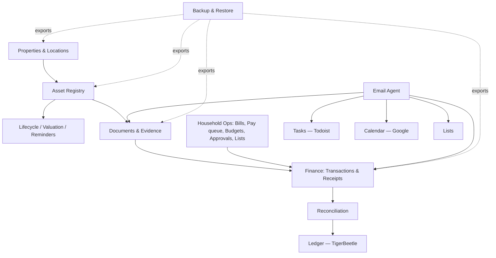
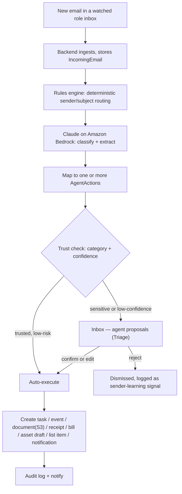
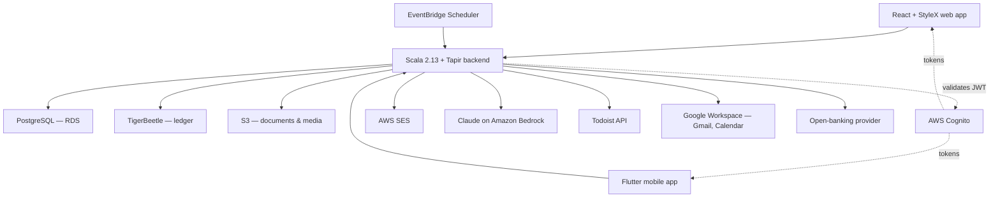

# Kanzen — Household Operations & Asset Registry Platform
### Combined end-to-end specification (v6)

A private, in-house platform that does two things as one system: **runs the household** as a small family office, and keeps a **rigorous registry of the household's assets and finances**. It is an operating system for the household and everything in it.

This version (**v6**) refines the v5 combined spec against the **Kanzen design prototype** — a high-fidelity React build of the product (16 screens in `input/views/`, with rendered previews in `input/previews/`). The prototype is the **canonical visual reference**; this document is the **canonical written reference**, and the two are now reconciled. Where the prototype showed features or detail the written spec lacked, they have been folded in; where the two conflicted, the conflicts were resolved (see §3 and the change log at the end of §0). Stack: Scala 2.13, cats-effect + http4s + Tapir, React + StyleX web, Flutter mobile, PostgreSQL, TigerBeetle, AWS (**eu-west-1, Ireland**). This document is the build input for Claude Code.

---

## 0. What changed in v6

Reconciliation outcomes against the prototype, recorded so nothing is silently lost:

- **Region reaffirmed `eu-west-1` (Ireland).** The prototype's Settings screen said `eu-west-2` (London); that was a slip and is overruled. Region is settled at Ireland.
- **Documents stay in-house (S3).** The prototype showed the agent filing some documents to Google Drive; overruled. S3 is the immutable source of truth (§3.2); the agent files to S3. Google Drive is **export-only / optional reach**, never a system-of-record.
- **Lists adopted as in-scope.** The prototype's recurring-shopping module (staff-propose → Principal-approve → roll-forward) is promoted from "not specified" to a first-class domain and module (§7.15, §9, App. A/B, milestone M2).
- **Vehicles = vertical + saved view.** Vehicles remain part of the **one unified Asset registry** as a typed vertical (App. C), surfaced as a saved Inventory view with vehicle-specific columns (MOT / road-tax / insurance). No separate vehicle domain.
- **"Inventory" is the UI label** for the Assets module; `Asset` remains the entity name.
- **Folded in from the prototype:** the grouped navigation (§5); a **Pay queue** and **Payment methods** in Finance, with a `PaymentMethod` entity and a bill-payment lifecycle (§9.7); a concrete **4-level permission model** (none/read/write/admin) over an editable role×module matrix (§4); per-jurisdiction **approval thresholds** (£1,500 / S$2,500), the **±15% variance** rule, 4-hour sessions, 7-year audit retention, 5-day bill lead (§4, §9, §13); an **Art** vertical (App. C); a **⌘K command palette** (§13); and a full **design language** plus **per-screen specifications** (§16, App. E).
- **Open decisions closed:** §19 #1 (EC2 autoscaling + NixOS; region Ireland), #3 (ledger hidden), #5 (first verticals), #6 (five mailboxes), #7 (financial categories locked to review), #9 (`kanzen.family`), #10 (parent/child category tree). Still open: open-banking provider, backup-binary packaging, wear/use counts, inference aggressiveness, payment-execution boundary.
- **Stack aligned to Hypervolt (v6.1).** After reading `ghost-busters` / `athena` / `hyperstore`: the backend is **Scala 2.13 + cats-effect + http4s (ember) + Tapir + Doobie + Flyway** (not Scala 3); compute is **EC2 autoscaling + NixOS** (not ECS Fargate); CI is **GitLab CI on Nix**; secrets split **Secrets Manager + SSM Parameter Store**; the web data layer is **hand-written services + Zod** (not OpenAPI-generated). **Auth stays AWS Cognito** by deliberate choice (Hypervolt uses Keycloak). Full detail in `specs/F00-foundation.md`.

---

## 1. Overview

### The two halves, one system
- **Household operations** — properties, staff, vendors, tasks, calendar, lists, the email agent, bills, budgets, approvals. Running the household day to day.
- **Asset & finance registry** — every owned object tracked through its life with provenance, valuation, location and cost; every transaction reconciled against commercial evidence; a rigorous double-entry ledger underneath; catastrophic-loss-safe backup and restore.

They unify around shared bones: **properties** (assets live in them), **assets** (the boiler and the watch collection are both assets), **the email agent** (one agent turns inbound mail into both household tasks and registry records), **finance** (household bills sit above the rigorous ledger), **documents** (one evidence store), and **maintenance & reminders** (servicing the HVAC and servicing a watch are the same mechanism).

### Guiding principles
- **Reuse over rebuild, where reuse is sound.** Tasks stay in Todoist; calendar stays in Google Calendar. Documents are owned in-house — see §3.2.
- **Own the gap, and own the truth.** The platform owns the data no tool holds well, and owns the rigorous financial and asset record beneath the friendly UI.
- **Source documents are sacred.** Original uploads are immutable and preserved forever unless explicitly purged. OCR and extraction are derived data, never source truth.
- **Three distinct financial concepts.** External facts (bank transactions), commercial evidence (receipts, invoices), and ledger truth (immutable postings) are modelled separately and never conflated.
- **Agent-assisted, human-in-the-loop.** The email agent proposes; a person disposes — until trust is granted per category. Nothing financial executes itself.
- **Kanzen never moves money.** The platform tracks, schedules, reconciles and reminds; payment execution stays with the bank/Direct Debit/GIRO. "Mark paid" records reality, it does not initiate a payment (§9.7).
- **Auditability everywhere.** Every meaningful write is auditable; ledger postings are immutable; corrections are events, not mutations.
- **Backup and restore are a product feature**, not a database afterthought.
- **Scoped access.** Each person sees only what their role and property scope allow; the asset and personal-finance registry is private to the Principal.
- **Future-safe.** Every record carries an `owner_id`; the model supports verticals and structural change not yet imagined.

---

## 2. Scope & non-goals

### In scope (v1 through the milestone plan)
A private, authenticated, multi-user household platform: properties, staff and vendors, tasks and calendar, **household lists**, the email agent, bills/budgets/approvals, **the pay queue and payment methods**, the full asset registry with verticals and lifecycle, bank ingestion and reconciliation, the double-entry ledger, documents and evidence, search and insights, and first-class backup/restore. Web-first, with a Flutter companion.

### Non-goals
Explicitly **not** built, to keep the build focused:
- tax-filing or tax-return workflows;
- budgeting-first UX (budgets exist, but the product is a stewardship and operations system, not a budgeting app);
- **payment execution / money movement** (Kanzen tracks and schedules; it never initiates a transfer);
- resale or marketplace integrations;
- insurance-carrier integrations (insurance *data* is tracked; carrier APIs are not);
- public, social or sharing features;
- SaaS multi-tenancy or billing;
- a desktop-native application.

Note: "household collaboration / shared workspaces" was a non-goal in the source registry spec. The merge **promotes it to in-scope** — the platform is genuinely multi-user (Lorna, Marcia and Siti are real users) — while the asset and personal-finance registry remains Principal-private (§4).

---

## 3. Synthesis decisions — how the two specs and the design were reconciled

The judgement calls that turn two specs and a prototype into one system. Each is open to challenge.

**3.1 One unified Asset registry.** Appliances/systems, insured contents and vehicles merge into **one Asset domain** covering everything physical the household owns — the boiler, the dining chairs, the watch collection, the cars. Category and typed attributes distinguish them. The Property Bible's "systems" and "inventory" become saved views onto the unified registry; **vehicles are an asset vertical** (App. C) surfaced as a saved view (§3.11).

**3.2 Documents are owned in-house (S3), not delegated to Google Drive.** The registry needs immutable originals, versioned parse runs, line-item extraction and full export/restore — none possible if files live in someone else's Drive. The platform owns its documents in S3-compatible object storage; **the email agent files to S3**. Google Drive integration is **optional, export-only reach** — never a system-of-record. (This overrules the prototype's Drive-filing flows.)

**3.3 Finance is two layers, not two systems.** Below: bank transactions, commercial evidence, reconciliation, immutable TigerBeetle postings. Above: the recurring **bill schedule**, the **pay queue**, **payment methods**, budgets and spend approvals. One Finance domain, two altitudes.

**3.4 Multi-user platform; Principal-private registry.** The platform is multi-user (Kanzen's RBAC stands); the asset registry, transactions, ledger and valuations are a **Principal-private domain** within it. Access is **role + property scope + per-module level (none/read/write/admin)**, editable in Settings (§4). The registry spec's `user_id` becomes `owner_id`, satisfied by the Principal.

**3.5 One email agent, feeding both halves** — household actions (deliveries, bookings, appointments) and registry pipelines (receipts → line items → assets, warranties → assets).

**3.6 One Inbox.** The household "Triage" and the registry "Inbox" merge into a single module with four streams: agent proposals, reconciliation, data quality, reminders due. The agent-proposals stream is titled **Triage** inside the Inbox.

**3.7 One maintenance & reminder engine** for property systems and registry assets alike, surfaced as a top-level **Maintenance** view.

**3.8 Backup & restore is a first-class platform feature**, applied to the whole combined system.

**3.9 The combined stack is the union** — adds TigerBeetle and Docker Compose; keeps StyleX, AWS (`eu-west-1`), Cognito, Bedrock and the Todoist/Google integrations.

**3.10 Household Lists are in-scope.** Recurring shopping/supply lists with a staff-propose → Principal-approve workflow, recurring items, budget-trigger approvals, vendor delivery and roll-forward on order day (§7.15). New domain (§6, App. A).

**3.11 Vehicles as vertical + saved view.** Reaffirms 3.1: no separate vehicle domain. The prototype's standalone Vehicles screen becomes a saved Inventory view filtered to the vehicle vertical, with vehicle columns (registration, MOT, road tax, insurance renewal, service interval).

---

## 4. Users, roles & access

Authentication is handled by AWS Cognito; **authorisation (role + property scope + per-module level) is owned by the platform**.

### Roles & people (seed)

| Role | Person | Property scope | Household operations | Asset & finance registry |
|---|---|---|---|---|
| **Principal** | Toby | All | Full | Full — incl. valuations, ledger, bank detail, private documents |
| **Manager / Chief of Staff** | Lorna | All | Full except the private document index | Operational only — upload receipts/documents, create/edit assets, log events and service costs, run reconciliation. **Not** valuations, ledger views or bank balances |
| **Staff (Housekeeper)** | Marcia | Wardian | Own tasks, lists (propose), shopping, raise issues | None |
| **Staff (Housekeeper)** | Siti | Singapore | Own tasks, lists (propose), shopping, raise issues | None |
| **Property-scoped Manager** | Future Singapore lead | Singapore | Manager access, one property | Per grant |

### The permission model
Access is **role + property scope + per-module level**, checked server-side on every request. Each `(role, module)` cell resolves to one of four levels — **none** (no visibility) · **read** (view) · **write** (create + edit) · **admin** (full, incl. delete) — and is **editable in a matrix** under Settings → Permissions. Property scope is **independent of level**: a staff member with `write` on Lists sees only their assigned property's lists. Registry modules (Inventory, Collections, Insights, Finance, Backup) are Principal-private with the documented Manager carve-out.

Every domain record carries `owner_id`. Each user may hold multiple login identities (local credentials, Google, Apple) mapping to one canonical profile; session inspection and revocation are supported. **Financial product settings** seed at: approval threshold **£1,500 (UK) / S$2,500 (SG)**; display currency **native, no conversion**; variance flag **±15% vs previous**; bill lead reminders **5 days**; session **4 hours**; audit retention **7 years**; MFA **required, all users**.

---

## 5. Information architecture

The web app is a persistent **grouped left navigation** + a top bar (⌘K command palette, mobile-preview toggle, notifications). Navigation:

```
Dashboard · Inbox
INVENTORY         Inventory · Collections · Insights
OPERATIONS        Properties · Tasks ↗ · Calendar ↗ · Lists · Maintenance
RECORDS           People · Vendors · Vehicles · Documents
FINANCE & SYSTEM  Finance · Backup · Settings
```

- **Tasks** and **Calendar** are integrated views onto Todoist and Google Calendar (↗ marks an externally-backed module).
- **Inbox** is the unified review surface (four streams); its agent-proposals stream is titled **Triage**.
- **Inventory** is the Assets module; **Vehicles** is a saved Inventory view filtered to the vehicle vertical.
- **Maintenance** is the cross-cutting plan/reminder view (engine shared with Properties and Inventory, §3.7).
- **Settings** holds Integrations, Permissions (the matrix), Preferences, **Rules engine**, **Directory** (operational mailboxes & role addresses), and the **Audit log**.
- Registry modules (Inventory, Collections, Insights, Finance, Backup) are Principal-private with the operational carve-out for the Manager.

Mobile is capture-first with a five-item bottom tab bar: **Home · Triage · Bibles · Money · Search** (§16, App. E).

---

## 6. Domain model

Modelled as related domains, not one flat schema. Files, tasks and calendar events live in external/object stores and are referenced by ID. The full entity and join-table list is in **Appendix A**.



- **Identity** — `User`, `LoginIdentity`, `UserPreference`, `RolePermission` (the matrix), `PropertyScope`.
- **Properties & locations** — `Property`, `Room`, `SubLocation` (storage area, cabinet/shelf/case), `CustodyRecord`. Location and custody changes are events, queryable, shown in asset timelines.
- **Asset registry** — `Asset`, `AssetGroup`, `Collection`, `Tag`, `Category`, `CategoryTemplate`, `AssetAttributeDefinition`, `AssetAttributeValue`, `AssetEvent`, `AssetComment`, `AssetValuationSnapshot`, `AssetStatus`, `AssetCondition`. Detail in §8.
- **Documents & evidence** — `Document`, `DocumentVersion`, `DocumentLink`, `Receipt`, `Invoice`, `ReceiptParseRun`, `ReceiptLineItem`, `Attachment`. Originals immutable; extracted data versioned and correctable.
- **Finance & ledger** — `FinancialConnection`, `FinancialInstitution`, `FinancialAccount`, `BankTransaction`, `BankTransactionRawPayload`, `Merchant`, `TransactionCategory`, `TransactionSplit`, `ReconciliationMatch`, `ReconciliationState`, `Bill`, `PaymentMethod`, `BillPayment` (the pay-queue lifecycle), `Budget`, `Approval`, `Expense`, `AssociatedCost`, `LedgerAccountMapping`, `LedgerPostingGroup`, `LedgerPostingReference`. Detail in §9.
- **Lists** — `ShoppingList`, `ListItem` (with approval state and recurrence). Detail in §7.15.
- **Household operations** — `Vendor`/`Contact`, `EmploymentRecord`, `MaintenancePlan`, `MaintenanceLog`, `Reminder`, `CalendarEventRef`, `TodoistTaskRef`, `AssociatedParty`.
- **Agent, rules & system** — `IncomingEmail`, `AgentAction`, `TrustSetting`, `SenderRule`, `Rule`, `Notification`, `AuditLogEntry`, `SavedView`, `ArchiveSnapshot`, `ExportJob`, `ExportManifest`, `RestoreJob`, `BackupArtifact`.

---

## 7. Feature modules

Each module below pairs intent with the concrete UI realised in the prototype; per-screen layout detail is in **Appendix E**.

### 7.1 Dashboard
A calm, role-aware overview. Greeting line ("Good morning, Toby."), a one-sentence status (items awaiting review, expenses to approve), and a **Quick add**. A **hero attention strip** (two cards: *N items in Triage* with the agent ribbon, and *N expenses to approve*). Below, a two-column body: **Upcoming** (next 14 days, agent-tagged), **This month · by property** (spend vs budget with a five-month sparkline), **Agent activity**; and a right rail of **Properties**, **Expiring within 60 days**, **This week's lists**, and **Connected systems** health. Registry health (assets missing proof, completeness) shows for the Principal.

### 7.2 Inbox — the unified review surface
Four streams with live counts: **Agent proposals / Triage** (classified mail awaiting confirmation), **Reconciliation** (unmatched bank transactions, suggested matches with confidence, resolved-in-30d), **Data quality** (assets missing photos/category/location, expensive assets missing proof, suspected duplicates, anomalies — each with a severity bar and a one-line fix), **Reminders** (service/maintenance/warranty/appraisal due, backups not run recently).
The **Triage** detail is a master/detail: email excerpt, **agent-extracted fields** (inline-editable), and **proposed actions** (each typed and editable). Footer: Reject · Edit & confirm · **Confirm · execute N** (⌘↵). A toast confirms; rejections feed sender learning. Tabs: Queue · History · **Trust settings** (per-category Review/Auto; **financial categories are locked to Review and cannot be auto-executed**).

### 7.3 Properties
The digital Property Bible. List of property cards (jurisdiction, ownership, type; rooms/assets/bills/vendors counts). Bible tabs: **Overview** (particulars + **Linked systems**: Todoist project, Google Calendar, optional Drive folder, 1Password vault reference) · **Rooms & sub-locations** (expand to per-room asset tables) · **Assets** · **Utilities** (recurring bills) · **Maintenance** (plans) · **Defects** (linked to Todoist) · **Documents**. Seed with **Wardian, Apt 5206** and **Singapore**.

### 7.4 Inventory (the Asset registry)
The unified registry (full treatment in §8). Header summary strip — **Assets shown · Estimated value · Insured value · Completeness** (with the count of expensive items missing proof). A sticky **filter rail**: Category tree (parent/child), Property, Status (Owned/Sold/Gifted/Lost/Stolen/Archived), Collection, Tag chips, plus a **Data-quality** nudge card. Main area: search toolbar with a **Grid / List / Timeline** segmented toggle and active-filter chips. Asset cards carry photo, maker, title, value, a tag, location, and mode badges (**×N** for grouped-quantity, **set** for structured). Asset detail is **timeline-centric** — see §8 and App. E.

### 7.5 Collections
User-defined arbitrary groupings for browsing and reporting ("all glassware", "things worth insuring", "items for the Wardian flat", "stuff to sell", estate planning). Card grid with a four-up cover collage, member count, total value, and a Principal-private lock where set. An asset belongs to many collections.

### 7.6 Finance
Two layers (full treatment in §9), with **property** and **currency (Native / £ only)** toggles. Tabs:
- **Recurring bills** — the schedule (payee, category, property, frequency, next due, amount, method), a summary strip (due this month GBP/SGD, variance flagged, next 7 days), and a **variance detail** card when the agent flags a material change.
- **Pay queue** — bills due, grouped by date, classified **Auto** (Direct Debit / GIRO / Card) · **Manual** ("Mark paid") · **Needs review** (variance or awaiting review); summary tiles (due next 30d GBP/SGD, auto-paid count, awaiting review). See §9.7.
- **Expenses** — pending-approval block (Approve/Reject, above-threshold note) + full expense table.
- **Payment methods** — cards/accounts as wallet tiles (type, holder, last-4, expiry, currency, used-by count); **card numbers and credentials live in 1Password**; Kanzen stores only display metadata and assignment. See §9.7.
- **Budgets** — per property/year, annual progress + a five-month bar chart.

### 7.7 Documents
The in-house evidence store (S3). Summary tiles (total documents, storage used incl. parse-run versions, parse runs/30d, line items/30d → pending-to-asset). Search + category filter (Receipt, Invoice, Warranty, Appraisal, Statement, Insurance, Service, Legal, HR). Table shows the **immutable-original** lock, parse-run/line-item counts, attachment target (polymorphic: asset/transaction/property/person), and source (agent vs manual). Originals immutable; extracted data versioned. Files in S3; metadata and links in Postgres.

### 7.8 Tasks — Todoist integration
Todoist is the task system of record. One project per property; labels for category and vendor. Maintenance plans and reminders create and maintain recurring Todoist tasks; completions sync back into the MaintenanceLog. Any user can raise an issue from the platform. The integrated view shows assignee, project, and a maintenance flag.

### 7.9 Calendar — Google Calendar integration
A shared household Google Calendar, two-way sync, with **Week / Month / List** views and a category legend (Delivery, Maintenance, Booking, HR, Finance), colour-coded. Events from the agent (deliveries, bookings, appointments), maintenance plans, manual entry and staff leave; agent-created events carry the agent ribbon. A delivery yields both a calendar event and a Todoist task.

### 7.10 People
Staff directory: role, jurisdiction, contract and key dates, leave, reviews, emergency contacts, documents. **Expiry reminders** on visas/work permits (e.g. Siti's permit) and reviews. Reference to the external payroll bureau.

### 7.11 Vendors & Contacts
Businesses and people relevant to the household and to assets: trade, contacts, rates, contract terms, **NDA and insurance status with expiry**, rating, linked maintenance history, bills, and asset provenance/service roles (dealer, luthier, appraiser, gift recipient, borrower, restoration specialist). Vendor approval is **property-scoped** (maintenance plans only offer vendors approved for that property).

### 7.12 Insights
Aggregate and descriptive reporting: summary tiles (total inventory value, lifetime spend, assets tracked, completeness); **lifetime spend by category** (stacked), **top assets by value**, **lifetime cost = acquisition vs operating** per asset, and a **registry-health** breakdown (photographed, categorised, located, proof attached, insured value set, appraisal recency). Built on the structured query model so a natural-language layer can sit on top later (M10).

### 7.13 Settings & audit
Tabs: **Integrations** (connection health for Gmail, Todoist, Calendar, optional Drive, Bedrock, SES, 1Password; plus a system summary), **Permissions** (the editable role×module matrix, §4), **Preferences** (financial thresholds, display currency, variance, bill lead; security: MFA, session, backup cadence, audit retention, email-content boundary), **Rules engine** (deterministic, inspectable, editable rules, §10.4), **Directory** (operational mailboxes & role addresses, §10.1), and the append-only **Audit log** (every user and agent action; Principal-only).

### 7.14 Backup
Full treatment in §12 — run full export (with live progress), last-export status, **download archive / view manifest / restore dry-run**, **annual immutable snapshots** (read-only, integrity-verified), an inline manifest preview, and a guarded **restore** flow.

### 7.15 Lists (household supplies)
Recurring shopping and supply lists per property. **Staff propose, the Principal approves, the list closes on order day and rolls forward.** A lists rail (per property, with a "needs approval" badge); a list header (vendor, who manages, last order, **next order** countdown, place-order action); a **needs-approval** strip for above-staple or budget-triggering items (Approve/Decline, requester, estimated price, note); inline add; and items grouped by category with checkboxes, recurring markers and per-item state (`needs_approval` → `added`). Items can be flagged **recurring** (auto-added next cycle). Delivery is via a vendor (e.g. Waitrose); ordering may open with the vendor. New domain (§6, App. A/B).

---

## 8. The Asset registry

### 8.1 Concepts, kept distinct
- **Asset** — an owned object tracked through time (a guitar, a coat, a sofa, a painting, a boxed set of six glasses).
- **Asset group** — a *structural* grouping of things that belong together physically or commercially (a tea set; four chairs from one order; a pedalboard rig).
- **Collection** — an arbitrary *logical* user-defined grouping for browsing/reporting.
- **Category** — the formal taxonomy of what something is (`Home > Glassware`, `Instruments > Guitars`), modelled as a **parent/child tree**.
- **Tag** — flexible labels for search (`fragile`, `favourite`, `repair-needed`). Tags never replace categories.

### 8.2 Tracking modes
- **Unique asset** — a single identifiable item (a guitar, a watch).
- **Quantity-tracked grouped asset** — one record with a quantity (a set of six tumblers); the UI badges it **×N** and preserves the original quantity through restructures ("was N").
- **Structured set with children** — a parent containing related child assets (a tea set; a guitar rig); badged as a **set** with a piece count.

Default to grouped-quantity for commodity-like identical units, individual for high-identity items; always allow later restructuring (§8.8).

### 8.3 Universal fields + typed verticals
Every asset has universal fields: `id`, `owner_id`, `title`, `description`, `category_id`, `tracking_mode`, `quantity`, `acquisition_date`, `acquisition_cost`, `acquisition_currency`, `merchant_id`, `ownership_status`, `condition_status`, `location_id`, `custody_status`, `notes`, `created_at`, `updated_at`, `deleted_at`. **Vertical-specific attributes** are implemented as **category templates** backed by typed attribute definitions — so verticals not yet imagined are added without schema changes. Templates for guitars, glassware, porcelain, clothing/shoes, furniture, watches/jewellery, **art** and vehicles are in **Appendix C**. First-build verticals (from the prototype): watches, art, guitars, furniture, clothing, porcelain, glassware, vehicles.

### 8.4 Lifecycle events
Assets carry a timeline of typed events: acquired, receipt linked, first use, moved, cleaned, dry cleaned, repaired, restored, damaged, condition up/downgraded, appraised, insured, listed, sold, gifted, lost, stolen, archived. Each event supports: timestamp, event type, optional cost, optional linked documents, optional comment, optional condition delta, optional valuation delta, optional associated party, optional location change, optional custody change. The detail view renders this as a **vertical timeline with typed, colour-coded event dots** (acquired = accent, valuation/appraisal = green, service/cleaning = cyan, moved/custody = purple, damage = red, document = grey).

### 8.5 Location & custody
Every asset may have a current location (property → room → sub-location → cabinet/shelf/case) and a full location history; and a custody state (with owner, with family, with repair shop, with appraiser, lent out, sold pending collection, in transit). Changes are events, visible in the timeline and queryable.

### 8.6 Valuation
Valuation concepts — acquisition cost, replacement cost, estimated market value, insured value, appraisal value, realised sale value — captured as dated snapshots with source, optional confidence, supporting documents and rationale. The detail view shows **change since acquisition** (absolute + %), current/insured/acquisition key facts, and a valuation history. History is queryable per asset, per collection, per category and per group.

### 8.7 Warranty, provenance, authenticity, insurance
Assets carry warranty (provider, dates, terms, documents), provenance (source, dealer/auction/retailer, prior-owner and restoration notes), authenticity (serial/reference, box & papers, signed, certificates), and insurance (insured flag, policy reference, insured value, last valuation date, coverage documents). The detail view dedicates a **Provenance & insurance** tab to these four panels. The platform flags expensive assets missing any of them.

### 8.8 Legacy onboarding & restructure
**Legacy onboarding is a first-class flow**: an asset can be created with no receipt, no transaction, approximate date and cost, unknown merchant, partial documents and a note on uncertainty (the prototype shows "Inherited …" provenance and a **Bulk import** entry on Inventory). **Restructure operations** — merge duplicates, split a grouped asset into children, regroup, convert quantity-tracked into structured children, reallocate costs and receipt links — are reachable from the asset's **Quick actions → Restructure** and are **auditable**: original identifiers and cost-basis/valuation history remain explainable, with no silent destructive mutation.

### 8.9 Completeness scoring
Each asset has a **completeness score** (0–100%) shown on the detail hero with an "Improve:" hint listing what's missing (e.g. insurance certificate, recent appraisal, insured value). Aggregate completeness and a **registry-health** breakdown appear in Inventory's summary strip, the Inbox data-quality stream, and Insights.

---

## 9. Finance & ledger

### 9.1 The two layers
- **Ledger layer (truth).** Bank transactions and raw payloads, commercial evidence, reconciliation, and immutable **TigerBeetle** postings. Postgres holds domain data; TigerBeetle holds postings only. **The ledger is fully hidden in the UI** (resolved, §19 #3) — it is first-class internal truth surfaced only through derived balances, Insights and the backup manifest, never as a postings screen.
- **Management layer (operations).** The recurring **bill schedule**, the **pay queue**, **payment methods**, **budgets** and **spend approvals**.

### 9.2 Transactions & evidence
Bank transactions are imported (open-banking provider, abstracted; CSV fallback) or manually entered, with raw payloads preserved. One receipt has many line items; a line item may become zero, one or many assets; a receipt may link to many transactions and a transaction to many receipts.

### 9.3 Reconciliation
Supports one-to-one, one-to-many and many-to-many transaction/receipt matches, partial payments, split transactions, refunds and reversals, transfer detection, an unmatched-transaction inbox and manual overrides. Reconciliation is surfaced in the **Inbox → Reconciliation** stream (suggested matches carry a confidence %; resolved items show their final state). Corrections are events; history is never mutated. **Reconciliation states:** unmatched, suggested, matched, partially matched, split, ignored, transfer, refund, superseded.

### 9.4 Ledger
Immutable postings via TigerBeetle, grouped into posting groups for acquisition, refunds, maintenance/service costs, transfers and adjustments, with derived balances. Reconciliation state is tracked; unreconciled transactions are allowed but surfaced in the Inbox.

### 9.5 Bills, budgets, approvals
Each **Bill** is a recurring cost (payee, property, amount, currency, frequency, payment method, next due, lead time); the platform rolls the schedule forward and raises reminders (**5-day lead**, configurable). The **agent reconciles** incoming invoice emails against the schedule, updating amount and next-due and raising a **variance flag on a change of ±15% or more** (configurable). **Budgets** are per property and category. **Approvals** route above-threshold spend to the Principal — **£1,500 (UK) / S$2,500 (SG)** by default — with Approve/Reject and an above-threshold note.

### 9.6 Associated costs
A cost (dry cleaning, a repair bill, restoration, re-soling, moving a fragile item) is both a financial expense and optionally linked to zero, one or many assets — feeding both the ledger and an asset's lifetime cost (Insights renders **acquisition vs operating** per asset).

### 9.7 Pay queue & payment methods
- **Pay queue.** A forward-looking view of bills coming due, grouped by date and classified: **Auto** (settled by Direct Debit / GIRO / Card — Kanzen shows "Scheduled", it does not pay), **Manual** (the household pays, then someone records **"Mark paid"**), and **Needs review** (a variance flag or an item awaiting review). Summary tiles: due next 30 days (GBP/SGD), auto-paid count, awaiting-review count. Modelled as a `BillPayment` lifecycle: `scheduled → (auto: settled) | (manual: due → paid) | (review → resolved)`. **Kanzen never initiates payment** (§1, §2).
- **Payment methods.** A wallet of cards/accounts (type, holder, last-4, expiry, currency, used-by count). **Card numbers and credentials live in 1Password**; Kanzen stores only display name, last-4, expiry and assignment, and links out to the vault entry. Bills and expenses reference a `PaymentMethod`.

---

## 10. The email agent & rules engine

### 10.1 Pipeline
The agent watches the **operational role inboxes** — never the Principal's personal mailbox. The five watched mailboxes (resolved, §19 #6) are:
`deliveries@` · `accounts@` · `house@` · `vendors@` · `concierge@` (all `@kanzen.family`).



Ingestion is by polling the Gmail API on a short interval. Classification/extraction uses **Claude on Amazon Bedrock** with a structured-output schema; content stays within the AWS boundary (`eu-west-1`). **The agent files documents to S3**, not Drive (§3.2).

### 10.2 Categories and actions

| Category | Actions |
|---|---|
| **Delivery** | Todoist task to receive it · calendar event for the window · notification |
| **Receipt** | Store the original (S3) · OCR/parse run → line items · propose asset creation in the Inbox · reconcile to a transaction |
| **Invoice / bill** | Store the original (S3) · reconcile to the recurring bill schedule (update amount/next due, flag ±15% variance) or propose a new Bill · optional Expense draft |
| **Booking** | Calendar event · task if preparation is needed |
| **Service / appointment** | Calendar event · Todoist task · link to vendor, asset and any maintenance plan |
| **Warranty / authenticity certificate** | Store the original (S3) · attach to the relevant asset · set warranty expiry reminder |
| **Shipping confirmation** | Delivery task and event; link to the originating receipt/asset |
| **Statement / official / renewal** | File the document (S3) · set or refresh an expiry reminder · notification |
| **Other / unclear** | No action proposed; sent to the Inbox for a human |

### 10.3 Trust model
Routing is by category plus confidence. **Financial records and asset creations are never auto-committed** — always proposed for confirmation; in Trust settings the financial categories are **locked to Review and cannot be promoted to Auto** (resolved, §19 #7). Categories start in `review`; trust is promoted per non-financial category in Settings once proven. Every proposal and decision is audited; every created record links back to its source email; rejections feed sender learning.

### 10.4 Rules engine
Complements the agent with deterministic, inspectable, editable rules: merchant-based category defaults, line-item → asset category defaults, transaction/receipt match suggestions, service-vs-acquisition cost inference, reminder suggestions, duplicate-detection heuristics. Edited under **Settings → Rules engine**. Rules are auditable; suggestions remain overridable. *(Present in the spec; not yet drawn in the prototype — build to this section.)*

---

## 11. Integrations

| System | Use | Auth pattern |
|---|---|---|
| **Gmail** | The agent polls the five watched role inboxes | Google Cloud service account, domain-wide delegation, narrow scope |
| **Todoist** | Task system of record | Household-workspace API token; webhook for completions |
| **Google Calendar** | Shared household calendar, two-way sync | Same service account |
| **Open-banking provider** | Bank transaction ingestion (provider abstracted; first provider TBD — §19) | Per-provider OAuth |
| **Amazon Bedrock (Claude)** | Agent classification/extraction; OCR assist | IAM role (`eu-west-1`) |
| **AWS Cognito** | Authentication, enforced MFA | User pool; hosted UI; JWT validated by the backend |
| **AWS SES** | Notification email | IAM role |
| **Google Drive** *(optional)* | **Export-only / optional reach — never a system-of-record** | Service account |
| **1Password** | Referenced only — vault name and payment-method metadata stored, never a secret | None |

Integration credentials live in **AWS Secrets Manager** — distinct from the household's own passwords, which stay in 1Password. Connection health is surfaced in **Settings → Integrations**.

---

## 12. Backup, export & restore

A first-class product feature and API surface — not a database dump.

### 12.1 Principles
The entire system is exportable into a **self-descriptive, portable** package that does not need the original codebase to be understood, preserves all relationships, identifiers, timestamps, schema and versions, and supports full catastrophic-loss recovery.

### 12.2 Full export
Exports all relational/domain data, all category templates and configuration, all object metadata with the original binary files, ledger snapshots and/or replayable posting history, audit data, schema version information and an export manifest. Format: a top-level JSON manifest, entity data as JSON / JSON Lines, original binaries, checksums, in a compressed archive (zip or tar.gz). Modes: full export, selective export by entity type (later), restore from full backup. The UI runs the export with **live progress** (snapshot tables → stream S3 documents → include ledger history → build manifest + checksums).

### 12.3 Manifest
`export_version`, `application_version`, `schema_version`, `export_timestamp`, `owner_id`, `included_entity_types`, `object_counts`, `checksum_algorithm`, `file_index`, `encryption_status`, `restore_compatibility_notes`. A worked example is in **Appendix D**.

### 12.4 Restore
Validates manifest and checksums, validates schema compatibility, restores entities in safe dependency order with relationships and object references intact, restores ledger data consistently, and supports a **dry-run** before any real restore. The UI guards the destructive action and offers upload-archive · dry-run · restore-from-latest.

### 12.5 Protection & snapshots
Optional **encrypted, password-protected** export (`age`) with integrity checksums and clear encryption metadata in the manifest, and the ability to verify a backup without exposing plaintext where practical. Support immutable **annual archive snapshots** (and user-triggered ones) marked read-only, integrity-verified, preserving schema/version — for record-keeping, insurance, audits and resilience.

---

## 13. Cross-cutting concerns

- **Authentication** — AWS Cognito, enforced MFA, multiple login methods per user; the Scala backend validates the Cognito JWT on every request; **4-hour sessions**.
- **Authorisation** — role + property scope + per-module level (none/read/write/admin), enforced server-side in shared middleware; agent actions use the same permission and audit paths as human actions.
- **Auditability** — append-only audit log (**7-year retention**); immutable original uploads; versioned parse corrections; immutable ledger postings; soft delete where practical; audit data included in exports.
- **Search** — a **⌘K command palette** (global search across properties, people, vendors, bills, expenses, assets, collections, documents, inbox items + Todoist tasks; plus quick actions and a theme toggle) and **faceted search** within Inventory/Documents. Aggregate queries; saved views and smart filters.
- **Data quality** — completeness scoring per asset, duplicate detection, anomaly detection — surfaced in the Inbox and Insights.
- **Currency** — multi-currency (GBP/SGD and beyond); **display is native by default, no conversion**; a per-view "£ only" toggle exists; cross-currency rollups are explicit, not silent.
- **Backups** — automated daily RDS snapshots in addition to the application-level export of §12.

---

## 14. Technical architecture

The stack matches existing Hypervolt projects.

| Layer | Choice |
|---|---|
| **Backend** | **Scala 2.13**, **cats-effect 3** runtime, **http4s** (ember) server, **Tapir** typed endpoints + OpenAPI, **Circe** JSON — mirrors ghost-busters/athena |
| **Web frontend** | **React + StyleX** |
| **Mobile** | **Flutter**, consuming the same API |
| **Domain database** | **PostgreSQL** on AWS RDS |
| **Ledger** | **TigerBeetle** — immutable double-entry postings only |
| **Object storage** | **S3** — original documents, photos, attachments, previews, backup artefacts |
| **Auth** | **AWS Cognito** |
| **LLM** | **Claude on Amazon Bedrock** — the email agent and OCR assist |
| **Email out** | **AWS SES** |
| **Scheduled jobs** | **AWS EventBridge Scheduler** — mailbox poll, reminders, schedule roll-forward, list roll-forward |
| **Secrets** | **AWS Secrets Manager** |
| **Local development** | **Docker Compose** — deterministic full stack incl. Postgres and TigerBeetle |
| **Hosting & region** | **AWS, region `eu-west-1` (Ireland)** — settled; a dedicated AWS profile exists. Compute on **EC2 autoscaling + NixOS** (reusing Hypervolt's `nixos-bootstrap` + `ec2-autoscaling-group` Terraform modules + shared ALB); the backend ships as a `Universal` `.txz` pulled from the `pkgs` S3 bucket. Web app on **S3 + CloudFront**. CI: **GitLab CI** on Nix |

### One API, two clients
The React web app and Flutter mobile app are separate codebases sharing one backend API. Define the API once with Tapir and publish the OpenAPI contract as documentation; the **web client is a hand-written service layer with Zod validation at boundaries** (matching Hyperstore) and the Flutter client likewise — clients are not auto-generated. Web is the full management surface; mobile is the capture-and-on-the-go surface — receipt and asset-photo capture, quick events, lookups, Inbox confirmations, approvals. The API surface is sketched in **Appendix B**.



---

## 15. Non-functional requirements

- **Security** — encryption in transit and at rest; enforced MFA; least-privilege RBAC (role + scope + level); append-only audit; integration secrets in Secrets Manager; no household secrets stored.
- **Privacy** — the agent watches only the five operational inboxes; email content processed within the AWS boundary (`eu-west-1`); the registry and finance domain private to the Principal.
- **Reliability** — daily RDS backups plus application-level export; strong test coverage for **reconciliation** and **backup/restore** specifically.
- **Correctness** — idempotent imports; deterministic local development via Docker; environment-based configuration; migration-safe, versioned schema evolution.
- **Observability** — structured logs and metrics.
- **Maintainability** — Hypervolt conventions; `SPEC.md` and `CLAUDE.md` kept current.
- **Consistency** — web and mobile share the API contract and the design language (§16); the prototype in `input/` is the visual source of truth.

---

## 16. Design language

Built to the standard the name implies — *kanzen* (完), done as completely and well as possible. The product feels like a premium provenance archive and a rigorous private ledger — a long-term stewardship system, not a budgeting app. Benchmark: Apple-grade restraint. The prototype in `input/` is the reference implementation of everything below.

### 16.1 Brand & tone
- **Mark:** the kanji **完** in a rounded near-black square, beside the **Kanzen** wordmark.
- **Voice:** calm, precise, butler-like. Microcopy reassures and states facts ("A person disposes", "Inbox zero, on the agent's side", "Card numbers and credentials live in 1Password"). Never breathless.

### 16.2 Themes & colour
- **Light (default) + dark**, toggled with **⌘D**. Light is a **warm paper** background, not stark white.
- An **ink scale** (`--ink` → `--ink-5`) for text/levels; warm surface tokens (`--bg`, `--bg-elev`, `--bg-sunken`, `--bg-overlay`); hairline borders (`--line`, `--line-strong`).
- **A single accent** — indigo/periwinkle (`--accent`, with `--accent-soft`, `--accent-ink`). Used sparingly: primary actions, active nav, the current period in charts.
- **Semantic colours** with soft variants: `--positive` (green), `--warn` (amber), `--danger` (red). Used only for status.

### 16.3 Typography
A clear hierarchy: `t-display` (greeting), `t-title` (page), `t-h2`, `t-eyebrow` (uppercase, letter-spaced section labels), `t-body`, `t-small`/`muted`. **Money and IDs are tabular** (`.num`, `var(--font-mono)`) — `fmtMoney` / `fmtMoneyShort` render native currency (£/S$) with no silent conversion.

### 16.4 Layout
Persistent **grouped left nav** (§5) + a top bar (⌘K search, mobile-preview toggle, notifications bell). Content uses comfortable max-widths (≈1280–1400), generous whitespace, and `grid-2/3/4` plus `card-pad`/`card-pad-lg` rhythm. Sticky filter rails and section headers where lists are long.

### 16.5 Components
Cards (border + `--shadow-1`, hover-lift to `--shadow-2`); **pills** (`outline/accent/positive/warn/danger`, with a leading dot for status); **segmented controls**; **tabs** with count pills; **filter rail** (collapsible groups, indented child rows, count suffixes, tag chips, active-filter chips); **meta-grid** (`dl/dt/dd`) and **kv-card** for facts; **tables**; the **timeline spine** with typed event dots (§8.4); **avatars**; the **agent-ribbon** (a glyph wherever the agent acted); **progress bars**; **modals** with a step indicator (e.g. the 3-step Add-maintenance plan); **toasts**; the **command palette**; and considered **empty states**.

### 16.6 Motion
Subtle and quick: `fade-in` on view change, hover-lift on cards, `height/width` transitions on bars/steppers, `modalIn` for overlays/toasts — all on an `ease-out` curve. Nothing decorative.

### 16.7 Agent presence
Wherever the agent created or proposed something, the **agent ribbon** marks it — in the Inbox, on calendar events, in the audit log, on the dashboard. The agent is visible but never silent or unaccountable.

### 16.8 Mobile
Capture-first parity in the same language: an iPhone frame, a blurred **bottom tab bar** (Home · Triage · Bibles · Money · Search), stacked attention cards, the same agent ribbon and pill vocabulary, and a sticky **Reject / Confirm** action bar on a Triage item. Mobile is for capture, lookups, confirmations and approvals on the move (App. E).

---

## 17. Build plan — milestones

A large system; each milestone is independently shippable, and the household becomes usable well before the registry depth is complete. The prototype in `input/` is the visual target throughout; **M0/M1 stand up the StyleX design-token set and component library first.**

- **M0 — Foundation.** Repo (monorepo: `/backend`, `/web`, `/mobile`, `/docs`, `/specs`), Docker Compose dev stack (Postgres 16, TigerBeetle, LocalStack), **Scala 2.13 + cats-effect + http4s + Tapir** skeleton with OpenAPI output, PostgreSQL + Flyway migrations, TigerBeetle integration skeleton, S3, **Cognito** with enforced MFA, **GitLab CI on Nix**, Terraform (EC2 + NixOS), the React + StyleX and Flutter shells, and the **design-token + component library** matching §16.
- **M1 — Core spine.** Identity; the **permission matrix** (role + scope + level); Properties with rooms, sub-locations and custody; the unified Asset model (basic); categories (tree), tags, collections, asset groups; the in-house Document store with immutable originals. The grouped navigation shell.
- **M2 — Household operations.** Tasks (Todoist), Calendar (Google), **Lists** (propose/approve/roll-forward), Vendors & Contacts, People/HR, maintenance plans and the reminder engine, the Maintenance view. The household is operable from here.
- **M3 — Finance: transactions, evidence & operations.** Bank-transaction ingestion (provider abstraction + CSV fallback), raw payloads, merchants, receipts/invoices, the OCR/parse pipeline, line items, reconciliation, bills and the recurring schedule, **payment methods**, the **pay queue**, budgets, approvals (per-jurisdiction thresholds).
- **M4 — Ledger.** TigerBeetle posting model, posting groups, reconciliation state machine, derived financial views, unmatched-expensive-transaction detection. (Ledger remains hidden in the UI.)
- **M5 — Asset depth.** Lifecycle events, valuation snapshots, warranty/provenance/authenticity/insurance, typed verticals and category templates (incl. **Art**), line-item → asset creation, completeness scoring, legacy onboarding, merge/split/regroup.
- **M6 — Email agent & rules.** Gmail ingestion (five mailboxes), Bedrock classification/extraction, the full action mapping incl. receipt → asset and list-item proposals, the unified Inbox (four streams), Trust settings (financial locked), the **rules engine** editor.
- **M7 — Insights, search & data quality.** Faceted search, the ⌘K command palette, aggregate spend and lifetime-cost reporting, completeness scoring, registry-health, duplicate and anomaly detection, saved views.
- **M8 — Backup & restore.** Full export API, self-descriptive manifest, archive packaging, checksums, restore dry-run and full restore, optional encryption (`age`), annual snapshots, a catastrophic-recovery test suite.
- **M9 — Flutter companion.** Sign-in, receipt and asset-photo capture, lightweight asset views, quick event entry, reminders, Inbox confirmations and approvals on the move (bottom tab bar parity).
- **M10 — Advanced.** Bulk onboarding of legacy collections, natural-language query over the structured search model, deeper workflow automation, optional Google Drive export.

---

## 18. Success criteria

The build is successful when the system can:
- run the household — properties, staff, vendors, tasks, calendar, **lists**, bills, the **pay queue**, budgets and approvals — as one operational surface;
- import bank transactions, store and parse receipts, and reconcile the two;
- create multiple assets from one receipt; track grouped sets and arbitrary collections;
- associate later costs with assets and answer aggregate questions about spend by category, group, tag and collection (acquisition vs operating);
- preserve a rigorous, immutable internal financial trail beneath a friendly UI, without ever moving money;
- track where each asset is located and who currently holds it;
- track proof, warranty, authenticity, provenance and insurance data, score completeness, and flag what is missing;
- maintain asset timelines and service reminders;
- support legacy onboarding and later restructures without losing explainability;
- turn inbound household email (five mailboxes) into proposed tasks, events, list items and records, with a human in the loop and financial categories locked to review;
- surface incomplete, duplicate, anomalous or risky records;
- export the whole system into a self-descriptive portable backup, optionally encrypted, and restore from it after catastrophic loss.

---

## 19. Open decisions

**Resolved in v6:**
- **Compute & region** — **EC2 autoscaling + NixOS** (matching Hypervolt), region **`eu-west-1` (Ireland)** — settled. Backend on **Scala 2.13** (cats-effect + http4s + Tapir + Doobie + Flyway).
- **Ledger visibility** — **fully hidden** behind the friendly UI; internal truth only.
- **First-priority verticals** — watches, art, guitars, furniture, clothing, porcelain, glassware, vehicles.
- **Watched mailboxes** — `deliveries@`, `accounts@`, `house@`, `vendors@`, `concierge@` (`@kanzen.family`).
- **Agent trust defaults** — all categories start in `review`; **financial categories locked to review** (cannot be auto).
- **App domain** — `kanzen.family` (suggest the web app at `app.kanzen.family`).
- **Category taxonomy shape** — parent/child tree (the canonical seed tree is still to be drawn, see below).
- **Documents** — in-house S3 only; Drive export-only (§3.2).
- **Lists & Vehicles** — Lists in-scope; Vehicles a vertical + saved view.

**Still open:**
1. **Open-banking** — the provider abstraction and the first provider.
2. **Backup binaries** — original files inline in the archive vs sidecar files within it.
3. **Repo layout** — confirm monorepo (assumed in §17/§20) vs three repos against Hypervolt convention.
4. **Canonical category tree** — the initial seed taxonomy (top level + children) to ship.
5. **Wear/use counts** — required in v1 for clothing and shoes?
6. **Inference aggressiveness** — how aggressive automatic merchant/category inference should be in v1.
7. **Payment-execution boundary** — confirm Kanzen never initiates payment (current assumption); "Mark paid" is a record only.
8. **Cross-currency rollups** — native-only display is settled; decide whether/where converted totals (e.g. household-wide net worth) are ever shown, and at what rate source.

---

## 20. Notes for building with Claude Code

- Keep this file as `SPEC.md` in the repo root; add a `CLAUDE.md` with Hypervolt's **Scala 2.13** / cats-effect / http4s / Tapir / Doobie / React + StyleX / Flutter conventions, commands and house style. **Treat `input/` as the canonical visual reference** (16 React views + previews).
- Stand up the **StyleX design-token set and component library (§16) first** — palette, type, pills, cards, tabs, filter rail, timeline, meta-grid, agent ribbon — so every module composes from it.
- Build **milestone by milestone**. Get M0 deployed and authenticating on both clients before any feature work; build the M1 spine before going wide.
- Define the database schema and the OpenAPI contract early — the domain model in §6 and Appendix A are the spine.
- Keep PostgreSQL for domain data and TigerBeetle strictly for ledger postings. Never conflate bank transactions, receipts and ledger postings. The ledger stays hidden in the UI.
- Keep original uploaded documents immutable in S3; the agent files to S3, never Drive; separate raw imported data from normalised domain data; OCR output is always derived, correctable, versioned.
- Write permission checks once, as shared server-side middleware reading the role×module matrix + property scope; agent actions take the same path.
- Treat each integration (Gmail, Todoist, Calendar, open-banking, Bedrock, Cognito, SES) as an isolated, individually testable adapter behind an internal interface.
- Design backup/restore as a formal API surface from the start; test catastrophic recovery deliberately.
- Implement the hard edge cases on purpose: split receipts, split transactions, partial payments, refunds, grouped and structured assets, legacy assets with no receipt, associated costs on existing assets, post-hoc restructures, and the **list approve → roll-forward** cycle.
- Hand-write the web (and Flutter) data layer as a service module with Zod validation at boundaries, matching Hyperstore; the OpenAPI contract documents the API, but clients are not auto-generated.
- Seed the database with the two real properties (**Wardian, Apt 5206**; **Singapore**) and the real users (**Toby**, **Lorna**, **Marcia**, **Siti**).

---

## Appendix A — Database entities & join tables

### Core entities, by domain
- **Identity:** `users`, `login_identities`, `user_preferences`, `role_permissions` (module × level), `property_scopes`.
- **Properties & locations:** `properties`, `rooms`, `sub_locations`, `asset_location_history`, `asset_custody_history`.
- **Assets:** `assets`, `asset_groups`, `asset_group_members`, `collections`, `collection_members`, `tags`, `asset_tags`, `categories` (self-referencing tree), `category_templates`, `asset_attribute_definitions`, `asset_attribute_values`, `asset_events`, `asset_comments`, `asset_valuation_snapshots`.
- **Documents & evidence:** `documents`, `document_versions`, `document_links`, `receipts`, `invoices`, `receipt_parse_runs`, `receipt_line_items`, `attachments`.
- **Finance:** `financial_connections`, `financial_institutions`, `financial_accounts`, `bank_transactions`, `bank_transaction_raw_payloads`, `merchants`, `transaction_categories`, `transaction_splits`, `reconciliation_matches`, `reconciliation_states`, `bills`, `payment_methods`, `bill_payments`, `budgets`, `approvals`, `expenses`, `associated_costs`.
- **Ledger:** `ledger_account_mappings`, `ledger_posting_groups`, `ledger_posting_references`.
- **Lists:** `shopping_lists`, `list_items`.
- **Household operations:** `vendors`, `employment_records`, `maintenance_plans`, `maintenance_logs`, `reminders`, `associated_parties`, `calendar_event_refs`, `todoist_task_refs`.
- **Agent, rules & system:** `incoming_emails`, `agent_actions`, `trust_settings`, `sender_rules`, `rules`, `notifications`, `audit_log_entries`, `saved_views`, `archive_snapshots`.
- **Backup:** `export_jobs`, `export_manifests`, `restore_jobs`, `backup_artifacts`.

### Selected new-entity shapes (v6 additions)
- **`payment_methods`** — `id`, `owner_id`, `type` (Credit card / Bank account / Multi-currency), `display_name`, `holder`, `last4`, `expiry`, `currency`, `status`, `vault_ref` (1Password name), `note`, `created_at`.
- **`bill_payments`** — `id`, `bill_id`, `payment_method_id`, `due_date`, `amount`, `currency`, `mode` (auto/manual/review), `state` (scheduled/settled/due/paid/resolved/ignored), `variance_flag`, `marked_paid_by`, `marked_paid_at`.
- **`shopping_lists`** — `id`, `owner_id`, `property_id`, `name`, `type` (grocery/supplies), `vendor_id`, `assignee_id`, `cycle`, `last_order`, `next_order`, `created_at`.
- **`list_items`** — `id`, `list_id`, `name`, `category`, `qty`, `status` (needs_approval/added), `recurring`, `added_by`, `est_price`, `currency`, `note`, `checked`.
- **`role_permissions`** — `id`, `role_id`, `module`, `level` (none/read/write/admin).

### Key join tables
`bank_transaction_receipt_link` · `bank_transaction_document_link` · `receipt_line_item_asset_link` · `expense_asset_link` · `associated_cost_asset_link` · `document_links` (polymorphic) · `collection_members` · `asset_tags` · `asset_group_members` · `asset_party_link` · `asset_location_history` · `asset_custody_history` · `vendor_property_link` · `agent_action_result_link` · `user_property_scope` · `bill_payment_method_link`.

---

## Appendix B — API surface (high-level)

- **Auth:** sign in · sign out · session info · linked identities · list active sessions · revoke session.
- **Permissions:** get matrix · update `(role, module)` level · get/set property scope.
- **Properties:** CRUD properties · rooms · sub-locations.
- **Assets:** create asset · create grouped asset · create asset group · create collection · add/remove collection members · add/remove tags · add asset event · add valuation snapshot · add associated cost · upload photos · move location · update custody · merge · split · regroup · restructure · search · completeness.
- **Documents:** upload document (S3) · list · fetch metadata · create parse run · correct parse result · attach to asset / transaction / property / person / reminder or service event.
- **Receipts:** create · list · list line items · edit line item · link line item to asset · convert line item to grouped or unique asset.
- **Finance — transactions:** connect institution · import transactions · list · create manual transaction · categorise · split · reconcile · mark transfer / refund / ignore.
- **Finance — management:** CRUD bills · roll schedule · CRUD payment methods · pay-queue list · mark bill payment paid · CRUD budgets · submit/approve/reject approvals.
- **Lists:** CRUD lists · add/edit/remove item · approve/decline item · toggle recurring · place order · roll forward.
- **Reminders & maintenance:** create · list · complete · skip · reschedule · maintenance plans CRUD.
- **Vendors & people:** CRUD vendors/contacts (property-scoped approval) · CRUD staff and employment records.
- **Inbox & agent:** list inbox items (by stream) · confirm / edit / reject agent proposal · trust settings · rules CRUD.
- **Calendar & tasks:** list/sync calendar events · raise task · list tasks.
- **Insights & search:** faceted search · command-palette search · aggregate queries · saved views CRUD.
- **Backup:** create full backup · get status · download manifest · download package · validate package · restore dry-run · run restore · create annual snapshot.

---

## Appendix C — Vertical attribute templates

Implemented as category templates backed by typed attribute definitions; templates determine which fields appear by default in the UI.

- **Guitar:** maker, model, year, serial_number, finish, body_wood, fretboard_material, pickup_configuration, country_of_manufacture, case_included, modification_history.
- **Glassware:** maker, line_or_pattern, material, capacity_ml, set_size, handmade_flag, dishwasher_safe_flag, fragility_score.
- **Porcelain:** maker, pattern, country, production_period, hand_painted_flag, chip_notes, crack_notes, crazing_notes.
- **Clothing & shoes:** brand, size, material_composition, colour, season, wear_count, dry_cleaning_history, alterations, sole_replacement_history.
- **Furniture:** maker, model, material, finish, dimensions, room_suitability, assembly_status, visible_damage_notes.
- **Watch / jewellery:** maker, model, serial_number, material, movement_type, gemstone_details, box_and_papers, appraisal_reference.
- **Art:** artist, title, medium, edition (e.g. lithograph N/M), year, signed, dimensions, framing, provenance_chain, authenticity_certificate, appraisal_reference.
- **Vehicle:** maker, model, year, registration, vin, mileage, fuel_type, mot_due_date, road_tax_due_date, insurance_renewal_date, service_interval.

---

## Appendix D — Example backup manifest

```json
{
  "export_version": "1.0.0",
  "application_version": "0.1.0",
  "schema_version": "2026-01",
  "export_timestamp": "2026-05-22T22:00:00Z",
  "owner_id": "usr_principal_001",
  "included_entity_types": [
    "users", "properties", "rooms", "sub_locations",
    "financial_accounts", "bank_transactions", "payment_methods", "bill_payments",
    "documents", "receipts", "receipt_line_items", "assets", "asset_groups",
    "collections", "tags", "asset_events", "asset_valuation_snapshots",
    "shopping_lists", "list_items",
    "ledger_posting_groups", "ledger_posting_references", "audit_log_entries"
  ],
  "object_counts": { "assets": 1240, "documents": 842, "bank_transactions": 9120 },
  "checksum_algorithm": "sha256",
  "encryption_status": { "enabled": true, "algorithm": "age" },
  "file_index": [
    { "path": "entities/assets.jsonl", "sha256": "..." },
    { "path": "objects/documents/receipt_001.pdf", "sha256": "..." }
  ],
  "restore_compatibility_notes": ["Supports restore into schema_version >= 2026-01"]
}
```

---

## Appendix E — Screen specifications

Per-screen detail derived from the prototype (`input/views/`). Each entry: purpose · layout · key components/states · primary actions. Build to these; the JSX is the pixel reference.

### E.1 App shell (`dashboard-full.png`, `inventory.png`)
Persistent grouped left nav (§5) with the 完 mark + "Kanzen"; nav items show an icon, optional unread dot, and a ↗ for externally-backed modules. Top bar: ⌘K **search** field, **mobile-preview** toggle, **notifications** bell. Light/dark via ⌘D.

### E.2 Dashboard (`dashboard.jsx`)
*Calm overview.* Header greeting + status + Quick add. **Hero attention strip** (2 cards: Triage with agent ribbon + "N new since…", and expenses-to-approve with amounts). Two-column body — left: Upcoming (date chips, category pill, agent ribbon), This-month-by-property (spend, budget %, progress bar, 5-month sparkline), Agent activity; right: Properties, Expiring-within-60-days (day-count/lapsed pills), This-week's-lists (needs-review badge), Connected systems (status dots). Empty/zero states collapse the hero.

### E.3 Inbox + Triage (`inbox.jsx`, `triage.jsx`)
*Unified review.* Four tabbed streams with counts: Agent proposals (renders Triage), Reconciliation, Data quality, Reminders. **Triage**: master list (category pill, variance pill, relative time) + detail (email excerpt → **agent-extracted editable fields** → **proposed actions** with typed icons) → footer Reject / Edit & confirm / **Confirm · execute N** (⌘↵) + success toast. Tabs: Queue · History (auto/confirmed/rejected dots) · **Trust settings** (Review/Auto segmented; Bill/Invoice locked). **Reconciliation**: needs-attention list (suggested w/ confidence vs unmatched) + resolved-30d. **Data quality**: completeness header + severity-coded issue rows with a one-line fix + Resolve. **Reminders**: maintenance/warranty/appraisal/backup with due/lapsed and Snooze/Act.

### E.4 Properties & Bible (`properties.jsx`)
*Property cards* (cover, jurisdiction/ownership pills, 4 counts) → **Bible** with cover + tabs Overview (Particulars · Linked systems w/ external links + 1Password reference · At-a-glance grid) · Rooms (expandable → per-room asset table) · Assets (table) · Utilities (bills table) · Maintenance (plans + Add plan) · Defects (count → Todoist) · Documents.

### E.5 Inventory (`assets.jsx`)
*The registry.* Summary strip (4 stats) · sticky **filter rail** (Category tree, Property, Status, Collection, Tag chips, + Data-quality nudge) · toolbar (search, **Grid/List/Timeline**, Sort) · active-filter chips · results. Grid = asset cards (photo, maker, title, value, tag, location, mode badge ×N/set/At-service). List = table. Timeline = month-grouped events with typed dots.

### E.6 Asset detail (`asset-detail.jsx`)
*Timeline-centric provenance.* Hero (photo + category/status/condition pills, maker, title, **4 key facts**, **completeness bar** + Improve hint). Tabs: **Timeline** (spine + typed dots, cost/party/value-delta pills) · **Specifications** (typed-template `dl`) · **Valuation** (key facts, change-since-acquisition, history, Add snapshot) · **Provenance & insurance** (4 panels) · **Documents** (immutable badge, parse runs) · **Comments** (Principal/Manager, audited). Right sidekick: Lifetime cost · In collections · Tags · **Quick actions** (Log event, Move, Add valuation, Upload photo, **Restructure**).

### E.7 Collections (`collections.jsx`)
*Arbitrary groupings.* Card grid with 4-up cover collage, name, lock if Principal-private, description, member count + total value → detail (header stats + asset card grid).

### E.8 Finance (`finance.jsx`)
*Bills · Pay queue · Expenses · Payment methods · Budgets*, with property + currency toggles. Bills: summary strip + schedule table + **variance detail** card (agent ribbon, statement/Triage links). Pay queue: 4 tiles + filter (All/Needs review/Auto/Manual) + date-grouped rows (Auto "Scheduled" · Manual "Mark paid" · variance "Review"). Expenses: pending-approval block (Approve/Reject) + table. Payment methods: wallet tiles + 1Password note + Add method. Budgets: per-property annual + 5-month bars.

### E.9 Documents (`stubs.jsx → DocumentsView`)
*In-house evidence store (S3).* 4 tiles · search + category segmented filter · table (immutable lock, parse runs/line items, polymorphic attachment, agent/manual source).

### E.10 Insights (`insights.jsx`)
4 tiles · Lifetime spend by category (stacked + legend) · Top assets by value · **Lifetime cost: acquisition vs operating** (per-asset split bars) · **Registry health** (6 metrics with thresholded bars).

### E.11 Lists (`lists.jsx`)
*Recurring supplies.* Lists rail (needs-approval badge) · list header (vendor/manager/last order, **next-order countdown**, Place order) · status chips (confirmed/need-approval/recurring) · **needs-approval strip** (Approve/Decline, requester, est. price, note) · inline add · items grouped by category (checkbox, recurring marker, per-item state).

### E.12 Calendar (`calendar.jsx`)
*Two-way Google Calendar.* Week/Month/List + nav + New event; category legend + "N from agent". Week = day headers + all-day row + hours grid with positioned colour-coded events (agent dot). Month = 6×7 grid (today marker, ≤3 events/cell). List = 30-day rows with agent ribbon.

### E.13 People · Vendors · Vehicles · Tasks · Directory (`stubs.jsx`)
People: team rows (avatar, role, **permit-expiry** warning). Vendors: table (trade, properties, **NDA/insurance expiry**, rating). Vehicles: **saved Inventory view** — cards with garage, reg, MOT/tax/insurance dates. Tasks: Todoist-backed rows (assignee, project, maintenance flag). Directory: operational mailboxes + role addresses.

### E.14 Settings (`stubs.jsx → SettingsView`, `PermissionsMatrix`)
Tabs Integrations (connection health + system summary) · **Permissions** (editable role×module matrix, click-to-cycle none/read/write/admin, grouped by module section, property-scope note, Save/Reset) · Preferences (financial + security) · **Rules engine** (to build) · **Directory** · Audit log (Principal-only, agent/user/staff-coded rows).

### E.15 Backup (`backup.jsx`)
Run full export (live progress) · Last-export status (`dl`) + Download/Manifest/Dry-run · **Annual immutable snapshots** (read-only, integrity, download) · inline **manifest.json** preview + entity counts · guarded **Restore** (upload / dry-run / restore-from-latest, danger styling).

### E.16 Command palette (`search.jsx`)
⌘K overlay: input + esc; empty state = **Quick actions** (Add property, Add maintenance plan, Log expense, Open Triage, Toggle theme); typing = results grouped by type (Property/Person/Vendor/Bill/Expense/Asset/Document/Collection/Inbox) across the whole corpus incl. Todoist tasks; keyboard hints; "last sync" footer.

### E.17 Add-maintenance modal (`add-maintenance.jsx`)
3-step modal (stepper): **1** Asset & vendor (vendors property-scoped) · **2** Schedule (frequency segmented, first due, lead days, expected cost + currency, **Create recurring Todoist task** toggle) · **3** Review (`kv-card` summary + reminder note → Create plan).

### E.18 Mobile (`mobile.jsx`)
iPhone parity: **Dashboard** (status, stacked attention cards w/ agent ribbon, Upcoming, blurred bottom tab bar Home/Triage/Bibles/Money/Search) and **Triage detail** (category + variance pills, agent-extracted `kv-card`, proposed actions, sticky **Reject/Confirm** bar). Capture-first; same tokens and vocabulary as web.
