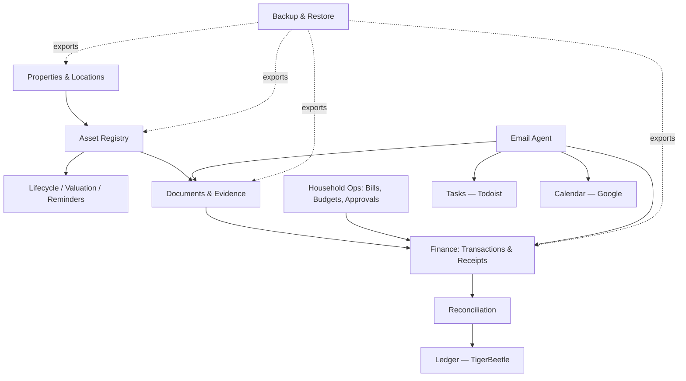
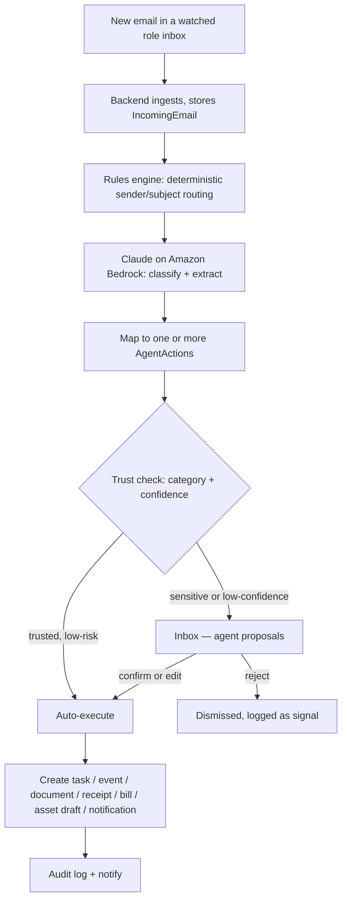
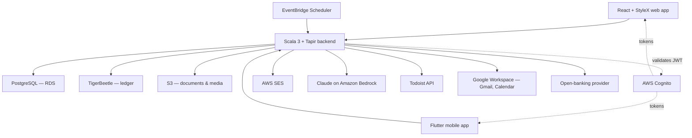

# Kanzen — Household Operations & Asset Registry Platform
### Combined end-to-end specification (v5)

A private, in-house platform that does two things as one system: **runs the household** as a small family office, and keeps a **rigorous registry of the household's assets and finances**. It is an operating system for the household and everything in it.

This version merges the Kanzen household-operations platform with the personal finance / receipt / asset registry system into one coherent design, with the region decision settled and detailed appendices added so this single file is complete. Stack: Scala 3, Tapir, React + StyleX web, Flutter mobile, PostgreSQL, TigerBeetle, AWS (eu-west-1). This document is the build input for Claude Code.

---

## 1. Overview

### The two halves, one system
- **Household operations** — properties, staff, vendors, tasks, calendar, the email agent, bills, budgets, approvals. Running the household day to day.
- **Asset & finance registry** — every owned object tracked through its life with provenance, valuation, location and cost; every transaction reconciled against commercial evidence; a rigorous double-entry ledger underneath; catastrophic-loss-safe backup and restore.

They unify around shared bones: **properties** (assets live in them), **assets** (the boiler and the watch collection are both assets), **the email agent** (one agent turns inbound mail into both household tasks and registry records), **finance** (household bills sit above the rigorous ledger), **documents** (one evidence store), and **maintenance & reminders** (servicing the HVAC and servicing a watch are the same mechanism).

### Guiding principles
- **Reuse over rebuild, where reuse is sound.** Tasks stay in Todoist; calendar stays in Google Calendar. Documents are owned in-house — see §3.2.
- **Own the gap, and own the truth.** The platform owns the data no tool holds well, and owns the rigorous financial and asset record beneath the friendly UI.
- **Source documents are sacred.** Original uploads are immutable and preserved forever unless explicitly purged. OCR and extraction are derived data, never source truth.
- **Three distinct financial concepts.** External facts (bank transactions), commercial evidence (receipts, invoices), and ledger truth (immutable postings) are modelled separately and never conflated.
- **Agent-assisted, human-in-the-loop.** The email agent proposes; a person disposes — until trust is granted per category. Nothing financial executes itself.
- **Auditability everywhere.** Every meaningful write is auditable; ledger postings are immutable; corrections are events, not mutations.
- **Backup and restore are a product feature**, not a database afterthought.
- **Scoped access.** Each person sees only what their role allows; the asset and personal-finance registry is private to the Principal.
- **Future-safe.** Every record carries an `owner_id`; the model supports verticals and structural change not yet imagined.

---

## 2. Scope & non-goals

### In scope (v1 through the milestone plan)
A private, authenticated, multi-user household platform: properties, staff and vendors, tasks and calendar, the email agent, bills/budgets/approvals, the full asset registry with verticals and lifecycle, bank ingestion and reconciliation, the double-entry ledger, documents and evidence, search and insights, and first-class backup/restore. Web-first, with a Flutter companion.

### Non-goals
Explicitly **not** built, to keep the build focused:
- tax-filing or tax-return workflows;
- budgeting-first UX (budgets exist, but the product is a stewardship and operations system, not a budgeting app);
- resale or marketplace integrations;
- insurance-carrier integrations (insurance *data* is tracked; carrier APIs are not);
- public, social or sharing features;
- SaaS multi-tenancy or billing;
- a desktop-native application.

Note: "household collaboration / shared workspaces" was a non-goal in the source registry spec. The merge **promotes it to in-scope** — the platform is genuinely multi-user (Lorna and Marcia are real users) — while the asset and personal-finance registry remains Principal-private (§4).

---

## 3. Synthesis decisions — how the two specs were reconciled

The judgement calls that turn two specs into one. Each is open to challenge.

**3.1 One unified Asset registry.** Appliances/systems, insured contents and vehicles merge into **one Asset domain** covering everything physical the household owns — the boiler, the dining chairs, the watch collection, the cars. Category and typed attributes distinguish them. The Property Bible's "systems" and "inventory" become saved views onto the unified registry; vehicles become an asset vertical (Appendix C).

**3.2 Documents are owned in-house (S3), not delegated to Google Drive.** The registry needs immutable originals, versioned parse runs, line-item extraction and full export/restore — none possible if files live in someone else's Drive. The platform owns its documents in S3-compatible object storage. Google Drive integration is downgraded to optional.

**3.3 Finance is two layers, not two systems.** Below: bank transactions, commercial evidence, reconciliation, immutable TigerBeetle postings. Above: the recurring bill schedule, budgets and spend approvals. One Finance domain, two altitudes.

**3.4 Multi-user platform; Principal-private registry.** The platform is multi-user (Kanzen's RBAC stands); the asset registry, transactions, ledger and valuations are a **Principal-private domain** within it. The registry spec's `user_id` becomes `owner_id`, satisfied by the Principal.

**3.5 One email agent, feeding both halves** — household actions (deliveries, bookings, appointments) and registry pipelines (receipts → line items → assets, warranties → assets).

**3.6 One Inbox** — the household "Triage" and the registry "Inbox" merge into a single module with four streams: agent proposals, reconciliation, data quality, reminders due.

**3.7 One maintenance & reminder engine** for property systems and registry assets alike.

**3.8 Backup & restore is a first-class platform feature**, applied to the whole combined system.

**3.9 The combined stack is the union** — adds TigerBeetle and Docker Compose; keeps StyleX, AWS, Cognito, Bedrock and the Todoist/Google integrations.

---

## 4. Users, roles & access

Authentication is handled by AWS Cognito; **authorisation (role + property scope + domain sensitivity) is owned by the platform**.

| Role | Person | Household operations | Asset & finance registry |
|---|---|---|---|
| **Principal** | You | Full | Full — incl. valuations, ledger, bank detail, private documents |
| **Manager** | Lorna (Chief of Staff / EA) | Full except the private document index | Operational only — upload receipts/documents, create/edit assets, log events and service costs, run reconciliation. **Not** valuations, ledger views or bank balances |
| **Staff** | Marcia (Housekeeper) | Scoped to assigned property: own tasks, shopping lists, raise issues | None |
| **Property-scoped Manager** | Future Singapore lead | Manager access, one property | Per grant |

The model is **role + property scope + domain sensitivity**, checked server-side on every request. Every domain record carries `owner_id`. Each user may hold multiple login identities (local credentials, Google, Apple) mapping to one canonical profile; session inspection and revocation are supported.

---

## 5. Information architecture

`Dashboard` · `Inbox` · `Properties` · `Assets` · `Collections` · `Finance` · `Documents` · `Tasks` · `Calendar` · `People` · `Vendors & Contacts` · `Insights` · `Settings` · `Backup`

`Tasks` and `Calendar` are integrated views onto Todoist and Google Calendar. `Inbox` is the unified review surface. Registry modules (`Assets`, `Collections`, `Finance`, `Insights`, `Backup`) are Principal-private with the operational carve-out for the Manager.

---

## 6. Domain model

Modelled as related domains, not one flat schema. Files, tasks and calendar events live in external/object stores and are referenced by ID. The full entity and join-table list is in **Appendix A**.



- **Identity** — `User`, `LoginIdentity`, `UserPreference`.
- **Properties & locations** — `Property`, `Room`, `SubLocation` (storage area, cabinet/shelf/case), `CustodyRecord`. Location and custody changes are events, queryable, shown in asset timelines.
- **Asset registry** — `Asset`, `AssetGroup`, `Collection`, `Tag`, `Category`, `CategoryTemplate`, `AssetAttributeDefinition`, `AssetAttributeValue`, `AssetEvent`, `AssetComment`, `AssetValuationSnapshot`, `AssetStatus`, `AssetCondition`. Detail in §8.
- **Documents & evidence** — `Document`, `DocumentVersion`, `DocumentLink`, `Receipt`, `Invoice`, `ReceiptParseRun`, `ReceiptLineItem`, `Attachment`. Originals immutable; extracted data versioned and correctable.
- **Finance & ledger** — `FinancialConnection`, `FinancialInstitution`, `FinancialAccount`, `BankTransaction`, `BankTransactionRawPayload`, `Merchant`, `TransactionCategory`, `TransactionSplit`, `ReconciliationMatch`, `ReconciliationState`, `Bill`, `Budget`, `Approval`, `Expense`, `AssociatedCost`, `LedgerAccountMapping`, `LedgerPostingGroup`, `LedgerPostingReference`. Detail in §9.
- **Household operations** — `Vendor`/`Contact`, `EmploymentRecord`, `MaintenancePlan`, `MaintenanceLog`, `Reminder`, `CalendarEventRef`, `TodoistTaskRef`, `AssociatedParty`.
- **Agent, rules & system** — `IncomingEmail`, `AgentAction`, `TrustSetting`, `SenderRule`, `Rule`, `Notification`, `AuditLogEntry`, `SavedView`, `ArchiveSnapshot`, `ExportJob`, `ExportManifest`, `RestoreJob`, `BackupArtifact`.

---

## 7. Feature modules

### 7.1 Dashboard
Per role: today's and overdue tasks, upcoming maintenance and calendar events, items expiring within 60 days, pending Inbox items and approvals, recent activity, this-month spend vs budget, and registry health (assets missing proof, completeness score) for the Principal.

### 7.2 Inbox — the unified review surface
Four streams: **Agent proposals** (email-agent actions awaiting confirmation), **Reconciliation** (unmatched bank transactions, unparsed receipts, line items needing review), **Data quality** (assets missing photos/category/location, expensive assets missing proof or warranty, suspected duplicates, anomalies), **Reminders** (service and maintenance due, backups not run recently).

### 7.3 Properties
The digital Property Bible: Overview (incl. linked Todoist project, Google Calendar, 1Password vault) · Rooms & sub-locations · Assets here · Utilities · Maintenance · Defects log · Emergency procedures · Documents. Seed with **Wardian, Apt 5206** and **Singapore**.

### 7.4 Assets
The unified registry — full treatment in §8. Faceted search; asset detail centred on a unified timeline.

### 7.5 Collections
User-defined arbitrary groupings for browsing and reporting ("all glassware", "things worth insuring", "items for the Wardian flat", "stuff to sell"). An asset belongs to many collections.

### 7.6 Finance
Two layers — full treatment in §9. Transactions, receipts and reconciliation below; bills, the recurring schedule, budgets and approvals above.

### 7.7 Documents
The in-house evidence store. Upload originals (immutable), classify, version extracted data, attach polymorphically to assets, transactions, properties, vendors, people. The agent files email attachments here. Files in S3; metadata and links in Postgres.

### 7.8 Tasks — Todoist integration
Todoist is the task system of record. One project per property; labels for category and vendor. Maintenance plans and reminders create and maintain recurring Todoist tasks; completions sync back into the MaintenanceLog. Any user can raise an issue from the platform.

### 7.9 Calendar — Google Calendar integration
A shared household Google Calendar, two-way sync. Events from the agent (deliveries, bookings, appointments), maintenance plans, manual entry and staff leave. Categorised and colour-coded; a delivery yields both a calendar event and a Todoist task.

### 7.10 People
Staff directory: role, jurisdiction, contract and key dates, leave, reviews, emergency contacts, documents. Expiry reminders on visas and reviews. Reference to the external payroll bureau.

### 7.11 Vendors & Contacts
Businesses and people relevant to the household and to assets: trade, contacts, rates, contract terms, **NDA and insurance status with expiry**, rating, linked maintenance history, bills, and asset provenance/service roles (dealer, luthier, appraiser, gift recipient, borrower, restoration specialist).

### 7.12 Insights
Aggregate and descriptive reporting: spend by category/collection/tag/property, lifetime cost of a collection, highest-maintenance assets, assets missing receipts, valuation history. Completeness scoring and anomaly/duplicate detection. Built on the structured query model so a natural-language layer can sit on top later.

### 7.13 Settings & audit
Users and roles, properties, categories and templates, spend threshold, currencies, integration connections, agent **trust settings**, and the **rules engine** editor. Append-only **audit log** of every user and agent action, visible to the Principal.

### 7.14 Backup
Full treatment in §12 — export, manifest, restore, encryption, annual snapshots.

---

## 8. The Asset registry

### 8.1 Concepts, kept distinct
- **Asset** — an owned object tracked through time (a guitar, a coat, a sofa, a painting, a boxed set of six glasses).
- **Asset group** — a *structural* grouping of things that belong together physically or commercially (a tea set; four chairs from one order; a pedalboard rig).
- **Collection** — an arbitrary *logical* user-defined grouping for browsing/reporting.
- **Category** — the formal taxonomy of what something is (`Home > Glassware`, `Instruments > Guitars`).
- **Tag** — flexible labels for search (`fragile`, `favourite`, `repair-needed`). Tags never replace categories.

### 8.2 Tracking modes
- **Unique asset** — a single identifiable item (a guitar, a watch).
- **Quantity-tracked grouped asset** — one record with a quantity (a set of six tumblers).
- **Structured set with children** — a parent containing related child assets (a tea set; a guitar rig).

Default to grouped-quantity for commodity-like identical units, individual for high-identity items; always allow later restructuring (§8.8).

### 8.3 Universal fields + typed verticals
Every asset has universal fields: `id`, `owner_id`, `title`, `description`, `category_id`, `tracking_mode`, `quantity`, `acquisition_date`, `acquisition_cost`, `acquisition_currency`, `merchant_id`, `ownership_status`, `condition_status`, `location_id`, `custody_status`, `notes`, `created_at`, `updated_at`, `deleted_at`. **Vertical-specific attributes** are implemented as **category templates** backed by typed attribute definitions — so verticals not yet imagined are added without schema changes. Templates for guitars, glassware, porcelain, clothing/shoes, furniture, watches/jewellery and vehicles are in **Appendix C**.

### 8.4 Lifecycle events
Assets carry a timeline of typed events: acquired, receipt linked, first use, moved, cleaned, dry cleaned, repaired, restored, damaged, condition up/downgraded, appraised, insured, listed, sold, gifted, lost, stolen, archived. Each event supports: timestamp, event type, optional cost, optional linked documents, optional comment, optional condition delta, optional valuation delta, optional associated party, optional location change, optional custody change.

### 8.5 Location & custody
Every asset may have a current location (property → room → sub-location → cabinet/shelf/case) and a full location history; and a custody state (with owner, with family, with repair shop, with appraiser, lent out, sold pending collection, in transit). Changes are events, visible in the timeline and queryable.

### 8.6 Valuation
Valuation concepts — acquisition cost, replacement cost, estimated market value, insured value, appraisal value, realised sale value — captured as dated snapshots with source, optional confidence, supporting documents and rationale. History is queryable per asset, per collection, per category and per group.

### 8.7 Warranty, provenance, authenticity, insurance
Assets carry warranty (provider, dates, terms, documents), provenance (source, dealer/auction/retailer, prior-owner and restoration notes), authenticity (certificates), and insurance (insured flag, policy reference, insured value, last valuation date, coverage documents). The platform flags expensive assets missing any of these.

### 8.8 Legacy onboarding & restructure
**Legacy onboarding is a first-class flow**: an asset can be created with no receipt, no transaction, approximate date and cost, unknown merchant, partial documents and a note on uncertainty. **Restructure operations** — merge duplicates, split a grouped asset into children, regroup, convert quantity-tracked into structured children, reallocate costs and receipt links — are supported and **auditable**: original identifiers and cost-basis/valuation history remain explainable, with no silent destructive mutation.

---

## 9. Finance & ledger

### 9.1 The two layers
- **Ledger layer (truth).** Bank transactions and raw payloads, commercial evidence, reconciliation, and immutable **TigerBeetle** postings. Postgres holds domain data; TigerBeetle holds postings only. Ledger machinery may be hidden by default in the UI but exists as first-class internal truth.
- **Management layer (operations).** The recurring **bill schedule**, **budgets** and **spend approvals**.

### 9.2 Transactions & evidence
Bank transactions are imported (open-banking provider, abstracted; CSV fallback) or manually entered, with raw payloads preserved. One receipt has many line items; a line item may become zero, one or many assets; a receipt may link to many transactions and a transaction to many receipts.

### 9.3 Reconciliation
Supports one-to-one, one-to-many and many-to-many transaction/receipt matches, partial payments, split transactions, refunds and reversals, transfer detection, an unmatched-transaction inbox and manual overrides. Corrections are events; history is never mutated. **Reconciliation states:** unmatched, suggested, matched, partially matched, split, ignored, transfer, refund, superseded.

### 9.4 Ledger
Immutable postings via TigerBeetle, grouped into posting groups for acquisition, refunds, maintenance/service costs, transfers and adjustments, with derived balances. Reconciliation state is tracked; unreconciled transactions are allowed but surfaced in the Inbox.

### 9.5 Bills, budgets, approvals
Each **Bill** is a recurring cost (payee, property, amount, currency, frequency, payment method, next due, lead time); the platform rolls the schedule forward and raises reminders. The **agent reconciles** incoming invoice emails against the schedule, updating amount and next-due and raising a **variance flag** on a material change. **Budgets** are per property and category; **approvals** route above-threshold spend to the Principal.

### 9.6 Associated costs
A cost (dry cleaning, a repair bill, restoration, re-soling, moving a fragile item) is both a financial expense and optionally linked to zero, one or many assets — feeding both the ledger and an asset's lifetime cost.

---

## 10. The email agent & rules engine

### 10.1 Pipeline
The agent watches the **operational role inboxes** (`deliveries@`, `accounts@`, `house@`, and similar) — never the Principal's personal mailbox.



Ingestion is by polling the Gmail API on a short interval. Classification/extraction uses **Claude on Amazon Bedrock** with a structured-output schema; content stays within the AWS boundary.

### 10.2 Categories and actions

| Category | Actions |
|---|---|
| **Delivery** | Todoist task to receive it · calendar event for the window · notification |
| **Receipt** | Store the original · OCR/parse run → line items · propose asset creation in the Inbox · reconcile to a transaction |
| **Invoice / bill** | Store the original · reconcile to the recurring bill schedule (update amount/next due, flag variance) or propose a new Bill · optional Expense draft |
| **Booking** | Calendar event · task if preparation is needed |
| **Service / appointment** | Calendar event · Todoist task · link to vendor, asset and any maintenance plan |
| **Warranty / authenticity certificate** | Store the original · attach to the relevant asset · set warranty expiry reminder |
| **Shipping confirmation** | Delivery task and event; link to the originating receipt/asset |
| **Statement / official / renewal** | File the document · set or refresh an expiry reminder · notification |
| **Other / unclear** | No action proposed; sent to the Inbox for a human |

### 10.3 Trust model
Routing is by category plus confidence. Financial records and asset creations are **never auto-committed** — always proposed for confirmation. Categories start in `review`; trust is promoted per category in Settings once proven. Every proposal and decision is audited; every created record links back to its source email.

### 10.4 Rules engine
Complements the agent with deterministic, inspectable, editable rules: merchant-based category defaults, line-item → asset category defaults, transaction/receipt match suggestions, service-vs-acquisition cost inference, reminder suggestions, duplicate-detection heuristics. Rules are auditable; suggestions remain overridable.

---

## 11. Integrations

| System | Use | Auth pattern |
|---|---|---|
| **Gmail** | The agent polls watched role inboxes | Google Cloud service account, domain-wide delegation, narrow scope |
| **Todoist** | Task system of record | Household-workspace API token; webhook for completions |
| **Google Calendar** | Shared household calendar, two-way sync | Same service account |
| **Open-banking provider** | Bank transaction ingestion (provider abstracted; first provider TBD — §19) | Per-provider OAuth |
| **Amazon Bedrock (Claude)** | Agent classification/extraction; OCR assist | IAM role |
| **AWS Cognito** | Authentication, enforced MFA | User pool; hosted UI; JWT validated by the backend |
| **AWS SES** | Notification email | IAM role |
| **Google Drive** *(optional)* | Optional export target / attachment reach | Service account |
| **1Password** | Referenced only — vault name stored, never a secret | None |

Integration credentials live in **AWS Secrets Manager** — distinct from the household's own passwords, which stay in 1Password.

---

## 12. Backup, export & restore

A first-class product feature and API surface — not a database dump.

### 12.1 Principles
The entire system is exportable into a **self-descriptive, portable** package that does not need the original codebase to be understood, preserves all relationships, identifiers, timestamps, schema and versions, and supports full catastrophic-loss recovery.

### 12.2 Full export
Exports all relational/domain data, all category templates and configuration, all object metadata with the original binary files, ledger snapshots and/or replayable posting history, audit data, schema version information and an export manifest. Format: a top-level JSON manifest, entity data as JSON / JSON Lines, original binaries, checksums, in a compressed archive (zip or tar.gz). Modes: full export, selective export by entity type (later), restore from full backup.

### 12.3 Manifest
`export_version`, `application_version`, `schema_version`, `export_timestamp`, `owner_id`, `included_entity_types`, `object_counts`, `checksum_algorithm`, `file_index`, `encryption_status`, `restore_compatibility_notes`. A worked example is in **Appendix D**.

### 12.4 Restore
Validates manifest and checksums, validates schema compatibility, restores entities in safe dependency order with relationships and object references intact, restores ledger data consistently, and supports a **dry-run** before any real restore.

### 12.5 Protection & snapshots
Optional **encrypted, password-protected** export with integrity checksums and clear encryption metadata in the manifest, and the ability to verify a backup without exposing plaintext where practical. Support immutable **annual archive snapshots** (and user-triggered ones) marked read-only, preserving schema/version — for record-keeping, insurance, audits and resilience.

---

## 13. Cross-cutting concerns

- **Authentication** — AWS Cognito, enforced MFA, multiple login methods per user; the Scala backend validates the Cognito JWT on every request.
- **Authorisation** — role + property scope + domain sensitivity, enforced server-side in shared middleware; agent actions use the same permission and audit paths as human actions.
- **Auditability** — append-only audit log; immutable original uploads; versioned parse corrections; immutable ledger postings; soft delete where practical; audit data included in exports.
- **Search** — faceted search across assets, transactions, documents, people, collections, tags, vendors and processed email; aggregate queries; saved views and smart filters.
- **Data quality** — completeness scoring per asset, duplicate detection, anomaly detection — surfaced in the Inbox.
- **Backups** — automated daily RDS snapshots in addition to the application-level export of §12.

---

## 14. Technical architecture

The stack matches existing Hypervolt projects.

| Layer | Choice |
|---|---|
| **Backend** | **Scala 3**, **Tapir** for typed endpoints + OpenAPI generation, ZIO HTTP or http4s runtime |
| **Web frontend** | **React + StyleX** |
| **Mobile** | **Flutter**, consuming the same API |
| **Domain database** | **PostgreSQL** on AWS RDS |
| **Ledger** | **TigerBeetle** — immutable double-entry postings only |
| **Object storage** | **S3** — original documents, photos, attachments, previews, backup artefacts |
| **Auth** | **AWS Cognito** |
| **LLM** | **Claude on Amazon Bedrock** — the email agent and OCR assist |
| **Email out** | **AWS SES** |
| **Scheduled jobs** | **AWS EventBridge Scheduler** — mailbox poll, reminders, schedule roll-forward |
| **Secrets** | **AWS Secrets Manager** |
| **Local development** | **Docker Compose** — deterministic full stack incl. Postgres and TigerBeetle |
| **Hosting & region** | **AWS, region `eu-west-1` (Ireland)** — a dedicated AWS profile exists. Backend on ECS Fargate (or EKS if that matches Hypervolt); web app on S3 + CloudFront |

### One API, two clients
The React web app and Flutter mobile app are separate codebases sharing one backend API. Define the API once with Tapir, publish the OpenAPI contract, generate a typed client for each. Web is the full management surface; mobile is the capture-and-on-the-go surface — receipt and asset-photo capture, quick events, lookups, Inbox confirmations, approvals. The API surface is sketched in **Appendix B**.



---

## 15. Non-functional requirements

- **Security** — encryption in transit and at rest; enforced MFA; least-privilege RBAC; append-only audit; integration secrets in Secrets Manager; no household secrets stored.
- **Privacy** — the agent watches only operational inboxes; email content processed within the AWS boundary; the registry and finance domain private to the Principal.
- **Reliability** — daily RDS backups plus application-level export; strong test coverage for **reconciliation** and **backup/restore** specifically.
- **Correctness** — idempotent imports; deterministic local development via Docker; environment-based configuration; migration-safe, versioned schema evolution.
- **Observability** — structured logs and metrics.
- **Maintainability** — Hypervolt conventions; `SPEC.md` and `CLAUDE.md` kept current.
- **Consistency** — web and mobile share the API contract and design language.

---

## 16. Design direction

Built to the standard the name implies — *kanzen*, done as completely and well as possible. The product should feel like a premium provenance archive and a rigorous private ledger — a long-term stewardship system, not a budgeting app. Restrained, content-first, generous whitespace, a tight neutral palette with a single accent, real typographic hierarchy. Quiet, fast, predictable. Light and dark themes. Each asset detail page is **timeline-centric** — acquisition, documents, location and custody changes, service events, valuations, comments, reminders and disposal unified into one chronological view. Data-quality and completeness are visible without overwhelming. The mobile app follows the same language. Benchmark: Apple-grade restraint.

---

## 17. Build plan — milestones

A large system; each milestone is independently shippable, and the household becomes usable well before the registry depth is complete.

- **M0 — Foundation.** Repo (monorepo: `/backend`, `/web`, `/mobile`, `/docs`), Docker Compose stack, Scala 3 + Tapir skeleton with OpenAPI output, PostgreSQL + migrations, TigerBeetle integration skeleton, S3, Cognito with enforced MFA, CI, the React + StyleX and Flutter shells.
- **M1 — Core spine.** Identity; Properties with rooms, sub-locations and custody; the unified Asset model (basic); categories, tags, collections, asset groups; the in-house Document store with immutable originals.
- **M2 — Household operations.** Tasks (Todoist), Calendar (Google), Vendors & Contacts, People/HR, maintenance plans and the reminder engine. The household is operable from here.
- **M3 — Finance: transactions & evidence.** Bank-transaction ingestion (provider abstraction + CSV fallback), raw payloads, merchants, receipts/invoices, the OCR/parse pipeline, line items, reconciliation, bills and the recurring schedule, budgets, approvals.
- **M4 — Ledger.** TigerBeetle posting model, posting groups, reconciliation state machine, derived financial views, unmatched-expensive-transaction detection.
- **M5 — Asset depth.** Lifecycle events, valuation snapshots, warranty/provenance/authenticity/insurance, typed verticals and category templates, line-item → asset creation, legacy onboarding, merge/split/regroup.
- **M6 — Email agent & rules.** Gmail ingestion, Bedrock classification/extraction, the full action mapping incl. receipt → asset, the unified Inbox, the rules engine.
- **M7 — Insights, search & data quality.** Faceted search, aggregate spend and lifetime-cost reporting, completeness scoring, duplicate and anomaly detection, saved views.
- **M8 — Backup & restore.** Full export API, self-descriptive manifest, archive packaging, checksums, restore dry-run and full restore, optional encryption, annual snapshots, a catastrophic-recovery test suite.
- **M9 — Flutter companion.** Sign-in, receipt and asset-photo capture, lightweight asset views, quick event entry, reminders, Inbox confirmations and approvals on the move.
- **M10 — Advanced.** Bulk onboarding of legacy collections, natural-language query over the structured search model, deeper workflow automation, optional Google Drive export.

---

## 18. Success criteria

The build is successful when the system can:
- run the household — properties, staff, vendors, tasks, calendar, bills, budgets and approvals — as one operational surface;
- import bank transactions, store and parse receipts, and reconcile the two;
- create multiple assets from one receipt; track grouped sets and arbitrary collections;
- associate later costs with assets and answer aggregate questions about spend by category, group, tag and collection;
- preserve a rigorous, immutable internal financial trail beneath a friendly UI;
- track where each asset is located and who currently holds it;
- track proof, warranty, authenticity, provenance and insurance data, and flag what is missing;
- maintain asset timelines and service reminders;
- support legacy onboarding and later restructures without losing explainability;
- turn inbound household email into proposed tasks, events and records, with a human in the loop;
- surface incomplete, duplicate, anomalous or risky records;
- export the whole system into a self-descriptive portable backup, optionally encrypted, and restore from it after catastrophic loss.

---

## 19. Open decisions

1. **Compute** — ECS Fargate vs EKS; match Hypervolt. *(Region settled: `eu-west-1`.)*
2. **Open-banking** — the provider abstraction and the first provider.
3. **Ledger visibility** — is TigerBeetle detail fully hidden behind the friendly UI, or partly inspectable?
4. **Backup binaries** — original files inline in the archive vs sidecar files within it.
5. **First-priority verticals** — which typed-attribute templates to build first (guitars? glassware? watches?).
6. **Watched mailboxes** — confirm which role inboxes the agent monitors, as real Gmail-readable mailboxes.
7. **Agent trust defaults** — which categories, if any, start in `auto` (recommendation: all start in `review`).
8. **Repo layout** — confirm monorepo vs three repos against Hypervolt convention.
9. **App domain** — suggest `app.kanzen.family`.
10. **Category taxonomy** — the initial canonical category tree.
11. **Wear/use counts** — required in v1 for clothing and shoes?
12. **Inference aggressiveness** — how aggressive automatic merchant/category inference should be in v1.

---

## 20. Notes for building with Claude Code

- Keep this file as `SPEC.md` in the repo root; add a `CLAUDE.md` with Hypervolt's Scala 3 / Tapir / React / StyleX / Flutter conventions, commands and house style.
- Build **milestone by milestone**. Get M0 deployed and authenticating on both clients before any feature work; build the M1 spine before going wide.
- Define the database schema and the OpenAPI contract early — the domain model in §6 and Appendix A are the spine.
- Keep PostgreSQL for domain data and TigerBeetle strictly for ledger postings. Never conflate bank transactions, receipts and ledger postings.
- Keep original uploaded documents immutable; separate raw imported data from normalised domain data; OCR output is always derived, correctable, versioned.
- Write permission checks once, as shared server-side middleware; agent actions take the same path.
- Treat each integration (Gmail, Todoist, Calendar, open-banking, Bedrock, Cognito, SES) as an isolated, individually testable adapter behind an internal interface.
- Design backup/restore as a formal API surface from the start; test catastrophic recovery deliberately.
- Implement the hard edge cases on purpose: split receipts, split transactions, partial payments, refunds, grouped and structured assets, legacy assets with no receipt, associated costs on existing assets, and post-hoc restructures.
- Generate the web and Flutter API clients from the OpenAPI contract.
- Seed the database with the two real properties and three real users.

---

## Appendix A — Database entities & join tables

### Core entities, by domain
- **Identity:** `users`, `login_identities`, `user_preferences`.
- **Properties & locations:** `properties`, `rooms`, `sub_locations`, `asset_location_history`, `asset_custody_history`.
- **Assets:** `assets`, `asset_groups`, `asset_group_members`, `collections`, `collection_members`, `tags`, `asset_tags`, `categories`, `category_templates`, `asset_attribute_definitions`, `asset_attribute_values`, `asset_events`, `asset_comments`, `asset_valuation_snapshots`.
- **Documents & evidence:** `documents`, `document_versions`, `document_links`, `receipts`, `invoices`, `receipt_parse_runs`, `receipt_line_items`, `attachments`.
- **Finance:** `financial_connections`, `financial_institutions`, `financial_accounts`, `bank_transactions`, `bank_transaction_raw_payloads`, `merchants`, `transaction_categories`, `transaction_splits`, `reconciliation_matches`, `reconciliation_states`, `bills`, `budgets`, `approvals`, `expenses`, `associated_costs`.
- **Ledger:** `ledger_account_mappings`, `ledger_posting_groups`, `ledger_posting_references`.
- **Household operations:** `vendors`, `employment_records`, `maintenance_plans`, `maintenance_logs`, `reminders`, `associated_parties`, `calendar_event_refs`, `todoist_task_refs`.
- **Agent, rules & system:** `incoming_emails`, `agent_actions`, `trust_settings`, `sender_rules`, `rules`, `notifications`, `audit_log_entries`, `saved_views`, `archive_snapshots`.
- **Backup:** `export_jobs`, `export_manifests`, `restore_jobs`, `backup_artifacts`.

### Key join tables
`bank_transaction_receipt_link` · `bank_transaction_document_link` · `receipt_line_item_asset_link` · `expense_asset_link` · `associated_cost_asset_link` · `document_links` (polymorphic) · `collection_members` · `asset_tags` · `asset_group_members` · `asset_party_link` · `asset_location_history` · `asset_custody_history` · `vendor_property_link` · `agent_action_result_link` · `user_property_scope`.

---

## Appendix B — API surface (high-level)

- **Auth:** sign in · sign out · session info · linked identities · list active sessions · revoke session.
- **Properties:** CRUD properties · rooms · sub-locations.
- **Assets:** create asset · create grouped asset · create asset group · create collection · add/remove collection members · add/remove tags · add asset event · add valuation snapshot · add associated cost · upload photos · move location · update custody · merge · split · regroup · restructure · search.
- **Documents:** upload document · list · fetch metadata · create parse run · correct parse result · attach to asset / transaction / reminder or service event.
- **Receipts:** create · list · list line items · edit line item · link line item to asset · convert line item to grouped or unique asset.
- **Finance — transactions:** connect institution · import transactions · list · create manual transaction · categorise · split · reconcile · mark transfer / refund / ignore.
- **Finance — management:** CRUD bills · roll schedule · CRUD budgets · submit/approve/reject approvals.
- **Reminders & maintenance:** create · list · complete · skip · reschedule · maintenance plans CRUD.
- **Vendors & people:** CRUD vendors/contacts · CRUD staff and employment records.
- **Inbox & agent:** list inbox items · confirm / edit / reject agent proposal · trust settings · rules CRUD.
- **Calendar & tasks:** list/sync calendar events · raise task · list tasks.
- **Insights & search:** faceted search · aggregate queries · saved views CRUD.
- **Backup:** create full backup · get status · download manifest · download package · validate package · restore dry-run · run restore.

---

## Appendix C — Vertical attribute templates

Implemented as category templates backed by typed attribute definitions; templates determine which fields appear by default in the UI.

- **Guitar:** maker, model, year, serial_number, finish, body_wood, fretboard_material, pickup_configuration, country_of_manufacture, case_included, modification_history.
- **Glassware:** maker, line_or_pattern, material, capacity_ml, set_size, handmade_flag, dishwasher_safe_flag, fragility_score.
- **Porcelain:** maker, pattern, country, production_period, hand_painted_flag, chip_notes, crack_notes, crazing_notes.
- **Clothing & shoes:** brand, size, material_composition, colour, season, wear_count, dry_cleaning_history, alterations, sole_replacement_history.
- **Furniture:** maker, model, material, finish, dimensions, room_suitability, assembly_status, visible_damage_notes.
- **Watch / jewellery:** maker, model, serial_number, material, movement_type, gemstone_details, appraisal_reference.
- **Vehicle:** maker, model, year, registration, vin, mileage, fuel_type, mot_due_date, road_tax_due_date, insurance_renewal_date, service_interval.

---

## Appendix D — Example backup manifest

```json
{
  "export_version": "1.0.0",
  "application_version": "0.1.0",
  "schema_version": "2026-01",
  "export_timestamp": "2026-05-22T22:00:00Z",
  "owner_id": "usr_123",
  "included_entity_types": [
    "users", "properties", "rooms", "sub_locations",
    "financial_accounts", "bank_transactions", "documents",
    "receipts", "receipt_line_items", "assets", "asset_groups",
    "collections", "tags", "asset_events", "asset_valuation_snapshots",
    "ledger_posting_groups", "ledger_posting_references", "audit_log_entries"
  ],
  "object_counts": { "assets": 1240, "documents": 842, "bank_transactions": 9120 },
  "checksum_algorithm": "sha256",
  "encryption_status": { "enabled": true, "algorithm": "age" },
  "file_index": [
    { "path": "entities/assets.jsonl", "sha256": "..." },
    { "path": "objects/documents/receipt_001.pdf", "sha256": "..." }
  ],
  "restore_compatibility_notes": ["Supports restore into schema_version >= 2026-01"]
}
```
