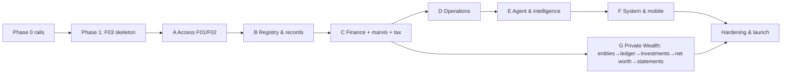

# Kanzen — Implementation Plan (single source of truth)

The one plan we build against. Bridges the spec (`../Kanzen-Platform-Spec.md`, the *what/why*) and the per-feature specs (`F__-*.md`, the *exactly how*). Supersedes the former `00-product-completion-plan.md` (merged here).

## Vision
Private **family-office / UHNWI** software, built by the owner for themselves: household operations + a full **asset registry**, on a core of **GnuCash-grade double-entry accounting** (translated to a modern stack on a **Postgres double-entry general ledger**), with an **AI capture pipeline** (OCR + ML categorisation; absorbs the `marvis` expense engine) and a **Private Wealth module** (consolidated net worth, investments, multi-entity). Real personas: Toby (Principal), Lorna (Manager), Marcia/Siti (Staff), + the email Agent.

## Where we are (honest)
Real: the StyleX design system + **theme engine** (light/dark, static CSS extraction). **44 feature specs (F00–F43)** written, each with UAT acceptance scenarios. **Phase 0 rails + Phase 1 walking skeleton are done and verified end-to-end** (May 2026): config→Flyway→Doobie boot, Cognito JWKS auth + dev-JWKS fallback, default-deny `Authorizer` from `permission_rules`, seeded real users + 2 properties; web data layer (typed fetch + Zod + TanStack + AuthContext + state primitives) + dev sign-in; **`GET /api/properties` flows login → API → Postgres → UI**, proven by 139 backend + 21 Vitest + 22 Playwright (live, audit-clean) tests. Still pending: CI green-gate, mobile foundation, visual-diff, and **0 of 44 features at full DoD** — the skeleton proves the stack; every feature slice now repeats the Playbook on top. "Tested module exists" ≠ done.

## Definition of Done (every feature)
Full **web UI** (all states, light/dark, a11y) · **mobile** surface (or N/A) · **Tapir API** (auth + RBAC + audit) · **wired** (web/mobile consume the real API; its mock deleted) · **integration** (real or flagged sandbox) · **full test pyramid** · **design-matched** · **invariants honoured**. Done only when a real user can use it end-to-end against the real backend.

## The unit of work — Vertical-Slice Playbook
1 read spec → 2 DB migration/seed → 3 API (Tapir + authz + audit + OpenAPI) → 4 backend tests (FreeSpec + weaver + Testcontainers) → 5 web service+Zod+TanStack (delete mock) → 6 web UI + states (design-matched) → 7 web tests (Vitest + Playwright vs real API) → 8 mobile + widget test → 9 verify (visual diff + DoD) → flip status.

## Decisions (locked; override any)
- **Auth:** real **Cognito** from the start (JWKS middleware → `Principal` → default-deny `Authorizer`); CI/tests use a local **test-JWKS**. Cognito dev pool = first `SETUP.md` item (critical path).
- **Deployable:** Phase 1 = builds + runs on dockerised Postgres + CI green; real AWS (Terraform/NixOS) is the final wave.
- **Design:** match from `input/views/*.jsx` + `previews/`; visual-diff goldens.
- **Integrations:** sandbox-first → **Done (sandbox)** vs **Done (prod)** (prod creds at the final wave).
- **Money:** integer minor units + ISO currency everywhere; dinero.js on web; **FX (F37) before any multi-currency reporting**.
- **Ledger:** the general ledger is **Postgres double-entry** — TigerBeetle dropped (not an exchange). See `02-accounting-ledger-architecture.md` (**ADR-001**): source-of-truth, value/amount multi-currency, commodity precision, posting cookbook.
- **Wealth:** **multi-entity / multi-book from the start** (every account/txn entity-scoped; consolidation); **full investment accounting** (lots, capital gains, dividends, corporate actions, live prices).
- **Tracking:** status `Backlog → In-slice → Done (sandbox) → Done (prod)`; one slice in flight; wave gate before the next.

## Phase 0 — rails (one-time, no features yet)
API scaffold (`/api`, error model, OpenAPI, **Cognito JWKS middleware + default-deny Authorizer**) · web data layer (TanStack Query + Zod + Cognito login + loading/empty/error/forbidden) · **CI** (backend+web+Flutter on every push) · local real-data stack (docker Postgres seeded: real users + 2 properties) · Flutter foundation (Dart client + capture-first IA) · visual-diff harness. **Gate:** rails exist, CI green, app runs on real Postgres.

## Phase 1 — walking skeleton
**F03 Properties (read)** through every layer: Cognito login → `GET /api/me` → `GET /api/properties` (Authorizer-filtered, from Postgres) → Properties page renders real data → Playwright (test-JWKS) → CI green → docker. **Gate:** a real user logs in and sees the two seeded properties **from the DB**, light+dark, tested. Proves the stack; every later slice repeats the Playbook on top.

## Waves & feature index (the tracker)
Dependency-ordered. `Spec` = spec written; `Build` = implementation status. Waves supersede the legacy `M` numbers in the spec headers.

| ID | Feature | Wave | Depends on | Spec | Build |
|---|---|---|---|---|---|
| F00 | Foundation: infra, repo, design system | Phase 0 | — | ✅ | 🚧 rails done (API+auth+boot+seed+skeleton); CI/mobile/visual-diff pending |
| F01 | Identity, auth & session (Cognito) | Phase 0/1 | F00 | ✅ | 🚧 In-slice (auth + DB principal resolution + /api/me + web login done; real Cognito pool + auto-provision pending) |
| F02 | Authorization (resource/field RBAC + custom roles + property **& entity** scope) | A | F01 | ✅ | 🚧 In-slice (Authorizer + permission_rules + property scope + reusable path done; field-filter applies at F04, role-mgmt UI + entity scope pending) |
| F03 | Properties, locations & defects | B (skeleton) | F02 | ✅ | 🚧 In-slice (read end-to-end: API+authz+web+e2e done; CRUD/locations/defects/bible pending) |
| F04 | Asset registry core (JSONB) | B | F03 | ✅ | ⬜ |
| F05 | Documents — S3 evidence store | B | F02 | ✅ | ⬜ |
| F22 | Verticals & category templates | B | F04 | ✅ | ⬜ |
| F33 | Custom fields, tags & taxonomies | B | F02, F04, F22 | ✅ | ⬜ |
| F23 | Completeness scoring & data quality | B | F04, F19–F22 | ✅ | ⬜ |
| F19 | Lifecycle events & timeline | B | F04 | ✅ | ⬜ |
| F20 | Valuation snapshots | B | F04 | ✅ | ⬜ |
| F21 | Warranty / provenance / insurance | B | F04 | ✅ | ⬜ |
| F24 | Legacy onboarding & restructure | B | F04, F19, F20 | ✅ | ⬜ |
| F10 | People / HR | B | F02 | ✅ | ⬜ |
| F09 | Vendors & contacts | B | F03 | ✅ | ⬜ |
| F37 | Currencies & FX (ECB source + cache, rate-at-date) | C | F12, F17, F20 | ✅ | ⬜ |
| F12 | Bank ingestion & transactions (AIS) **+ CSV import (marvis)** | C | F02 | ✅ | ⬜ |
| F13 | Receipts, OCR/parse + ML categorisation **+ brand/product resolution** | C | F05, F04 | ✅ | ⬜ |
| F14 | Reconciliation engine (**single-spend / dedup association**) | C | F12, F13 | ✅ | ⬜ |
| F15 | Bills & recurring schedule | C | F03, F09 | ✅ | ⬜ |
| F16 | Payment methods & Pay queue (never moves money) | C | F15 | ✅ | ⬜ |
| F17 | Budgets, expenses & approvals **+ income/deductibility (marvis)** | C | F15 | ✅ | ⬜ |
| F18 | General ledger — Postgres double-entry (hidden in UI) | C | F14 | ✅ | ⬜ |
| F38 | Tax, VAT & deductibility (marvis tax engine) | C | F13, F17, F37 | ✅ | ⬜ |
| F29 | Dashboard, Insights & reporting | C | F18, F23 | ✅ | ⬜ |
| F06 | Tasks — native | D | F03 | ✅ | ⬜ |
| F07 | Calendar — Google (two-way) | D | F03, F06 | ✅ | ⬜ |
| F08 | Lists | D | F03 | ✅ | ⬜ |
| F34 | Event backbone (events, queue, push) | D | F00 | ✅ | ⬜ |
| F35 | Products & stock (consumables) | D | F08, F09, F33, F34 | ✅ | ⬜ |
| F36 | Predictive replenishment | D | F35, F12, F13 | ✅ | ⬜ |
| F11 | Maintenance plans & reminder engine | D | F04, F06, F07 | ✅ | ⬜ |
| F25 | Email agent pipeline (Gmail + Bedrock) | E | F05, F13, F15 | ✅ | ⬜ |
| F26 | Unified Inbox + Triage | E | F25, F14, F23 | ✅ | ⬜ |
| F27 | Trust model, rules & learned categorisation | E | F25, F13 | ✅ | ⬜ |
| F28 | Search + ⌘K command palette (semantic) | E | F04, F12, F13 | ✅ | ⬜ |
| F32 | Advanced: bulk onboarding, **NL query (product-level spend)**, Drive export | E | F28, F30 | ✅ | ⬜ |
| F30 | Backup / export / restore | F | all domains | ✅ | ⬜ |
| F31 | Flutter companion (capture-first; Triage) | F | F00, key reads | ✅ | ⬜ |
| F42 | Legal entities, books & structures (multi-book foundation) | G | F02, F18, F37 | ✅ | ⬜ |
| F39 | Chart of accounts & double-entry transactions/splits | G | F42, F18, F37, F14 | ✅ | ⬜ |
| F40 | Investments & securities (lots, gains, prices) | G | F39, F42, F37 | ✅ | ⬜ |
| F41 | Liabilities & consolidated net worth | G | F39, F42, F37, F04/F20, F12, F40 | ✅ | ⬜ |
| F43 | Financial statements & wealth reporting | G | F39–F42, F37 | ✅ | ⬜ |
| — | **Hardening & launch** | Final | all | — | ⬜ edge-case suite · backup→restore drill · a11y · authz fuzzing · perf · real AWS infra · prod-cred swap |

## Cross-cutting (apply throughout)
- **Intelligent capture pipeline:** capture (F25/F31/F05/F12) → OCR (F13) → **ML categorise + brand/product resolution** (F13/F27) → reconcile (F14) → **post to the general ledger** (F18) → **propose inventory asset** from line items, with provenance (F04/F19/F20/F21) → confirm in Triage (F26). **AI proposes; the Principal decides** — non-financial steps may auto-apply above confidence, but **financial postings + asset/inventory creation are never auto-committed** (F27).
- **Single-spend guarantee:** a real payment counts exactly once — per-source dedup (F12/F13) + reconciliation as the association engine (F14). All totals/analytics draw from this set.
- **Product-level analytics:** line items resolve to brand/product → "how much did I spend on Coca-Cola?" answerable via NL (F32) / insights (F29), permission-filtered, FX-normalised.
- **Component library, just-in-time:** build each (Table, FilterRail, Tabs, Timeline, **⌘K palette**, Modal/Toast, MetaGrid) when its first consumer slice needs it (have Card/Pill/Bar/AgentRibbon/icons).
- **CI + visual-diff from day one;** a11y + edge-case suite grow per slice (final hardening pass, not a big bang).

## Cross-cutting requirements (every spec inherits)
AuthZ (role + property/entity scope + field-level none/read/write/admin; agent same path; **default-deny**) · `owner_id` on every row · registry/finance/wealth **Principal-private** (Manager operational carve-out) · **append-only audit** (corrections are events) · soft-delete + immutable originals + immutable ledger postings · **money = integer minor units + ISO currency** · API contract first (Tapir + OpenAPI; hand-written web services + Zod) · observability (structured logs + metrics).

## Invariants (never violate)
Kanzen **never moves money** (AIS read-only; "Mark paid" records reality; investments record, never trade) · financial/asset creation **always proposed**, never auto-committed · **general ledger hidden** in UI (statements/registers only) · **source documents sacred** (immutable S3 originals) · **everything permission/entity-scope-filtered server-side** (no leak via totals/consolidation/search/NL) · registry/finance/wealth **Principal-private**.

## Testing strategy (per slice)
ScalaTest **FreeSpec** (rules) · **weaver** (endpoint + authz/field-filter) · **Testcontainers** Postgres (round-trips, migrations, reconciliation, backup/restore) · **Vitest** (component/service+Zod) · **Playwright** (flows vs real API, console-error guard, axe, visual diff) · **Flutter** widget + integration. All in CI on every push.

## Integrations & operator inputs (`../SETUP.md`)
**Cognito (Phase 0/1 — critical path, first)** · GoCardless (F12) · Bedrock (F13/F25) · Google Gmail/Calendar/Drive (F07/F25/F32) · S3 (F05/F30) · **market-data quotes** (F40) · Pulsar (F34) · SES (notifications) · Terraform/DNS/CloudFront (final wave). Missing input → Done (sandbox), not Done (prod).

## Stack (locked in F00, mirrors Hypervolt)
Scala 2.13 · cats-effect 3 · http4s ember · Tapir + OpenAPI · Circe · Doobie · Flyway · **PostgreSQL 16** (+ pgvector; double-entry GL, ADR-001) · S3 · **AWS Cognito** (not Keycloak) · React 19 + Vite + **StyleX** (hand-written services + Zod, TanStack Query, dinero.js) · Flutter · GitLab CI on Nix · Terraform (EC2 autoscaling + NixOS) · eu-west-1 · Secrets Manager + SSM.

## Status legend
✅ spec complete · ⬜ Backlog · 🚧 In-slice · ✔️ Done (sandbox) · ✅✅ Done (prod). Update this table as the single live tracker.
