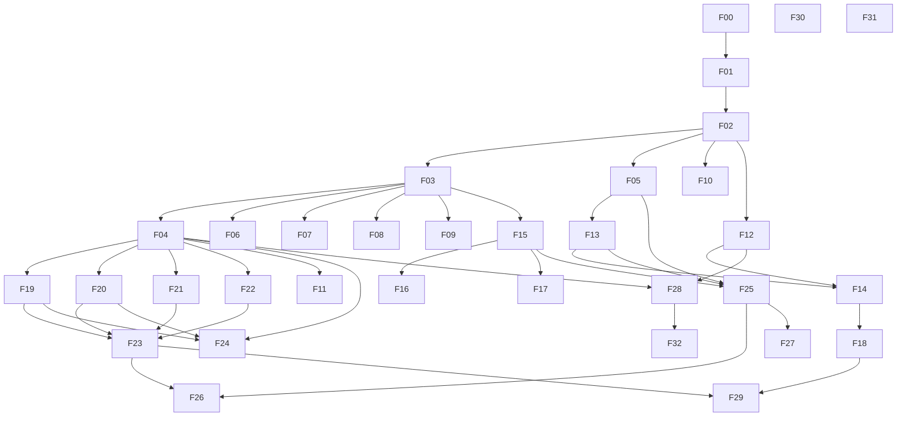

# Kanzen — Master Implementation Plan

The bridge between the v6 platform spec (`../Kanzen-Platform-Spec.md`) and the build. The spec says *what* and *why*; this plan and the per-feature specs in this directory say *exactly how*, feature by feature, in dependency order.

> **Planning status: ✅ COMPLETE.** All **38 feature specs (F00–F37)** are written (tasks confirmed native), plus **`../CLAUDE.md`** (build conventions) and **`01-data-model.md`** (consolidated schema + migration order). The build can begin at **F00**; **`../SETUP.md`** lists exactly what the operator must provide. Each spec's status is tracked below; flip to 🚧/✔️ as implementation proceeds.

## How this works
- **Per-capability slicing.** ~32 features (below). Big modules are split into buildable units.
- **One at a time, question-first.** For each feature we resolve its open questions, then write an **implementation-ready** spec (`F__-<name>.md`) using `_template.md`.
- **Committed as we go**, on the `spec` branch. The status table below is the live tracker.
- **Foundation-first, dependency order.** Start at F00 and walk the graph.
- **External inputs tracked centrally.** Every operator-provided input (AWS resources, tokens, DNS, third-party accounts, model access) is logged in [`../SETUP.md`](../SETUP.md) as the feature that needs it is specced — so we always know exactly what's required to boot and run the app.

### Status legend
📋 planned · ❓ questions open · ✍️ drafting · ✅ spec complete · 🚧 implementing · ✔️ shipped

## Cross-cutting requirements (every feature inherits these)
Applied in every spec, not repeated as features:
- **AuthZ** — role + property scope + per-module level (none/read/write/admin), enforced in shared server middleware; agent actions take the same path. (SPEC §4, §13)
- **`owner_id` on every domain record**; registry/finance modules Principal-private with the Manager carve-out.
- **Audit** — every meaningful write to the append-only audit log (7-yr retention); corrections are events, never mutations.
- **Soft delete** (`deleted_at`) where practical; immutable originals and ledger postings never mutated.
- **API contract first** — Tapir endpoints + generated OpenAPI; web & Flutter clients generated from it.
- **Tests** — unit + integration; reconciliation and backup/restore get extra rigor.
- **Observability** — structured logs + metrics.
- **Design system** — every screen composes from the StyleX token set + component library (F00, SPEC §16).

## Feature index

| ID | Feature | M | Domain | Depends on | Status | Spec |
|---|---|---|---|---|---|---|
| F00 | Foundation: infra, repo, design system | M0 | Platform | — | ✅ spec complete | [F00](F00-foundation.md) |
| F01 | Identity, auth & session | M1 | Identity | F00 | ✅ spec complete | [F01](F01-identity-auth.md) |
| F02 | Authorization (resource/field RBAC + custom roles + scope) | M1 | Identity | F01 | ✅ spec complete | [F02](F02-authorization.md) |
| F03 | Properties, locations & defects | M1 | Properties | F02 | ✅ spec complete | [F03](F03-properties.md) |
| F04 | Asset registry core | M1 | Assets | F03 | ✅ spec complete | [F04](F04-asset-registry-core.md) |
| F05 | Documents — S3 evidence store | M1 | Documents | F02 | ✅ spec complete | [F05](F05-documents.md) |
| F06 | Tasks — **native** (was Todoist) | M2 | Operations | F03 | ✅ spec complete | [F06](F06-tasks.md) |
| F07 | Calendar — Google Calendar (two-way) | M2 | Operations | F03, F06 | ✅ spec complete | [F07](F07-calendar.md) |
| F08 | Lists | M2 | Operations | F03 | ✅ spec complete | [F08](F08-lists.md) |
| F09 | Vendors & contacts | M2 | Operations | F03 | ✅ spec complete | [F09](F09-vendors.md) |
| F10 | People / HR | M2 | Operations | F02 | ✅ spec complete | [F10](F10-people-hr.md) |
| F11 | Maintenance plans & reminder engine | M2 | Operations | F04, F06, F07 | ✅ spec complete | [F11](F11-maintenance-reminders.md) |
| F12 | Bank ingestion & transactions (open banking AIS) | M3 | Finance | F02 | ✅ spec complete | [F12](F12-bank-ingestion.md) |
| F13 | Receipts & OCR/parse + learned categorisation | M3 | Finance | F05 | ✅ spec complete | [F13](F13-receipts-ocr.md) |
| F14 | Reconciliation engine | M3 | Finance | F12, F13 | ✅ spec complete | [F14](F14-reconciliation.md) |
| F15 | Bills & recurring schedule | M3 | Finance | F03, F09 | ✅ spec complete | [F15](F15-bills.md) |
| F16 | Payment methods & Pay queue | M3 | Finance | F15 | ✅ spec complete | [F16](F16-payments-pay-queue.md) |
| F17 | Budgets, expenses & approvals | M3 | Finance | F15 | ✅ spec complete | [F17](F17-budgets-expenses-approvals.md) |
| F18 | TigerBeetle ledger | M4 | Finance | F14 | ✅ spec complete | [F18](F18-tigerbeetle-ledger.md) |
| F19 | Lifecycle events & timeline | M5 | Assets | F04 | ✅ spec complete | [F19](F19-lifecycle-events.md) |
| F20 | Valuation snapshots | M5 | Assets | F04 | ✅ spec complete | [F20](F20-valuation.md) |
| F21 | Warranty / provenance / authenticity / insurance | M5 | Assets | F04 | ✅ spec complete | [F21](F21-provenance-insurance.md) |
| F22 | Verticals & category templates (incl. Art) | M5 | Assets | F04 | ✅ spec complete | [F22](F22-verticals-templates.md) |
| F23 | Completeness scoring & data quality | M5 | Assets | F04, F19–F22 | ✅ spec complete | [F23](F23-completeness-data-quality.md) |
| F24 | Legacy onboarding & restructure | M5 | Assets | F04, F19, F20 | ✅ spec complete | [F24](F24-legacy-onboarding-restructure.md) |
| F25 | Email agent pipeline | M6 | Agent | F05, F13, F15 | ✅ spec complete | [F25](F25-email-agent.md) |
| F26 | Unified Inbox + Triage | M6 | Agent | F25, F14, F23 | ✅ spec complete | [F26](F26-inbox-triage.md) |
| F27 | Trust model, rules & learned categorisation | M6 | Agent | F25, F13 | ✅ spec complete | [F27](F27-trust-rules-learning.md) |
| F28 | Search + ⌘K command palette (advanced + semantic) | M7 | Platform | F04, F12, F13 | ✅ spec complete | [F28](F28-search-command-palette.md) |
| F29 | Dashboard, Insights & reporting | M7 | Platform | F18, F23 | ✅ spec complete | [F29](F29-dashboard-insights.md) |
| F30 | Backup / export / restore | M8 | Platform | all domains | ✅ spec complete | [F30](F30-backup-restore.md) |
| F31 | Flutter companion | M9 | Mobile | F00, key reads | ✅ spec complete | [F31](F31-flutter-companion.md) |
| F32 | Advanced: bulk onboarding, NL query, Drive export | M10 | Platform | F28, F30 | ✅ spec complete | [F32](F32-advanced.md) |
| F33 | Custom fields, tags & user-defined taxonomies (extensibility) | M1.5 | Platform | F02, F04, F22 | ✅ spec complete | [F33](F33-custom-fields-tags-taxonomies.md) |
| F34 | Event backbone (domain events, queue, consumers, push) | M0.5 | Platform | F00 | ✅ spec complete | [F34](F34-event-backbone.md) |
| F35 | Products & stock (consumables/supplies) | M2 | Operations | F08, F09, F33, F34 | ✅ spec complete | [F35](F35-products-stock.md) |
| F36 | Predictive replenishment (consumption analytics) | M7 | Operations | F35, F12, F13 | ✅ spec complete | [F36](F36-predictive-replenishment.md) |
| F37 | Currencies & FX | M3 | Finance | F12, F17, F20 | ✅ spec complete | [F37](F37-currencies-fx.md) |

## Dependency graph

## Milestone roll-up
- **M0** F00 · **M1** F01–F05 · **M2** F06–F11 · **M3** F12–F17 · **M4** F18 · **M5** F19–F24 · **M6** F25–F27 · **M7** F28–F29 · **M8** F30 · **M9** F31 · **M10** F32.

## Global open decisions (SPEC §19 — still open)
Open-banking provider · backup-binary packaging · ~~repo layout~~ (resolved F00: monorepo) · canonical category tree (resolving in F22) · wear/use counts · inference aggressiveness · payment-execution boundary (assumed: Kanzen never moves money) · cross-currency rollups. Each is pinned to the feature that resolves it.

**Stack (locked in F00, mirrors Hypervolt):** Scala 2.13 · cats-effect 3 · http4s ember · Tapir + OpenAPI · Circe · Doobie · Flyway · PostgreSQL 16 · TigerBeetle · S3 · **AWS Cognito** (not Keycloak) · React 19 + Vite + StyleX (hand-written services + Zod, TanStack Query, dinero.js) · Flutter · GitLab CI on Nix · Terraform (EC2 autoscaling + NixOS) · eu-west-1 · Secrets Manager + SSM.
