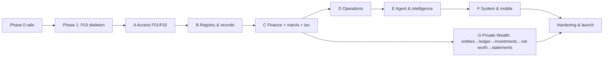

# Kanzen — Implementation Plan (single source of truth)

The one plan we build against. Bridges the spec (`../Kanzen-Platform-Spec.md`, the *what/why*) and the per-feature specs (`F__-*.md`, the *exactly how*). Supersedes the former `00-product-completion-plan.md` (merged here).

## Vision
Private **family-office / UHNWI** software, built by the owner for themselves: household operations + a full **asset registry**, on a core of **GnuCash-grade double-entry accounting** (translated to a modern stack on a **Postgres double-entry general ledger**), with an **AI capture pipeline** (OCR + ML categorisation; absorbs the `marvis` expense engine) and a **Private Wealth module** (consolidated net worth, investments, multi-entity). Real personas: Toby (Principal), Lorna (Manager), Marcia/Siti (Staff), + the email Agent.

## Where we are (honest)
Real: the StyleX design system + **theme engine** (light/dark, static CSS extraction). **44 feature specs (F00–F43)** written, each with UAT acceptance scenarios. **Phase 0 rails + Phase 1 walking skeleton done and verified end-to-end** (May 2026): config→Flyway→Doobie boot, Cognito JWKS auth + dev-JWKS fallback, default-deny `Authorizer` from `permission_rules`, seeded real users + 2 properties.

**All 44 features now at ✔️ Done (sandbox)** (May 2026): every feature has a backend vertical slice — Tapir API + authz + migration/seed — proven by **333 backend tests** (weaver + Testcontainers-PG, FreeSpec for pure logic), plus the web surface for the M1/Wave-B/C-D core (Vitest 56 + live Playwright, a11y/axe clean) and the Flutter companion (6 screens + capture-first Triage, widget tests). CI gates **backend + web + flutter** on every push (F0.4); `scalafmtCheckAll` clean. House invariants are each proven by a test: Kanzen never moves money (mark-paid manual-only → 409), single-spend (reconcile-once → 409), Principal-private + Manager field-strip, registry/finance/search/NL permission- & scope-filtered (no leak via totals → 403/404), agent financial/asset actions never auto-commit (F27 → 409), backup→restore faithful round-trip (F30 AC4), double-entry balanced-or-rejected (422).

**Not yet done (the gap to launch, much of it operator-gated per `SETUP.md`):** deferred *enhancement* web surfaces (Inventory value-totals [valuation-method decision pending] / Property·Tag filters / Timeline view / photo-cards, AssetDetail provenance·documents·quick-actions sections, Lists ordering workflow, Calendar week/month grid [event-creation shipped], **Vehicles** [from-scratch — needs scoping] — Settings role-management + dynamic/estate roles, Collections, Calendar new-event, Wealth dashboards, Inbox/⌘K all shipped); **prod integrations** — real Cognito pool, S3/LocalStack→real S3, Gmail+Bedrock, GoCardless, Pulsar transport, ECB FX job, APNs/FCM/SES; **real AWS** via Terraform/NixOS + **prod-credential swap**; and remaining hardening rigor (a11y/axe sweep, authz fuzzing, perf, visual-diff goldens; a11y ✓). "Done (sandbox)" ≠ "Done (prod)": the sandbox stack proves every feature end-to-end against dockerised Postgres; launch needs the operator to provision the real estate. "Tested module exists" ≠ done.

**Web-depth pass (2026-05-26).** Closing the gap between "backend done" and "a real user can use the screen": **all mock data deleted** from the web (`src/data/` is now just the money helper — no screen can fall back to demo data); a **token-derived identity engine** (`web/src/auth/claims.ts` → `AuthContext.role`) recalibrates role-gated UI synchronously with the bearer (fixed the impersonation→403 race). Five screens rebuilt to real, deep, prototype-grade and verified live: **Lists** (master-detail + approval queue + cadence/place-order), **Dashboard** (100% live reads), **PropertyBible** (defect lifecycle + editable rooms), **People** (HR roster + compliance + add), **Wealth** (realistic balanced UHNWI book ~£6.67m). See the **End-to-end UI completeness audit** below for the per-feature web-UI status (🟢 9 complete · 🟡 17 core-done · 🔵 13 backend-only). Backend + 61 web unit + full Playwright e2e (incl. audit/a11y guardrails) green.

## Definition of Done (every feature)
Full **web UI** (all states, light/dark, a11y) · **mobile** surface (or N/A) · **Tapir API** (auth + RBAC + audit) · **wired** (web/mobile consume the real API; its mock deleted) · **integration** (real or flagged sandbox) · **full test pyramid** · **design-matched** · **invariants honoured**. Done only when a real user can use it end-to-end against the real backend.

## The unit of work — Vertical-Slice Playbook
1 read spec → 2 DB migration/seed → 3 API (Tapir + authz + audit + OpenAPI) → 4 backend tests (FreeSpec + weaver + Testcontainers) → 5 web service+Zod+TanStack (delete mock) → 6 web UI + states (design-matched) → 7 web tests (Vitest + Playwright vs real API) → 8 mobile + widget test → 9 verify (visual diff + DoD) → flip status.

## Decisions (locked; override any)
- **Auth:** real **Cognito** from the start (JWKS middleware → `Principal` → default-deny `Authorizer`); CI/tests use a local **test-JWKS**. Cognito dev pool = first `SETUP.md` item (critical path).
- **Deployable:** Phase 1 = builds + runs on dockerised Postgres + CI green; real AWS (Terraform/NixOS) is the final wave.
- **Design:** match from `input/views/*.jsx` + `previews/`; visual-diff goldens.
- **Integrations:** sandbox-first → **Done (sandbox)** vs **Done (prod)** (prod creds at the final wave).
- **Money:** integer minor units + ISO currency everywhere; dinero.js on web; **FX (F37) before any multi-currency reporting**.
- **Ledger:** the general ledger is **Postgres double-entry** — TigerBeetle dropped (not an exchange). See `02-accounting-ledger-architecture.md` (**ADR-001**): source-of-truth, value/amount multi-currency, commodity precision, posting cookbook.
- **Wealth:** **multi-entity / multi-book from the start** (every account/txn entity-scoped; consolidation); **full investment accounting** (lots, capital gains, dividends, corporate actions, live prices).
- **Tracking:** status `Backlog → In-slice → Done (sandbox) → Done (prod)`; one slice in flight; wave gate before the next.

## Phase 0 — rails (one-time, no features yet)
API scaffold (`/api`, error model, OpenAPI, **Cognito JWKS middleware + default-deny Authorizer**) · web data layer (TanStack Query + Zod + Cognito login + loading/empty/error/forbidden) · **CI** (backend+web+Flutter on every push) · local real-data stack (docker Postgres seeded: real users + 2 properties) · Flutter foundation (Dart client + capture-first IA) · visual-diff harness. **Gate:** rails exist, CI green, app runs on real Postgres.

## Phase 1 — walking skeleton
**F03 Properties (read)** through every layer: Cognito login → `GET /api/me` → `GET /api/properties` (Authorizer-filtered, from Postgres) → Properties page renders real data → Playwright (test-JWKS) → CI green → docker. **Gate:** a real user logs in and sees the two seeded properties **from the DB**, light+dark, tested. Proves the stack; every later slice repeats the Playbook on top.

## Waves & feature index (the tracker)
Dependency-ordered. `Spec` = spec written; `Build` = implementation status. Waves supersede the legacy `M` numbers in the spec headers.

| ID | Feature | Wave | Depends on | Spec | Build |
|---|---|---|---|---|---|
| F00 | Foundation: infra, repo, design system | Phase 0 | — | ✅ | 🚧 rails + design system done; CI green-gate (backend+web+flutter, scalafmt) ✓; mobile foundation ✓ (F31); **Terraform launch substrate ✓ (validate-clean)**; cross-cutting authz-fuzz suite ✓; **a11y/axe sweep ✓ (every route, in CI)**. Pending: visual-diff goldens (F0.7), real-AWS apply (operator) |
| F01 | Identity, auth & session (Cognito) | Phase 0/1 | F00 | ✅ | 🚧 In-slice (auth + DB principal resolution + /api/me + web login done; real Cognito pool + auto-provision pending) |
| F02 | Authorization (resource/field RBAC + custom roles + property **& entity** scope) | A | F01 | ✅ | ✅ Done (Authorizer + permission_rules + property/entity scope + field-filter; **/api/me exposes the effective permission set → the web nav/UI recalibrates to the principal via can()**; **impersonation engine** (admin act-as any user → UI recalibrates + 'viewing as' banner + Stop, audited; kinetic-style); **admin role-management UI** (Settings page edits the permission matrix — none/read/write/admin × resource/field × role, audited, root-grant lockout-protected). All proven live + tested (backend RolesApiIT/ImpersonateApiIT, web Vitest + Playwright)) |
| F03 | Properties, locations & defects | B (skeleton) | F02 | ✅ | ✔️ Done (sandbox) — backend complete; web list/Bible/Add-property wired + e2e; **in-Bible write forms shipped (2026-05-26): Report defect + lifecycle workflow (Start/Resolve/Won't fix/Reopen), Add room; rooms+defects richly seeded (V2_63)**. Deferred: mobile (via F31), assets/utilities/documents Bible tabs (need property-scoped reads) |
| F04 | Asset registry core (JSONB) | B | F03 | ✅ | ✔️ Done (sandbox) — backend (list/detail/create/categories/seed, authz, modes, JSONB) + web Inventory/detail wired + e2e; location/custody, collections multi-ccy deferred; field-strip (AC5) done via F20 |
| F05 | Documents — S3 evidence store | B | F02 | ✅ | ✔️ Done (sandbox) — backend (upload/list/detail/links/presign/dedup/soft-delete, visibility+scope, ObjectStore) + web Documents module + e2e; embedded asset/property tabs + real S3/LocalStack deferred |
| F22 | Verticals & category templates | B | F04 | ✅ | ✔️ Done (sandbox) — backend (versioned templates, typed validation wired into asset create, GET/POST endpoint, seed) + tests; template-driven web create form deferred (Specifications display via F04) |
| F33 | Custom fields, tags & taxonomies | B | F02, F04, F22 | ✅ | ✔️ Done (sandbox) — backend (typed custom_field_definitions, polymorphic tags, infinite user-defined taxonomies; API for all three; Principal-define/Manager-use/Staff-read authz; sensitive-field strip helper) + ITs (AC1/AC2/AC3/AC5 + authz). Deferred: web tree editor, per-entity strip wiring, unknown-key DQ flag (F23) |
| F23 | Completeness scoring & data quality | B | F04, F19–F22 | ✅ | ✔️ Done (sandbox) — backend (live per-asset completeness + improve-hints, registry-health aggregate, idempotent scan→flags, resolve/dismiss; registry-private authz Staff-403/Mgr-operational) + ITs **+ web Insights surface (registry-health bars + DQ flag stream + scan/resolve, live-wired)**. Deferred: completeness cache, dup/anomaly (needs F13 embeddings), scheduler |
| F19 | Lifecycle events & timeline | B | F04 | ✅ | ✔️ Done (sandbox) — backend (log event + timeline + lifetime cost, authz) + web AssetDetail Lifecycle card + e2e; custody/location-history events deferred |
| F20 | Valuation snapshots | B | F04 | ✅ | ✔️ Done (sandbox) — backend (record/list latest-by-kind, Principal-only) + field-level stripping for Manager (closes F04 AC5) + web detail; aggregate valuation summary deferred |
| F21 | Warranty / provenance / insurance | B | F04 | ✅ | ✔️ Done (sandbox) — backend (warranties registry-write; insurance Principal-only via field authz) + web AssetDetail card + tests; provenance asset-party roles deferred |
| F24 | Legacy onboarding & restructure | B | F04, F19, F20 | ✅ | ✔️ Done (sandbox) — backend (legacy create w/ uncertainty note AC1; merge AC3 + split AC4 — cost-basis reallocated, lineage preserved, originals superseded-not-deleted AC5, reversible) + ITs. Deferred: bulk import staging/UI (AC2), regroup/convert/reallocate, web guided flow |
| F10 | People / HR | B | F02 | ✅ | ✔️ Done (sandbox) — backend (roster/detail/create/expiring, Staff own-only authz, permit surfacing) + **web People rebuilt (2026-05-26): "Needs attention" compliance section (permits + reviews due ≤90d, soonest first), roster w/ role · jurisdiction · property + countdown pills, Add person (Manager+)** + e2e. Deferred: person detail view, leave/offboarding, HR-doc-visibility |
| F09 | Vendors & contacts | B | F03 | ✅ | ✔️ Done (sandbox) — backend (scoped list/detail/create/approve/selectable, insurance gating, Staff read-scoped) + web Vendors wired + e2e; history panels (maintenance/bills/asset-roles) deferred to their features |
| F37 | Currencies & FX (ECB source + cache, rate-at-date) | C | F12, F17, F20 | ✅ | ✔️ Done (sandbox) — backend (native-truth; convert at rate-on-date w/ base-triangulation + label; rollup w/ per-currency breakdown + unconvertible list; rate-at-ingestion captured & never re-stated AC1) + ITs (AC1/AC2 + missing-rate 422). Deferred: ECB fetch/backfill job, display-currency persistence, web selector |
| F12 | Bank ingestion & transactions (AIS) **+ CSV import (marvis)** | C | F02 | ✅ | 🚧 backend done (accounts/transactions/CSV-import, idempotent, finance carve-out authz, seed, tests) **+ web Finance Transactions tab (accounts + txns w/ reconciliation-state pills, live-wired)**; GoCardless sandbox deferred |
| F13 | Receipts, OCR/parse + ML categorisation **+ brand/product resolution** | C | F05, F04 | ✅ | 🚧 backend done (receipts+line items, brand-norm resolution, line confirm, product-level spend F32, finance authz, tests) **+ web Receipts tab (receipts + brand-normalised line items w/ category, live-wired)**; OCR/Bedrock parse adapter deferred (infra) |
| F14 | Reconciliation engine (**single-spend / dedup association**) | C | F12, F13 | ✅ | ✔️ Done (sandbox) — backend (txn↔receipt match, single-spend 409 guard, unmatched list, **auto-suggest scoring by amount/merchant/currency → ranked candidates + reasons**, finance authz) + ITs **+ web Reconcile tab (auto-suggested matches w/ score badge + one-click Confirm) & reconciliation-state in Transactions tab, live-wired**; split/refund/transfer deferred |
| F15 | Bills & recurring schedule | C | F03, F09 | ✅ | ✔️ Done (sandbox) — backend (bills CRUD, ±15% variance) + web Finance Recurring tab + e2e; calendar reminders deferred |
| F16 | Payment methods & Pay queue (never moves money) | C | F15 | ✅ | ✔️ Done (sandbox) — backend (methods/schedule/queue, mark-paid MANUAL-only→409) + web Pay-queue tab + e2e |
| F17 | Budgets, expenses & approvals **+ income/deductibility (marvis)** | C | F15 | ✅ | ✔️ Done (sandbox) — backend (threshold→Principal approvals, deductibility/VAT) + web Expenses tab (approve/reject) + e2e; budgets deferred |
| F18 | General ledger — Postgres double-entry (hidden in UI) | C | F14 | ✅ | 🚧 backend done (gl_accounts/transactions/splits, balanced-or-rejected, derived balances, reversing corrections, registers, Principal-only) + tests; posting-cookbook auto-post + statements web deferred |
| F38 | Tax, VAT & deductibility (marvis tax engine) | C | F13, F17, F37 | ✅ | 🚧 backend done (UK income-tax estimate, deductible/VAT report, Principal-only, estimation-only) + tests **+ web Finance Tax tab (income estimate + deductible/VAT report, live-wired)**; dividend/NI/corp-tax deferred |
| F29 | Dashboard, Insights & reporting | C | F18, F23 | ✅ | ✔️ Done (sandbox) — backend summary (authz/scope-filtered counts, no leak) + **Dashboard rebuilt to 100% real data (2026-05-26): live glance + attention strip (real triage + pending expenses) + Upcoming (calendar) + Properties + Expiring (permits/reviews) + Expenses-to-approve + agent triage feed + This-week's-lists; role-gated (Staff hides review surfaces); ALL mock data deleted from the codebase** + e2e **+ Insights surface: registry-health + value-by-category + top-assets + lifetime-spend KPIs (live-wired)**. Deferred: spend-trend time-series |
| F06 | Tasks — native | D | F03 | ✅ | ✔️ Done (sandbox) — backend (projects/tasks CRUD, recurrence-spawns-next, operational authz) + web Tasks page + e2e; assignee/RRULE + calendar link deferred |
| F07 | Calendar — Google (two-way) | D | F03, F06 | ✅ | ✔️ Done (sandbox) — backend (native event CRUD + merged view overlaying read-only task & maintenance dates; idempotent google_event_id sync seam; Principal/Manager author, Staff read) + ITs **+ web agenda (60-day merged view w/ task/maintenance overlays + category filter, live-wired)**. Deferred (infra): Google Calendar API client (watch/syncToken/etag), RRULE, week/month grid |
| F08 | Lists | D | F03 | ✅ | ✔️ Done (sandbox) — backend (lists/items, Staff-propose→approve routing, Manager/Principal approve, **place-order roll-forward by cycle**) + **web Lists rebuilt to prototype parity (2026-05-26): master rail w/ cadence + pending badges, detail w/ next-order countdown + status chips, "Items awaiting you" approval queue (Approve/Decline), category-grouped items w/ staples + tick-off, Place order, New list; enriched API (cycle/next_order/category/note/est_price/added-by) + rich seed (V2_61)** + e2e. Deferred: replenishment auto-fill (F36) |
| F34 | Event backbone (events, queue, push) | D | F00 | ✅ | ✔️ Done (sandbox) — unified envelope + transactional outbox + in-process relay (at-least-once, resume-from-unpublished) + NotificationFanout consumer (F02-trimmed, idempotent) + notifications/subscriptions/devices API + emit wired into task.completed & product.out_of_stock; ITs (AC1/AC3/AC5) **+ web notification centre (unread list + mark-read, live-wired)**. Deferred (infra): Pulsar+DLQ (AC4), APNs/FCM/SES, quiet-hours, top-bar bell, buy-request consumer (AC6) |
| F35 | Products & stock (consumables) | D | F08, F09, F33, F34 | ✅ | ✔️ Done (sandbox) — backend (products list/create, stock state, reorder list, manager-write/staff-read authz) + seed; web surface deferred |
| F36 | Predictive replenishment | D | F35, F12, F13 | ✅ | ✔️ Done (sandbox) — backend forecast (avg interval / predicted-next / due-soon via pure ReplenishmentService) + IT; web surface deferred |
| F11 | Maintenance plans & reminder engine | D | F04, F06, F07 | ✅ | ✔️ Done (sandbox) — backend (plans, due-soon reminders, complete-rolls-forward + logs) + web Maintenance page + e2e; calendar/task spawn deferred |
| F25 | Email agent pipeline (Gmail + Bedrock) | E | F05, F13, F15 | ✅ | ✔️ Done (sandbox) — backend ingest→classify→propose actions + IT. Deferred (infra): Gmail fetch + Bedrock classification |
| F26 | Unified Inbox + Triage | E | F25, F14, F23 | ✅ | ✔️ Done (sandbox) — backend unified inbox counts + agent-action Triage stream (confirm/reject, 409 on re-act) + IT **+ web Inbox + Triage stream (live-wired; Review badge on financial proposals)** |
| F27 | Trust model, rules & learned categorisation | E | F25, F13 | ✅ | ✔️ Done (sandbox) — backend trust routing; financial/asset categories LOCKED to review (auto-execute 409, setTrust forced to review); confirm via agent-write authz + IT (never-auto-commit invariant proven). Deferred: learned categorisation |
| F28 | Search + ⌘K command palette (semantic) | E | F04, F12, F13 | ✅ | ✔️ Done (sandbox) — backend permission-filtered full-text search (no leak: hit returned only if role can read that entity type) + IT **+ web ⌘K command palette (global, debounced, permission-filtered, live-wired)**. Deferred (infra): pgvector semantic embeddings |
| F32 | Advanced: bulk onboarding, **NL query (product-level spend)**, Drive export | E | F28, F30 | ✅ | ✔️ Done (sandbox) — backend NL query (read-only intent: count/last-purchase, permission-filtered, gibberish 422, Staff 403) + IT. Deferred: bulk onboarding (F24), Drive export, semantic NL via Claude |
| F30 | Backup / export / restore | F | all domains | ✅ | ✔️ Done (sandbox) — backend (self-descriptive archive: dependency-ordered sections + manifest w/ per-section sha256; validate w/ tamper detection; dry-run writes nothing; full restore faithful delete→restore round-trip AC4; Principal-only) + ITs **+ web Backup screen (run export → manifest counts/checksums, validate, restore dry-run; live-wired)**. Deferred (infra): age encryption, S3 binary streaming, immutable snapshots, full entity coverage |
| F31 | Flutter companion (capture-first; Triage) | F | F00, key reads | ✅ | ✔️ Done (sandbox) — Flutter app (5 parity screens already) + new capture-first Triage screen (Capture FAB → review queue; Confirm/Reject; financial items marked Review per F27) + widget tests. Deferred: real Dart API client (mock-data), camera/OCR, offline queue, push deep-links |
| F42 | Legal entities, books & structures (multi-book foundation) | G | F02, F18, F37 | ✅ | ✔️ Done (sandbox) — backend (wealth_entities multi-book + consolidation tree; every gl_account entity-scoped; Principal-only) + ITs. Deferred: accounting-period close, intercompany elimination view, circular-ownership deep check, web |
| F39 | Chart of accounts & double-entry transactions/splits | G | F42, F18, F37, F14 | ✅ | ✔️ Done (sandbox) — backend (entity-scoped COA asset/liability/equity/income/expense; balanced-or-rejected posting 422 on splits≠0; reuses GL engine; ledger hidden) + ITs. Deferred: trading accounts (multi-ccy), web registers |
| F40 | Investments & securities (lots, gains, prices) | G | F39, F42, F37 | ✅ | ✔️ Done (sandbox) — backend (securities + price db + cost-basis lots; holdings at market w/ unrealised gain; FIFO sell→realised gain; oversell 409; records-not-trades; Principal-only) + ITs **+ web holdings table (market value + unrealised gain, live-wired)**. Deferred: dividends/corporate actions, TWR/IRR |
| F41 | Liabilities & consolidated net worth | G | F39, F42, F37, F04/F20, F12, F40 | ✅ | ✔️ Done (sandbox) — backend (liability accounts; net worth = GL assets + investments@market − liabilities, per-entity/consolidated, computed + snapshotted; Principal-private hard 403) + ITs **+ web net-worth surface (hero + entity scope selector, live-wired); realistic UHNWI book seeded (V2_64, 2026-05-26): ~£6.67m consolidated, 2 entities, cash+2 properties−mortgage, diversified portfolio, balanced**. Deferred: illiquid-asset valuation pull-in (F04/F20), FX display ccy |
| F43 | Financial statements & wealth reporting | G | F39–F42, F37 | ✅ | ✔️ Done (sandbox) — backend (balance sheet assets=liabilities+equity incl. retained; income statement by period; derived from gl_splits, read-only) + ITs **+ web balance-sheet card (balanced indicator, live-wired)**. Deferred: income-statement web, multi-ccy temporal translation, drill-down registers, budget-vs-actual, PDF/CSV export |
| — | **Hardening & launch** | Final | all | — | 🚧 ✅ edge-case suite · ✅ backup→restore drill (F30 AC4) · ✅ a11y (axe, every route) · ✅ authz fuzzing (AuthzFuzzIT) · ⬜ perf · ⬜ real AWS infra (Terraform written, apply operator-gated) · ⬜ prod-cred swap · ⬜ visual-diff goldens |

## End-to-end UI completeness (audit — 2026-05-26)
Every feature below is **Done (sandbox)** at the backend (Tapir API + authz + migration + ITs). This audit is strictly about the **web UI**: is *every* UI surface the feature needs shipped, wired to the real API, live on :3020, and tested? Judged against the per-feature specs + `input/` prototype. Mobile (F31) is a separate surface, tracked on its own row. Honest bar — "tested endpoint exists" ≠ UI done.

**Legend:** 🟢 UI complete (no web UI deferred) · 🟡 core workflow usable E2E, named UI extras deferred · 🔵 no dedicated web UI yet (backend-only, or surfaces only indirectly).

| Feature | UI tier | Web UI state — what's done / what's deferred |
|---|---|---|
| F02 Authorization | 🟢 | nav/UI recalibrates via `can()`; impersonation (act-as + banner + Stop); Settings role-matrix editor; **token-derived identity** drives role gating synchronously. No web UI deferred. |
| F03 Properties & Bible | 🟢 | list + Add-property; Bible overview/rooms/defects; **Report defect + lifecycle + Add room**. (mobile deferred → F31; extra Bible tabs assets/utilities/docs need property-scoped reads) |
| F08 Lists | 🟢 | master-detail, cadence + next-order, approval queue (Approve/Decline), category groups + staples + tick-off, Place order, New list. (auto-fill = F36) |
| F09 Vendors | 🟢 | list/detail/create/approve, insurance gating. (per-feature history panels belong to their features) |
| F26 Inbox & Triage | 🟢 | unified inbox counts + agent-action Triage (Confirm/Reject, Review badge on financial proposals) |
| F28 Search ⌘K | 🟢 | global debounced permission-filtered command palette |
| F06 Tasks | 🟡 | projects/tasks list + add + recurrence. Deferred: assignee picker, RRULE editor, calendar link |
| F07 Calendar | 🟡 | 60-day agenda (merged task/maintenance overlays) + category filter + New event. Deferred: **week/month grid** |
| F04 Inventory / assets | 🟡 | list + detail + New asset + FilterRail (Category/Status) + search; AssetDetail = Key facts/Specs/Lifecycle/Valuations/Insurance+warranty + edit/log/valuation. Deferred: **Property·Tag filters, value-totals, photo-cards, location/custody** |
| F19/F20/F21 Asset records | 🟡 | Lifecycle timeline, Valuations (Principal-only), Insurance & warranty cards — all live. Deferred: provenance asset-party roles, aggregate valuation summary |
| F10 People / HR | 🟡 | "Needs attention" compliance + roster (role·jurisdiction·property + countdowns) + Add person. Deferred: person detail view, leave/offboarding, HR-doc visibility |
| F11 Maintenance | 🟡 | plans + due-soon + complete-rolls-forward. Deferred: calendar/task spawn from a plan |
| F23 Insights / DQ | 🟡 | registry-health bars + DQ flag stream + scan/resolve + value-by-category/top-assets/lifetime-spend KPIs. Deferred: completeness cache, anomaly/dup (needs F13 embeddings) |
| F29 Dashboard | 🟡 | **100% real data** (glance, attention strip, Upcoming, Properties, Expiring, Expenses-to-approve, agent feed, lists), role-gated. Deferred: spend-trend time-series |
| F05 Documents | 🟡 | evidence module: upload + list + detail/links. Deferred: embedded asset/property doc tabs, real-S3 binary |
| F12 Bank / transactions | 🟡 | Finance → Transactions tab (accounts + txns + reconciliation-state). Deferred: GoCardless (infra) |
| F13 Receipts | 🟡 | Finance → Receipts tab (receipts + brand-normalised lines + category). Deferred: OCR/Bedrock parse (infra) |
| F14 Reconciliation | 🟡 | Finance → Reconcile tab (auto-suggested matches + score + one-click Confirm). Deferred: split/refund/transfer |
| F15 Bills | 🟡 | Finance → Recurring tab (schedule + ±15% variance), read-only. Deferred: **Add/edit bill UI** (seeded only) |
| F16 Pay queue | 🟡 | Finance → Pay tab (queue + mark-paid MANUAL-only). Deferred: add payment-method, schedule-a-payment UI |
| F17 Budgets/expenses | 🟡 | Finance → Expenses tab (approve/reject + deductibility/VAT). Deferred: **Budgets tab is a stub** (per-property budgets) |
| F38 Tax | 🟡 | Finance → Tax tab (income estimate + deductible/VAT report). Deferred: dividend/NI/corp-tax |
| F34 Notifications | 🟡 | Notifications centre (unread list + mark-read). Deferred: top-bar bell, quiet-hours |
| F30 Backup | 🟢 | run export → manifest counts/checksums, validate (tamper), restore dry-run |
| F40 Investments | 🟡 | Wealth → holdings table (market + unrealised gain); diversified portfolio seeded. Deferred: dividends/corporate actions, TWR/IRR |
| F41 Net worth | 🟡 | Wealth → net-worth hero + cash/investments/liabilities + entity scope; realistic UHNWI book seeded. Deferred: FX display ccy |
| F42 Entities | 🟡 | entity scope selector (Consolidated / per-entity) in Wealth. Deferred: entity management UI, period close |
| F43 Statements | 🟡 | Wealth → balance-sheet card (balanced indicator). Deferred: **income-statement web, drill-down registers, budget-vs-actual, PDF/CSV export** |
| F22 Category templates | 🔵 | no template-driven create form (typed attrs validated server-side; Specs shown read-only via F04) |
| F33 Custom fields/tags/taxonomies | 🔵 | no web tree editor / tag chips UI |
| F24 Legacy onboarding & restructure | 🔵 | no guided merge/split/bulk-import UI |
| F18 General ledger | 🔵 | hidden by design; no statements/registers UI yet |
| F39 Chart of accounts | 🔵 | no COA/registers UI (ledger hidden) |
| F37 Currencies & FX | 🔵 | no display-currency selector |
| F35 Products & stock | 🔵 | no web surface |
| F36 Predictive replenishment | 🔵 | no web surface |
| F25 Email agent pipeline | 🔵 | no own UI — proposals surface in Inbox/Triage (F26) |
| F27 Trust model | 🔵 | no own UI — enforced server-side; surfaces as "Review" badges in Triage |
| F32 NL query / bulk / export | 🔵 | no web surface (NL query backend-only) |
| F00/F01 Foundation/Auth | 🔵 | infra + DevLogin/`/api/me` plumbing (not a feature screen) |
| F31 Flutter companion | 🔵 | separate mobile surface (6 screens, mock data — own row) |

**Summary:** 🟢 **7 features UI-complete** (F02, F03, F08, F09, F26, F28, F30) · 🟡 **19 core-usable, extras deferred** · 🔵 **13 backend-only / no dedicated UI**. A recurring 🟡 theme: **Finance is mostly read + a few actions** (reconcile/approve/mark-paid) — there's no create-UI for bills/expenses/payment-methods (seeded only). Biggest remaining web gaps, rough priority: Finance create-forms + **Budgets** (F15/F17) + **income-statement/export** (F43); **Calendar week/month grid** (F07); **Inventory Property·Tag filters + value-totals + photo-cards** (F04); **tags/custom-field editor** (F33); **Products/replenishment** surfaces (F35/F36); **FX display-currency selector** (F37); **restructure/bulk-import** flow (F24).

## Forward build plan — actionable slices (2026-05-27)
The ordered backlog to close the 🟡/🔵 gaps above and reach in-depth Done. Each `[ ]` is one **vertical-slice** (DB/seed → API gap if any → service+Zod → UI+states → tests → verify live at :3020), the same loop used for Lists/Dashboard/PropertyBible/People/Wealth. Waves are value+dependency ordered; one slice in flight; check off as shipped. 🔒 = **operator-gated** (needs SETUP.md provisioning — can't be completed in the sandbox).

**Design coverage (`input/` from Claude Design — build to the view, not just the spec text).** `styles.css` (tokens) is implemented. Screen → design source: Dashboard `dashboard.jsx` · Inbox `inbox.jsx` · Triage `triage.jsx` · Inventory `assets.jsx` · Asset detail `asset-detail.jsx` · Collections `collections.jsx` · Insights `insights.jsx` · Properties/Bible `properties.jsx` · Finance `finance.jsx` · Calendar `calendar.jsx` · Lists `lists.jsx` · Backup `backup.jsx` · ⌘K `search.jsx` · Maintenance modal `add-maintenance.jsx` · Mobile `mobile.jsx`; **People · Vendors · Documents · Tasks · Vehicles · Settings · Directory** + the role×module **PermissionsMatrix** all live in `stubs.jsx`; shell/nav/topbar `app.jsx`; sample shapes `data.jsx`/`data-inventory.jsx`. **Every slice below must match its design view.**

**Design-driven items the spec-only plan missed (now folded in):**
- **Vehicles** is a *bespoke card view* (garage · name · colour · reg + MOT/Tax/Insurance meta-grid), not a generic Inventory filter → W3.
- **Directory** screen (operational mailboxes + role addresses) — we don't have it at all → W8 (new).
- **Documents** design is rich: 4 KPI tiles (docs/storage/parse-runs/line-items) + search + category segmented filter + table with attached-to + immutable/parse-run badges + agent ribbon → W8 (ours is simpler).
- **Settings** is 4 tabs in the design — Integrations (connected-systems health) · Permissions (role×module matrix, have it) · Preferences (thresholds/security) · Audit log → W8.
- **Shell** (`app.jsx`): grouped nav incl. a **Directory** item + **external-integration markers** on Tasks/Calendar + a **Mobile-preview** toggle (have brand/⌘K/theme) → W8.
- Intentional divergences to KEEP: **People/Vendors** already exceed the simple stub design; **Wealth/Notifications** are real features the design snapshot predates.

**Registry & property core comes FIRST** (W1–W4): it's the spine of Kanzen — everything-is-an-asset-in-a-location-with-a-timeline — and the audit under-weighted it. Finance and the rest follow. Within a wave the slices are top-to-bottom order.

### W1 · Asset registry depth (F04 — the create/browse/detail spine) — design: `assets.jsx`, `asset-detail.jsx`, `collections.jsx`
The Inventory create is unique-only (title/maker/category); filters are Category/Status only; detail lacks docs/comments/tags/collections/move. Per F04 §5.
- [x] **F04** **Full create form** (2026-05-27) — tracking mode (unique / grouped_quantity +qty / structured_set) · **location picker** (property → room) · **acquisition cost/date/currency** · **collection**; card ×N/set badges already present. Deferred: **tags** on create → W3 (F33), structured-set child entry → W3 (F24), "At service" badge → W2 (custody).
- [ ] **F04** **Faceted filter rail** — add **Property**, **Collection**, **Tag** facets (have Category/Status) + active-filter chips; **value-totals** summary strip (acquisition-cost sums until F20, labelled).
- [ ] **F04** **Asset-detail completeness** — **Documents** tab (F05 links) + **Comments** tab + **in-collections** + **tags** display + sidekick **quick actions** wiring (move / upload photo / restructure).
- [ ] **F04** **Move / custody** actions — move asset via location-tree picker + custody change → writes `asset_location_history` / `asset_custody_history`; **hero photo** from a document.
- [ ] **F04** **Asset groups** (order / set / rig) — peer groupings UI (distinct from structured sets + collections).

### W2 · Asset timeline & lifecycle (F19 + F20/F21 — the provenance heart) — design: `asset-detail.jsx` (TimelineTab + EventDot)
Current AssetDetail has a basic event log; the spec is a typed, side-effecting timeline. Per F19 §5/§6.
- [ ] **F19** **Full timeline** — typed colour-coded event dots (acquired=accent · valuation=green · service/clean=cyan · move/custody=purple · damage=red · doc=grey), cost/party/value-delta pills, chronological (retroactive) insert; upgrade the Lifecycle card to this.
- [ ] **F19** **Rich log-event** — type · date · **cost** · **vendor party** (F09) · **documents** · condition delta · location/custody · valuation delta; with side-effects: `moved`→location history, cost→lifetime cost (→F17/F18), `sold/gifted/lost`→closes asset + ownership status.
- [ ] **F20/F21** Asset detail — **aggregate valuation** summary (history chart) + **provenance party-roles** section (maker/restorer/appraiser/prior-owner); insurance Principal-only (built).

### W3 · Verticals, vehicles, tags & restructure (F22 / F33 / F24)
- [ ] **F22** **Template-driven typed create + Specifications** — New-asset + Specs render typed fields from the vertical's category template (validation already server-side).
- [ ] **Vehicles** (design: `stubs.jsx` VehiclesView) — **bespoke card view** (garage eyebrow · name · colour · reg + MOT/Tax/Insurance meta-grid), not a generic Inventory filter; typed attributes (reg/VIN/mileage/MOT/road-tax/insurance) via the `vehicle` template; vehicle-specific timeline events + due-soon reminders (ties F11).
- [ ] **F33** **Tags + custom fields + taxonomies** — tag chips manager; Principal **custom-field-definition** editor; user-defined **taxonomy tree** editor.
- [ ] **F24** **Restructure flow** — guided **merge / split / regroup** UI + **legacy bulk-import** staging (backend merge/split/legacy already done).

### W4 · Property administration — the full Bible (F03) — design: `properties.jsx`
Bible has only Overview/Rooms/Defects; spec wants the full record. Per F03 §5.
- [ ] **F03** **Bible tabs** — add **Assets** (F04 table scoped to the property), **Utilities** (bills, F15), **Maintenance** (plans, F11), **Documents** (F05).
- [ ] **F03** **Overview depth** — full Particulars (address · country · type · ownership · building-mgmt · jurisdiction) + **Linked systems** card (native task project · Calendar · Drive folder · 1Password vault — *reference only, never a secret*).
- [ ] **F03** **Location tree depth** — richer kinds (cabinet/shelf/case/garage/storage), **per-node asset list**, rename/edit, **move/reparent** subtree, delete-guard UX ("move N assets first").
- [ ] **F03** **Defects + property admin** — assign **vendor** (F09) + **spawn task** (F06) + edit; **edit particulars** + **archive** property (read-only, preserved).

### W5 · Make Finance operable (read + approve/reconcile/mark-paid only today — no create UI)
- [ ] **F15** Add/Edit **bill** — create-bill modal (payee · category · property · amount · cadence) → POST → appears in Recurring; ±15% variance retained.
- [ ] **F17** Add **expense** (manual) — create-expense form → threshold routes to Principal approval (so expenses aren't seed-only).
- [ ] **F16** **Payment methods + schedule** — add a payment method; schedule a payment into the Pay queue (still never moves money).
- [ ] **F17** **Budgets** — replace the stub tab with real per-property/category budgets + budget-vs-actual bars (needs a budget model + endpoint).
- [ ] **F43** **Income statement** (web) + **statement export** (CSV) — balance sheet already shipped.

### W6 · Operations surfaces
- [ ] **F07** Calendar **week/month grid** (agenda shipped).
- [ ] **F06** Tasks — **assignee** picker + **RRULE** recurrence editor; link task ↔ calendar.
- [ ] **F11** Maintenance — **spawn a task + calendar event** from a plan.
- [ ] **F35** **Products & stock** — web surface (list · stock state · reorder list). · [ ] **F36** **Replenishment** — due-soon predictions on Lists/Products.

### W7 · Records & wealth depth
- [ ] **F10** People — **person detail/record** view; leave + offboarding; HR-doc visibility.
- [ ] **F42** **Entity management** UI (create/edit legal entities + ownership tree). · [ ] **F37** **FX display-currency selector** (persisted).
- [ ] **F40** Investments — **dividends + corporate actions** + record-a-lot/trade UI; TWR/IRR. · [ ] **F41** pull illiquid valuations into the book.

### W8 · Agent, search, system & design-only screens
- [ ] **Directory** (design: `stubs.jsx` DirectoryView) — new screen: operational mailboxes + role addresses; add to nav.
- [ ] **F05** Documents → match `stubs.jsx` DocumentsView: 4 KPI tiles + search + category segmented filter + table (attached-to · immutable/parse-run badges · agent ribbon); embedded doc tabs on asset/property.
- [ ] **Settings** → match `stubs.jsx` SettingsView 4 tabs: **Integrations** (connected-systems health), Permissions (have it), **Preferences** (thresholds/security), **Audit log**.
- [ ] **Shell** (design: `app.jsx`) — grouped-nav **Directory** item + **external-integration markers** on Tasks/Calendar + **Mobile-preview** toggle.
- [ ] **F34** Notifications **top-bar bell** + quiet-hours. · [ ] **F32** **NL query UI** + Drive export. · [ ] **F18/F39** Principal-only **statements/registers** view. · [ ] **F23/F29** **spend-trend** time-series.

### Operator-gated track (🔒 — needs you, per SETUP.md; blocks Done(prod))
- [ ] 🔒 **F01/F00** real Cognito pool + JWKS swap · real AWS apply (Terraform/NixOS) · prod-cred swap.
- [ ] 🔒 **F05/F30** real S3 (immutable originals + backup streaming) + age encryption.
- [ ] 🔒 **F13/F25** Gmail fetch + Bedrock OCR/classification. · 🔒 **F12** GoCardless AIS live. · 🔒 **F37** ECB FX fetch/backfill job. · 🔒 **F34** APNs/FCM/SES + Pulsar. · 🔒 **F40** market-data price feed.
- [ ] 🔒 **Hardening** perf pass · visual-diff goldens (Linux CI).

### Mobile track (F31, parallel)
- [ ] Flutter companion is mock-data parity screens; real Dart API client + camera/OCR + offline queue + push deep-links are a separate surface.

## Cross-cutting (apply throughout)
- **Intelligent capture pipeline:** capture (F25/F31/F05/F12) → OCR (F13) → **ML categorise + brand/product resolution** (F13/F27) → reconcile (F14) → **post to the general ledger** (F18) → **propose inventory asset** from line items, with provenance (F04/F19/F20/F21) → confirm in Triage (F26). **AI proposes; the Principal decides** — non-financial steps may auto-apply above confidence, but **financial postings + asset/inventory creation are never auto-committed** (F27).
- **Single-spend guarantee:** a real payment counts exactly once — per-source dedup (F12/F13) + reconciliation as the association engine (F14). All totals/analytics draw from this set.
- **Product-level analytics:** line items resolve to brand/product → "how much did I spend on Coca-Cola?" answerable via NL (F32) / insights (F29), permission-filtered, FX-normalised.
- **Component library, just-in-time:** build each (Table, FilterRail, Tabs, Timeline, **⌘K palette**, Modal/Toast, MetaGrid) when its first consumer slice needs it (have Card/Pill/Bar/AgentRibbon/icons).
- **CI + visual-diff from day one;** a11y + edge-case suite grow per slice (final hardening pass, not a big bang).

## Cross-cutting requirements (every spec inherits)
AuthZ (role + property/entity scope + field-level none/read/write/admin; agent same path; **default-deny**) · `owner_id` on every row · registry/finance/wealth **Principal-private** (Manager operational carve-out) · **append-only audit** (corrections are events) · soft-delete + immutable originals + immutable ledger postings · **money = integer minor units + ISO currency** · API contract first (Tapir + OpenAPI; hand-written web services + Zod) · observability (structured logs + metrics).

## Invariants (never violate)
Kanzen **never moves money** (AIS read-only; "Mark paid" records reality; investments record, never trade) · financial/asset creation **always proposed**, never auto-committed · **general ledger hidden** in UI (statements/registers only) · **source documents sacred** (immutable S3 originals) · **everything permission/entity-scope-filtered server-side** (no leak via totals/consolidation/search/NL) · registry/finance/wealth **Principal-private**.

## Testing strategy (per slice)
ScalaTest **FreeSpec** (rules) · **weaver** (endpoint + authz/field-filter) · **Testcontainers** Postgres (round-trips, migrations, reconciliation, backup/restore) · **Vitest** (component/service+Zod) · **Playwright** (flows vs real API, console-error guard, axe, visual diff) · **Flutter** widget + integration. All in CI on every push.

## Integrations & operator inputs (`../SETUP.md`)
**Cognito (Phase 0/1 — critical path, first)** · GoCardless (F12) · Bedrock (F13/F25) · Google Gmail/Calendar/Drive (F07/F25/F32) · S3 (F05/F30) · **market-data quotes** (F40) · Pulsar (F34) · SES (notifications) · Terraform/DNS/CloudFront (final wave). Missing input → Done (sandbox), not Done (prod).

## Stack (locked in F00, mirrors Hypervolt)
Scala 2.13 · cats-effect 3 · http4s ember · Tapir + OpenAPI · Circe · Doobie · Flyway · **PostgreSQL 16** (+ pgvector; double-entry GL, ADR-001) · S3 · **AWS Cognito** (not Keycloak) · React 19 + Vite + **StyleX** (hand-written services + Zod, TanStack Query, dinero.js) · Flutter · GitLab CI on Nix · Terraform (EC2 autoscaling + NixOS) · eu-west-1 · Secrets Manager + SSM.

## Status legend
✅ spec complete · ⬜ Backlog · 🚧 In-slice · ✔️ Done (sandbox) · ✅✅ Done (prod). Update this table as the single live tracker.
