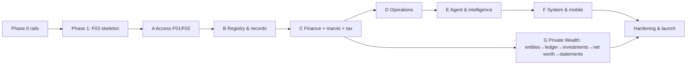

# Kanzen — Implementation Plan (single source of truth)

The one plan we build against. Bridges the spec (`../Kanzen-Platform-Spec.md`, the *what/why*) and the per-feature specs (`F__-*.md`, the *exactly how*). Supersedes the former `00-product-completion-plan.md` (merged here).

## Vision
Private **family-office / UHNWI** software, built by the owner for themselves: household operations + a full **asset registry**, on a core of **GnuCash-grade double-entry accounting** (translated to a modern stack on a **Postgres double-entry general ledger**), with an **AI capture pipeline** (OCR + ML categorisation; absorbs the `marvis` expense engine) and a **Private Wealth module** (consolidated net worth, investments, multi-entity). Real personas: Toby (Principal), Lorna (Manager), Marcia/Siti (Staff), + the email Agent.

## Where we are (honest)
Real: the StyleX design system + **theme engine** (light/dark, static CSS extraction). **44 feature specs (F00–F43)** written, each with UAT acceptance scenarios. **Phase 0 rails + Phase 1 walking skeleton done and verified end-to-end** (May 2026): config→Flyway→Doobie boot, Cognito JWKS auth + dev-JWKS fallback, default-deny `Authorizer` from `permission_rules`, seeded real users + 2 properties.

**All 44 features now at ✔️ Done (sandbox)** (May 2026): every feature has a backend vertical slice — Tapir API + authz + migration/seed — proven by **425 backend tests** (weaver + Testcontainers-PG, FreeSpec for pure logic), plus the web surface for the M1/Wave-B/C-D core (Vitest 56 + live Playwright, a11y/axe clean) and the Flutter companion (6 screens + capture-first Triage, widget tests). CI gates **backend + web + flutter** on every push (F0.4); `scalafmtCheckAll` clean. House invariants are each proven by a test: Kanzen never moves money (mark-paid manual-only → 409), single-spend (reconcile-once → 409), Principal-private + Manager field-strip, registry/finance/search/NL permission- & scope-filtered (no leak via totals → 403/404), agent financial/asset actions never auto-commit (F27 → 409), backup→restore faithful round-trip (F30 AC4), double-entry balanced-or-rejected (422).

**Not yet done (the gap to launch, much of it operator-gated per `SETUP.md`):** deferred *enhancement* web surfaces (Inventory value-totals [valuation-method decision pending] / Property·Tag filters / Timeline view / photo-cards, AssetDetail provenance·documents·quick-actions sections, Lists ordering workflow, Calendar week/month grid [event-creation shipped], **Vehicles** [from-scratch — needs scoping] — Settings role-management + dynamic/estate roles, Collections, Calendar new-event, Wealth dashboards, Inbox/⌘K all shipped); **prod integrations** — real Cognito pool, S3/LocalStack→real S3, Gmail+Bedrock, GoCardless, Pulsar transport, ECB FX job, APNs/FCM/SES; **real AWS** via Terraform/NixOS + **prod-credential swap**; and remaining hardening rigor (a11y/axe sweep, authz fuzzing, perf, visual-diff goldens; a11y ✓). "Done (sandbox)" ≠ "Done (prod)": the sandbox stack proves every feature end-to-end against dockerised Postgres; launch needs the operator to provision the real estate. "Tested module exists" ≠ done.

**Web-depth pass (2026-05-26).** Closing the gap between "backend done" and "a real user can use the screen": **all mock data deleted** from the web (`src/data/` is now just the money helper — no screen can fall back to demo data); a **token-derived identity engine** (`web/src/auth/claims.ts` → `AuthContext.role`) recalibrates role-gated UI synchronously with the bearer (fixed the impersonation→403 race). Five screens rebuilt to real, deep, prototype-grade and verified live: **Lists** (master-detail + approval queue + cadence/place-order), **Dashboard** (100% live reads), **PropertyBible** (defect lifecycle + editable rooms), **People** (HR roster + compliance + add), **Wealth** (realistic balanced UHNWI book ~£6.67m). See the **End-to-end UI completeness audit** below for the per-feature web-UI status (🟢 9 complete · 🟡 17 core-done · 🔵 13 backend-only). Backend + 61 web unit + full Playwright e2e (incl. audit/a11y guardrails) green.

## Definition of Done (every feature)
Full **web UI** (all states, light/dark, a11y) · **mobile** surface (or N/A) · **Tapir API** (auth + RBAC + audit) · **wired** (web/mobile consume the real API; its mock deleted) · **integration** (real or flagged sandbox) · **full test pyramid** · **design-matched** · **invariants honoured**. Done only when a real user can use it end-to-end against the real backend.

## The unit of work — Vertical-Slice Playbook
1 read spec → 2 DB migration/seed → 3 API (Tapir + authz + audit + OpenAPI) → 4 backend tests (FreeSpec + weaver + Testcontainers) → 5 web service+Zod+TanStack (delete mock) → 6 web UI + states (design-matched) → 7 web tests (Vitest + Playwright vs real API) → 8 mobile + widget test → 9 verify (visual diff + DoD) → flip status.

**Per-slice gates (do ALL before flipping status — the robust step-through):**
0. **Frame** — read the feature spec's acceptance + the `input/` design; state this slice's scope + explicit out-of-scope (record deferrals in the plan so they're never lost).
1. **Backend rigor** — Flyway migration (idempotent, registered in `specs/01-data-model.md` order) + **real seed** (not mocks); DB invariants (uuid PK · timestamptz · money = integer minor units + ISO currency · `owner_id` · soft-delete); every meaningful write → `audit_log_entries`.
2. **AuthZ — test the DENY paths**, not just the happy path: 403 wrong role · 404 out-of-scope · field-level stripping (e.g. valuations for Manager) · search/aggregates filtered server-side.
3. **House invariants checklist** (every slice): never moves money · financial/asset creation always *proposed*, never auto-commit · ledger hidden in UI (statements/registers only) · source documents immutable · everything permission+scope-filtered server-side · registry/finance Principal-private (Manager carve-out).
4. **Tapir/OpenAPI** — every endpoint `.summary(...)`'d, live at `/docs`.
5. **UI** — design parity with `input/`; render **all states** (loading/empty/error/forbidden); **ThemeContext only** (one token contract + dark `createTheme`; no inline `style={{}}`, no stacked conditional theming); idiomatic, accessible React.
6. **Tests** — Vitest unit + Playwright e2e vs the **real backend**; a11y beyond axe (keyboard · focus-trap + Escape on modals · focus return); assertions **pollution-robust + idempotent**.
7. **Regression gate** — full web unit suite + `tsc` + scalafmt + backend tests green; **a11y (axe AA) + full-route audit clean in light & dark** (the cross-slice safety net).
8. **Verify live at :3020** against the real backend — round-trip the flow; **screenshot in both themes**; leave the **dev DB pristine** (clean any test/demo pollution).
9. **Close out** — wire the UI to the real API (delete the mock); keep `SETUP.md` + data-model docs current; one focused commit on the build branch; **flip status in this plan** (record deferrals).

## Decisions (locked; override any)
- **Auth:** real **Cognito** from the start (JWKS middleware → `Principal` → default-deny `Authorizer`); CI/tests use a local **test-JWKS**. Cognito dev pool = first `SETUP.md` item (critical path).
- **Deployable:** Phase 1 = builds + runs on dockerised Postgres + CI green; real AWS (Terraform/NixOS) is the final wave.
- **Design:** match from `input/views/*.jsx` + `previews/`; visual-diff goldens.
- **Integrations:** sandbox-first → **Done (sandbox)** vs **Done (prod)** (prod creds at the final wave).
- **Money:** integer minor units + ISO currency everywhere; dinero.js on web; **FX (F37) before any multi-currency reporting**.
- **Ledger:** the general ledger is **Postgres double-entry** — TigerBeetle dropped (not an exchange). See `02-accounting-ledger-architecture.md` (**ADR-001**): source-of-truth, value/amount multi-currency, commodity precision, posting cookbook.
- **Wealth:** **multi-entity / multi-book from the start** (every account/txn entity-scoped; consolidation); **full investment accounting** (lots, capital gains, dividends, corporate actions, live prices).
- **Tracking:** status `Backlog → In-slice → Done (sandbox) → Done (prod)`; one slice in flight; wave gate before the next.

## Phase 0 — rails (one-time, no features yet)
API scaffold (`/api`, error model, OpenAPI, **Cognito JWKS middleware + default-deny Authorizer**) · web data layer (TanStack Query + Zod + Cognito login + loading/empty/error/forbidden) · **CI** (backend+web+Flutter on every push) · local real-data stack (docker Postgres seeded: real users + 2 properties) · Flutter foundation (Dart client + capture-first IA) · visual-diff harness. **Gate:** rails exist, CI green, app runs on real Postgres.

## Phase 1 — walking skeleton
**F03 Properties (read)** through every layer: Cognito login → `GET /api/me` → `GET /api/properties` (Authorizer-filtered, from Postgres) → Properties page renders real data → Playwright (test-JWKS) → CI green → docker. **Gate:** a real user logs in and sees the two seeded properties **from the DB**, light+dark, tested. Proves the stack; every later slice repeats the Playbook on top.

## Waves & feature index (the tracker)
Dependency-ordered. `Spec` = spec written; `Build` = implementation status. Waves supersede the legacy `M` numbers in the spec headers.

| ID | Feature | Wave | Depends on | Spec | Build |
|---|---|---|---|---|---|
| F00 | Foundation: infra, repo, design system | Phase 0 | — | ✅ | 🚧 rails + design system done; CI green-gate (backend+web+flutter, scalafmt) ✓; mobile foundation ✓ (F31); **Terraform launch substrate ✓ (validate-clean)**; cross-cutting authz-fuzz suite ✓; **a11y/axe sweep ✓ (every route, in CI)**. Pending: visual-diff goldens (F0.7), real-AWS apply (operator) |
| F01 | Identity, auth & session (Cognito) | Phase 0/1 | F00 | ✅ | 🚧 In-slice (auth + DB principal resolution + /api/me + web login done; real Cognito pool + auto-provision pending) |
| F02 | Authorization (resource/field RBAC + custom roles + property **& entity** scope) | A | F01 | ✅ | ✅ Done (Authorizer + permission_rules + property/entity scope + field-filter; **/api/me exposes the effective permission set → the web nav/UI recalibrates to the principal via can()**; **impersonation engine** (admin act-as any user → UI recalibrates + 'viewing as' banner + Stop, audited; kinetic-style); **admin role-management UI** (Settings page edits the permission matrix — none/read/write/admin × resource/field × role, audited, root-grant lockout-protected). All proven live + tested (backend RolesApiIT/ImpersonateApiIT, web Vitest + Playwright)) |
| F03 | Properties, locations & defects | B (skeleton) | F02 | ✅ | ✔️ Done (sandbox) — backend complete; web list/Bible/Add-property wired + e2e; **in-Bible write forms (2026-05-26): Report defect + lifecycle (Start/Resolve/Won't fix/Reopen), Add room; rooms+defects seeded (V2_63)**. **W4 COMPLETE (2026-05-28): Bible tabs (Assets/Maintenance/Documents, V2_76) + Overview depth (Particulars + Linked-systems, V2_77) + location-tree depth (richer kinds, per-node items, rename/move/reparent, delete-guard, V2_78) + defects ops (assign vendor/spawn task/edit, V2_79) + property admin (edit particulars/archive).** **Utilities/bills tab shipped in W5.1** (`Bill.propertyId`). Deferred: mobile (via F31) |
| F04 | Asset registry core (JSONB) | B | F03 | ✅ | ✔️ Done (sandbox) — backend (list/detail/create/categories/seed, authz, modes, JSONB) + web Inventory/detail wired + e2e; location/custody, collections multi-ccy deferred; field-strip (AC5) done via F20 |
| F05 | Documents — S3 evidence store | B | F02 | ✅ | ✔️ Done (sandbox) — backend (upload/list/detail/links/presign/dedup/soft-delete, visibility+scope, ObjectStore; createdAt exposed) + **web Documents (W8.2): 4 KPI tiles, search + category filter, type-iconed table w/ immutable shield + Uploaded date, drag-and-drop upload (PDF/image/any), click-row → in-app preview (PDF iframe / image / download); MediaGallery now accepts + renders PDFs (file tile → open) so attachments everywhere take PDFs** + e2e (PDF upload→preview). Deferred: embedded asset/property doc tabs, attached-to column, real S3/LocalStack binary, parse-run versions |
| F22 | Verticals & category templates | B | F04 | ✅ | ✔️ Done (sandbox) — backend (versioned templates, typed validation wired into asset create, GET/POST endpoint, seed) + tests + **web template-driven create form + Specs display (W3)**. Deferred: enum/select field types |
| F33 | Custom fields, tags & taxonomies | B | F02, F04, F22 | ✅ | ✔️ Done (sandbox) — backend (typed custom_field_definitions, polymorphic tags, infinite user-defined taxonomies; API for all three; Principal-define/Manager-use/Staff-read authz; sensitive-field strip helper) + ITs + **web `/customization` (tags + custom-field editor + taxonomy tree) + tag chips on the asset detail (W3)**. Deferred: enum-value editor, node reorder/rename, unknown-key DQ flag (F23) |
| F23 | Completeness scoring & data quality | B | F04, F19–F22 | ✅ | ✔️ Done (sandbox) — backend (live per-asset completeness + improve-hints, registry-health aggregate, idempotent scan→flags, resolve/dismiss; registry-private authz Staff-403/Mgr-operational) + ITs **+ web Insights surface (registry-health bars + DQ flag stream + scan/resolve, live-wired)**. Deferred: completeness cache, dup/anomaly (needs F13 embeddings), scheduler |
| F19 | Lifecycle events & timeline | B | F04 | ✅ | ✔️ Done (sandbox) — backend (log event + timeline + lifetime cost, authz) + web AssetDetail Lifecycle `<Timeline>` (typed, backdate, party, closes-on-sold/lost) + **move/custody + location/custody history (W1.4)** + e2e (W2) |
| F20 | Valuation snapshots | B | F04 | ✅ | ✔️ Done (sandbox) — backend (record/list latest-by-kind, Principal-only) + field-level stripping for Manager (closes F04 AC5) + web detail + **aggregate valuation summary (history + relative Bars + valued_at, W2.3)** |
| F21 | Warranty / provenance / insurance | B | F04 | ✅ | ✔️ Done (sandbox) — backend (warranties registry-write; insurance Principal-only via field authz) + web AssetDetail card + **provenance party-roles (`<ProvenanceParties>` maker/restorer/appraiser/…, W2.3)** + tests |
| F24 | Legacy onboarding & restructure | B | F04, F19, F20 | ✅ | ✔️ Done (sandbox) — backend (legacy create w/ uncertainty note AC1; merge AC3 + split AC4 — cost-basis reallocated, lineage preserved, originals superseded-not-deleted AC5, reversible) + ITs + **web Restructure modal (split/merge/undo, W3)**. Deferred: bulk-import staging/UI (AC2), regroup/convert/reallocate |
| F10 | People / HR | B | F02 | ✅ | ✔️ Done (sandbox) — backend (roster/detail/create/expiring, Staff own-only authz, permit surfacing) + **web People (2026-05-26): "Needs attention" compliance section, roster + countdown pills, Add person** + **person detail page (W7.1): particulars, contract + key dates (start/end/contract type), work-permit no., emergency contacts, payroll ref, notes, HR documents (`MediaGallery target=person`); enriched detail view + jsonb emergency_contacts (V2_84) + rich team seed** + e2e + a11y. Deferred: leave (request→approve→calendar), offboarding, principal-private HR-doc visibility subset |
| F09 | Vendors & contacts | B | F03 | ✅ | ✔️ Done (sandbox) — backend (scoped list/detail/create/approve/selectable, insurance gating, Staff read-scoped) + web Vendors wired + e2e; history panels (maintenance/bills/asset-roles) deferred to their features |
| F37 | Currencies & FX (ECB source + cache, rate-at-date) | C | F12, F17, F20 | ✅ | ✔️ Done (sandbox) — backend (native-truth; convert at rate-on-date w/ base-triangulation + label; rollup w/ per-currency breakdown + unconvertible list; rate-at-ingestion captured & never re-stated AC1) + ITs (AC1/AC2 + missing-rate 422). Deferred: ECB fetch/backfill job, display-currency persistence, web selector |
| F12 | Bank ingestion & transactions (AIS) **+ CSV import (marvis)** | C | F02 | ✅ | 🚧 backend done (accounts/transactions/CSV-import, idempotent, finance carve-out authz, seed, tests) **+ web Finance Transactions tab (accounts + txns w/ reconciliation-state pills, live-wired)**; GoCardless sandbox deferred |
| F13 | Receipts, OCR/parse + ML categorisation **+ brand/product resolution** | C | F05, F04 | ✅ | 🚧 backend done (receipts+line items, brand-norm resolution, line confirm, product-level spend F32, finance authz, tests) **+ web Receipts tab (receipts + brand-normalised line items w/ category, live-wired)**; OCR/Bedrock parse adapter deferred (infra) |
| F14 | Reconciliation engine (**single-spend / dedup association**) | C | F12, F13 | ✅ | ✔️ Done (sandbox) — backend (txn↔receipt match, single-spend 409 guard, unmatched list, **auto-suggest scoring by amount/merchant/currency → ranked candidates + reasons**, finance authz) + ITs **+ web Reconcile tab (auto-suggested matches w/ score badge + one-click Confirm) & reconciliation-state in Transactions tab, live-wired**; split/refund/transfer deferred |
| F15 | Bills & recurring schedule | C | F03, F09 | ✅ | ✔️ Done (sandbox) — backend (bills CRUD, ±15% variance) + web Finance Recurring tab + e2e; **W5.1 (2026-05-28): Add-bill modal (payee·category·property·amount·cadence) + `Bill.propertyId`/`category` → category column + Property-Bible Utilities tab.** Deferred: Edit-bill (PATCH), calendar reminders |
| F16 | Payment methods & Pay queue (never moves money) | C | F15 | ✅ | ✔️ Done (sandbox) — backend (methods/schedule/queue, mark-paid MANUAL-only→409) + web Pay-queue tab + **Add-method & Schedule-payment modals (W5.3)** + e2e |
| F17 | Budgets, expenses & approvals **+ income/deductibility (marvis)** | C | F15 | ✅ | ✔️ Done (sandbox) — backend (threshold→Principal approvals, deductibility/VAT) + web Expenses tab (approve/reject) + **Add-expense modal (W5.2)** + **Budgets tab w/ budget-vs-actual (W5.4, V2_80)** + e2e |
| F18 | General ledger — Postgres double-entry (hidden in UI) | C | F14 | ✅ | ✔️ backend done (gl_accounts/transactions/splits, balanced-or-rejected, derived balances, reversing corrections, registers, Principal-only) + tests **+ web Statements/registers view (W8.3): chart of accounts (grouped, derived balances) + per-account register (transaction-level statement lines, never raw postings); Principal-private**. Deferred: posting-cookbook auto-post (events post; no manual posting UI by design) |
| F38 | Tax, VAT & deductibility (marvis tax engine) | C | F13, F17, F37 | ✅ | 🚧 backend done (UK income-tax estimate, deductible/VAT report, Principal-only, estimation-only) + tests **+ web Finance Tax tab (income estimate + deductible/VAT report, live-wired)**; dividend/NI/corp-tax deferred |
| F29 | Dashboard, Insights & reporting | C | F18, F23 | ✅ | ✔️ Done (sandbox) — backend summary (authz/scope-filtered counts, no leak) + **Dashboard rebuilt to 100% real data (2026-05-26): live glance + attention strip (real triage + pending expenses) + Upcoming (calendar) + Properties + Expiring (permits/reviews) + Expenses-to-approve + agent triage feed + This-week's-lists; role-gated (Staff hides review surfaces); ALL mock data deleted from the codebase** + e2e **+ Insights surface: registry-health + value-by-category + top-assets + lifetime-spend KPIs (live-wired) + spend-trend (W8.6): a "Spend · last 12 months" bar chart of approved-expense GBP totals per month (native, no FX), riding the existing analytics endpoint** |
| F06 | Tasks — native | D | F03 | ✅ | ✔️ Done (sandbox) — backend (projects/tasks CRUD, recurrence-spawns-next, operational authz) + web **New-task modal (project·title·assignee·due·recurrence) + assignee/recurrence pills + due-date→Calendar overlay + assignee carries to next occurrence (W6.2)** + e2e. **Todoist-grade (2026-05-29): a `priority` (urgent/high/normal/low, V2_87) — colour-flagged + list sorted by priority then due; extended cadence (fortnightly/quarterly added to `TaskService.nextDue`); completion carries BOTH assignee + priority to the next occurrence. **Staff are scope-filtered to their own work** — assigned-to-them or unassigned-in-their-property (`AssigneeScope` resolved from `employment_records`); Manager/Principal see all; completing a task outside scope is 403 (proven by TasksApiIT).** **Todoist-grade view (2026-05-29): the flat pill-list was replaced — priority lives in the checkbox ring (urgent=red…low=faint), tasks are grouped into date buckets (Overdue/Today/Tomorrow/This week/Later/No date), due dates are human ("Today"/"Wednesday"/"12 Jun", overdue in red), recurrence shows as ↻, the assignee is a round avatar, completing is the circle (not a button), and completed tasks collapse away; richer seed (V2_88: 10 tasks across priorities/buckets/assignees).** **Associations (2026-05-29): a task can be linked to a property and/or one-or-more assets (`task_links`, V2_89) — set in the New-task modal's "Related to" (property dropdown + asset multi-pick) and shown as clickable chips on the row through to the asset/property (the "task about a specific piece of furniture" case); a reusable round `<Avatar>` (photo-ready, initials fallback). Backend add/remove-link endpoints + TaskView.links (labels resolved).** **Edit/delete (2026-05-29): clicking a task opens an Edit modal (pre-filled, incl. its links) → PATCH `/api/tasks/:id` (title/project/assignee/priority/due/recurrence) with link-diffing; soft-delete (status `cancelled`, excluded from lists) with a two-step confirm; completed tasks live in a collapsible "Show completed" history. Edit/delete writes are `task:edit`-gated + Staff-scoped.** **People identity (2026-05-29): the assignee avatar is a `<PersonAvatar>` — links to the profile page (`/people/:id`), reveals a hover/focus **profile card** (avatar · name · role · property · "View profile"), and offers **Reassign** (people dropdown → PATCH the assignee) to Manager/Principal; reusable beyond tasks.** Deferred: full RFC RRULE (interval/byday); real person **photos** to fill the avatars (server-side `photoUrl` resolution — `<Avatar>` is photo-ready + `photo_document_id` exists) |
| F07 | Calendar — Google (two-way) | D | F03, F06 | ✅ | ✔️ Done (sandbox) — backend (native event CRUD + merged view overlaying read-only task & maintenance dates; idempotent google_event_id sync seam; Principal/Manager author, Staff read) + ITs **+ web Month grid + agenda (W6.1) + timed Week/Day hour-grids (W6.5): property-local wall-clock `start_time`/`end_time` (V2_83), 07:00–22:00 grid, all-day strip for timeless events, click-an-hour→pre-timed new-event; merged task/maintenance overlays stay all-day**. Deferred (infra): Google Calendar API client (watch/syncToken/etag), RRULE, drag-to-reschedule |
| F08 | Lists | D | F03 | ✅ | ✔️ Done (sandbox) — backend (lists/items, Staff-propose→approve routing, Manager/Principal approve, **place-order roll-forward by cycle**) + **web Lists rebuilt to prototype parity (2026-05-26): master rail w/ cadence + pending badges, detail w/ next-order countdown + status chips, "Items awaiting you" approval queue (Approve/Decline), category-grouped items w/ staples + tick-off, Place order, New list; enriched API (cycle/next_order/category/note/est_price/added-by) + rich seed (V2_61)** + e2e. **Enhancements (2026-05-27): per-list Configure (property·vendor·cadence·next-order, PATCH /api/lists/:id); item substitutions ("sub items" nested under their item, skip approval; V2_65); item photos via drag-and-drop `MediaGallery` (F05 docs + `document_links target='list_item'` + signed `/api/blobs` URLs).** **Todoist-grade (2026-05-29): run-level `assignee_id` (assign the grocery run → Housekeeper; seeded V2_87) shown in the header + set in Configure; a list `priority`; and a clear one-off-vs-staple toggle on quick-add (default one-off "this run" — "add extra toilet paper to this week's run" — vs a repeating staple). Staff are scope-filtered to runs assigned to them (or unassigned in their property); Manager/Principal see all.** Deferred: replenishment auto-fill (F36) |
| F34 | Event backbone (events, queue, push) | D | F00 | ✅ | ✔️ Done (sandbox) — unified envelope + transactional outbox + in-process relay (at-least-once, resume-from-unpublished) + NotificationFanout consumer (F02-trimmed, idempotent) + notifications/subscriptions/devices API + emit wired into task.completed & product.out_of_stock; ITs (AC1/AC3/AC5) **+ web notification centre (unread list + mark-read) + top-bar bell (W8): unread badge + popover of recent items (mark-read on click) + "View all", polled, present on every route**. Deferred (infra): Pulsar+DLQ (AC4), APNs/FCM/SES, quiet-hours, buy-request consumer (AC6) |
| F35 | Products & stock (consumables) | D | F08, F09, F33, F34 | ✅ | ✔️ Done (sandbox) — backend (products list/create, stock state→F34 event, reorder list, manager-write/staff-read authz) + seed; **web Supplies surface (W6.4): shelf w/ stock chips + per-row stock segmented control (in/low/out), preferred-vendor buy-links, reorder lens; enriched view (unit + preferred vendor + buy_url via V2_82 seed) + e2e + a11y**. Deferred: product detail, vendor-CRUD UI, taxonomy grouping, stock history, staff-mark-out + strict property scope, out→Lists auto-propose consumer |
| F36 | Predictive replenishment | D | F35, F12, F13 | ✅ | ✔️ Done (sandbox) — backend forecast (avg interval / predicted-next / due-soon via pure ReplenishmentService) + IT; **reorder lens shipped on the W6.4 Supplies surface (low/out)**. Deferred to W8: materialised consumption (purchase→product matching, cadence display, due-scan job + `replenishment_due` event) |
| F11 | Maintenance plans & reminder engine | D | F04, F06, F07 | ✅ | ✔️ Done (sandbox) — backend (plans, due-soon reminders, complete-rolls-forward + logs) + web Maintenance page + **Spawn-task from a plan → property project, due=next_due, on the Calendar (W6.3)** + e2e |
| F25 | Email agent pipeline (Gmail + Bedrock) | E | F05, F13, F15 | ✅ | ✔️ Done (sandbox) — backend ingest→classify→propose actions + IT. Deferred (infra): Gmail fetch + Bedrock classification. **→ elevated into the [Collaborative Inbox v2](F25-F26v2-collaborative-inbox.md) (Wave W9; spec done, build infra-gated).** |
| F26 | Unified Inbox + Triage | E | F25, F14, F23 | ✅ | ✔️ Done (sandbox) — backend unified inbox counts + agent-action Triage stream (confirm/reject, 409 on re-act) + IT **+ web Inbox + Triage stream (live-wired; Review badge on financial proposals)**. **→ elevated into the [Collaborative Inbox v2](F25-F26v2-collaborative-inbox.md): real Gmail client (read+send), threaded mailbox, assignable threads, internal comments/@mentions/shared drafts, thread→task, archive, richer routing (grocery→list, car-service→vehicle). Spec done; build = Wave W9, infra-gated.** |
| F27 | Trust model, rules & learned categorisation | E | F25, F13 | ✅ | ✔️ Done (sandbox) — backend trust routing; financial/asset categories LOCKED to review (auto-execute 409, setTrust forced to review); confirm via agent-write authz + IT (never-auto-commit invariant proven). Deferred: learned categorisation |
| F28 | Search + ⌘K command palette (semantic) | E | F04, F12, F13 | ✅ | ✔️ Done (sandbox) — backend permission-filtered full-text search (no leak: hit returned only if role can read that entity type) + IT **+ web ⌘K command palette (global, debounced, permission-filtered, live-wired)**. Deferred (infra): pgvector semantic embeddings |
| F32 | Advanced: bulk onboarding, **NL query (product-level spend)**, Drive export | E | F28, F30 | ✅ | ✔️ Done (sandbox) — backend NL query (read-only structured intent → scope-filtered execution; gibberish 422) + ITs **+ NL-1 (2026-05-29): broadened intent catalogue (count · last-purchase · where-is · value-by-category · spend(finance) · due-soon(household)) + ⌘K "Ask" UI (answer inline w/ agent ribbon); Principal-only in v1 (Manager/Staff 403 — no leak via totals); deterministic translator in sandbox behind the Claude/Bedrock seam for prod**. **NL-2a (2026-05-29): a RAG index over the registry** — `entity_documents` (FTS tsvector, V2_85) rendered per asset (facts + provenance + custody + full Lifecycle timeline; `AssetDocRenderer`); an `Unknown`-intent prompt falls back to FTS retrieval so open questions ("tell me about the Royal Oak") are answered from the indexed doc; **freshness is a reconcile loop** (`IndexReconcile.loop`, ~15s) that re-renders every asset — so a new asset/update lands in the index within a cycle **even though asset writes audit rather than emit F34 events** (the F34 `IndexConsumer` covers event-emitting entities; reconcile is the safety net). Verified live (new asset → RAG-answerable). **NL-2b-i (2026-05-29): the three crisp single-fact intents** — `ServiceDueIntent` ("when is my car next due a service" → maintenance plan), `InsuranceAmountIntent` ("how much is my car insurance" → `asset_insurance` *cover*, honestly the sum insured, not a premium), `LastActivityIntent` ("when was the housekeeper last in" → most-recent calendar booking, role-noun stemmed to its activity title); a `subject()` extractor (noun after the last my/the) + `carSyn` (car→vehicle); ordered ahead of the spend/due branches so they aren't swallowed; **seed V2_86** makes all three answer for real (Range Rover service plan + Hiscox cover + past Housekeeping bookings). Verified live + IT. **NL-2b-ii (2026-05-29): RAG now spans all four entity groups** — `PersonDocRenderer` (role/contract/key-dates/permit/emergency contacts), `PropertyDocRenderer` (particulars + locations + open defects), `DocumentDocRenderer` (metadata + what it's attached to, OCR text still deferred-infra) feed the same `entity_documents` store; the reconcile loop drives a `groups` list so each is backfilled + kept fresh, and the F34 `IndexConsumer` routes person/property/document events too. Verified live ("tell me about Marcia" → Housekeeper · Wardian · contract · permit; "tell me about the Wardian" → particulars + rooms; "the tenancy agreement" → the filed PDF). Index population: asset/person/property/document. Deferred: finance/expense retrieval (Principal-private, ledger-hidden — kept out for now), document **OCR** body (infra), ⌘K **citations**, scoped multi-role NL, bulk onboarding, Drive export |
| F30 | Backup / export / restore | F | all domains | ✅ | ✔️ Done (sandbox) — backend (self-descriptive archive: dependency-ordered sections + manifest w/ per-section sha256; validate w/ tamper detection; dry-run writes nothing; full restore faithful delete→restore round-trip AC4; Principal-only) + ITs **+ web Backup screen (run export → manifest counts/checksums, validate, restore dry-run; live-wired)**. Deferred (infra): age encryption, S3 binary streaming, immutable snapshots, full entity coverage |
| F31 | Flutter companion (capture-first; Triage) | F | F00, key reads | ✅ | ✔️ Done (sandbox) — Flutter app (5 parity screens already) + new capture-first Triage screen (Capture FAB → review queue; Confirm/Reject; financial items marked Review per F27) + widget tests. Deferred: real Dart API client (mock-data), camera/OCR, offline queue, push deep-links |
| F42 | Legal entities, books & structures (multi-book foundation) | G | F02, F18, F37 | ✅ | ✔️ Done (sandbox) — backend (wealth_entities multi-book + consolidation tree; every gl_account entity-scoped; Principal-only) + ITs **+ web entity-management UI (W7.2): ownership tree (nested by parent), create + edit (name/kind/jurisdiction/parent; base currency immutable), reached via "Manage entities" off Wealth; PATCH /api/wealth/entities/:id (self-parent→400, Manager→403)**. Deferred: accounting-period close, intercompany elimination view, circular-ownership deep check, ownership-% (parent-child only) |
| F39 | Chart of accounts & double-entry transactions/splits | G | F42, F18, F37, F14 | ✅ | ✔️ Done (sandbox) — backend (entity-scoped COA asset/liability/equity/income/expense; balanced-or-rejected posting 422 on splits≠0; reuses GL engine; ledger hidden) + ITs **+ web COA + registers in the Statements view (W8.3)**. Deferred: trading accounts (multi-ccy) |
| F40 | Investments & securities (lots, gains, prices) | G | F39, F42, F37 | ✅ | ✔️ Done (sandbox) — backend (securities + price db + cost-basis lots; holdings at market w/ unrealised gain; FIFO sell→realised gain; oversell 409; records-not-trades; Principal-only) + ITs **+ web holdings table + record-a-trade UI (W7.3): Buy opens a lot / Sell closes FIFO and surfaces the realised gain; Add-security; per-entity, Principal-private**. Deferred: dividends/corporate actions, TWR/IRR, set-price UI |
| F41 | Liabilities & consolidated net worth | G | F39, F42, F37, F04/F20, F12, F40 | ✅ | ✔️ Done (sandbox) — backend (liability accounts; net worth = GL assets + investments@market − liabilities, per-entity/consolidated, computed + snapshotted; Principal-private hard 403) + ITs **+ web net-worth surface (hero + entity scope selector, live-wired); realistic UHNWI book seeded (V2_64, 2026-05-26): ~£6.67m consolidated, 2 entities, cash+2 properties−mortgage, diversified portfolio, balanced**. Deferred: illiquid-asset valuation pull-in (F04/F20), FX display ccy |
| F43 | Financial statements & wealth reporting | G | F39–F42, F37 | ✅ | ✔️ Done (sandbox) — backend (balance sheet; income statement by period; gl_splits, read-only) + ITs + web balance-sheet card **+ income-statement card (period selector) + CSV export (W5.5)** + budget-vs-actual (W5.4). Deferred: multi-ccy temporal translation, drill-down registers (F18/F39 → W8), PDF export |
| — | **Hardening & launch** | Final | all | — | 🚧 ✅ edge-case suite · ✅ backup→restore drill (F30 AC4) · ✅ a11y (axe, every route) · ✅ authz fuzzing (AuthzFuzzIT) · ⬜ perf · ⬜ real AWS infra (Terraform written, apply operator-gated) · ⬜ prod-cred swap · ⬜ visual-diff goldens |

## End-to-end UI completeness (audit — 2026-05-29, through NL-2b)
Every feature below is **Done (sandbox)** at the backend (Tapir API + authz + migration + ITs). This audit is strictly about the **web UI**: is *every* UI surface the feature needs shipped, wired to the real API, live on :3020, and tested? Judged against the per-feature specs + `input/` prototype. Mobile (F31) is a separate surface, tracked on its own row. Honest bar — "tested endpoint exists" ≠ UI done.

**Legend:** 🟢 UI complete (no web UI deferred) · 🟡 core workflow usable E2E, named UI extras deferred · 🔵 no dedicated web UI yet (backend-only, or surfaces only indirectly).

| Feature | UI tier | Web UI state — what's done / what's deferred |
|---|---|---|
| F02 Authorization | 🟢 | nav/UI recalibrates via `can()`; impersonation (act-as + banner + Stop); Settings role-matrix editor; **token-derived identity** drives role gating synchronously. No web UI deferred. **→ F02 v2 (in progress, `specs/F02v2-enterprise-rbac.md`):** enterprise RBAC — every action gated (object×verbs+specials) + permission sets/roles(inheritable)/teams(nested) + scopes(own/team/property/all) + builder UI; cohesive, non-breaking via a legacy-level bridge. **S1–S3 done (backend):** action catalogue + `can(action)` bridge · schema (sets/role_sets/inheritance/teams/user_roles) + composed `Authz.forUser` · whole API surface migrated to `can(action)` (verb-granular, proven by ListsActionScopeIT) + Own-scope on the registry; catalogue reconciled to real gating resources; Ledger/Roles/Impersonate/Defects/field-level valuation deliberately kept on the legacy path. **S4 done:** management API `/api/admin/rbac/*` (sets/grants, role composition+inheritance w/ cycle guards, nested teams, multi-role users) + effective-permissions preview (runs real `Authz.forUser`), all root-admin-gated + audited; **HubSpot-style builder UI** at Settings → Builder (Permission sets · Roles · Teams · People), token-driven (light+dark), axe-clean. **S5 done:** seeded 5 canonical starter permission sets (system, reusable bundles) — provably non-breaking (attached to no role; matrix + bridge stay the per-role source of truth) + a11y contrast fix. **→ F02 v2 COMPLETE.** Final regression on a pristine, seeded DB: backend 384/384, web 90/90 + 78/78 e2e + a11y clean. |
| F03 Properties & Bible | 🟢 | **W4 complete** — Bible **Overview depth** (Particulars + Linked-systems) / **location tree** (richer kinds, per-node items, rename/move/reparent, delete-guard) / **Assets/Maintenance/Documents** tabs / **defect ops** (assign vendor·spawn task·edit) / **property admin** (edit·archive) / **Utilities** tab (bills, W5.1). (mobile → F31) |
| F08 Lists | 🟢 | master-detail, cadence + next-order, approval queue (Approve/Decline), category groups + staples + tick-off, Place order, New list, **per-list Configure, item substitutions, item photos (MediaGallery)**, **run-level assignee + priority + one-off/staple quick-add (Todoist-grade)**. (auto-fill = F36) |
| F09 Vendors | 🟢 | list/detail/create/approve, insurance gating. (per-feature history panels belong to their features) |
| F26 Inbox & Triage | 🟢 | unified inbox counts + agent-action Triage (Confirm/Reject, Review badge on financial proposals) |
| F28 Search ⌘K | 🟢 | global debounced permission-filtered command palette |
| F06 Tasks | 🟢 | projects/tasks + **New-task modal** (project·title·assignee·**priority**·due·recurrence), priority/assignee/recurrence pills, **sorted by priority then due**, due-date→Calendar overlay, assignee+priority carry to next occurrence; cadence incl. fortnightly/quarterly (W6.2 + Todoist-grade). Deferred: full RFC RRULE (interval/byday) |
| F07 Calendar | 🟢 | **Month grid** + 60-day agenda + category filter + New event (W6.1) + **timed Week/Day hour-grids** (property-local wall-clock, all-day strip, click-hour→pre-timed event; W6.5). Deferred: drag-to-reschedule, RRULE |
| F04 Inventory / assets | 🟢 | list + detail + New asset + FilterRail (Category/Property/Status/Collection/**Tag**) + search + value-totals + completeness/proof stats; grid cards lead with a **hero-photo cell** (thumbnail when photographed, else an initial placeholder); AssetDetail = Key facts/Specs/Lifecycle/Valuations/Insurance+warranty + edit/log/valuation/move/custody/hero. Deferred: seeded hero images (un-photographed assets show placeholders until a photo is uploaded), per-card tag pills |
| F19/F20/F21 Asset records | 🟢 | **W2 complete** — typed side-effecting **Lifecycle timeline** (`<Timeline>`, backdate, party, closes asset on sold/lost) + **Valuations** summary (history + relative Bars + `valued_at`, Principal-only) + **provenance party-roles** (`<ProvenanceParties>`: maker/restorer/appraiser/…) + Insurance & warranty. |
| F10 People / HR | 🟡 | "Needs attention" compliance + roster + Add person + **person detail page** (particulars, contract/key-dates, work-permit, emergency contacts, payroll ref, notes, HR documents; W7.1). Deferred: leave→calendar, offboarding, HR-doc visibility subset |
| F11 Maintenance | 🟢 | plans + due-soon + complete-rolls-forward + **Spawn task** (→ property project, due=next_due, lands on Calendar; W6.3). |
| F23 Insights / DQ | 🟡 | registry-health bars + DQ flag stream + scan/resolve + value-by-category/top-assets/lifetime-spend KPIs. Deferred: completeness cache, anomaly/dup (needs F13 embeddings) |
| F29 Dashboard | 🟢 | **100% real data** Dashboard (glance, attention strip, Upcoming, Properties, Expiring, Expenses-to-approve, agent feed, lists), role-gated + Insights (analytics, health, flags, **spend-trend chart W8.6**). |
| F05 Documents | 🟢 | **rich evidence store (W8.2)**: KPI tiles, search + category filter, type-iconed table + Uploaded date, drag-drop upload (PDF/image/any), in-app preview (PDF iframe / image); MediaGallery accepts PDFs. Deferred: embedded asset/property doc tabs, attached-to column, real-S3 binary |
| F12 Bank / transactions | 🟡 | Finance → Transactions tab (accounts + txns + reconciliation-state). Deferred: GoCardless (infra) |
| F13 Receipts | 🟡 | Finance → Receipts tab (receipts + brand-normalised lines + category). Deferred: OCR/Bedrock parse (infra) |
| F14 Reconciliation | 🟡 | Finance → Reconcile tab (auto-suggested matches + score + one-click Confirm). Deferred: split/refund/transfer |
| F15 Bills | 🟢 | Finance → Recurring tab (schedule + ±15% variance + category) + **Add-bill modal**; bills carry property → **Property-Bible Utilities tab**. Deferred: Edit-bill (PATCH) |
| F16 Pay queue | 🟢 | Finance → Pay tab: payment methods + **Add-method** & **Schedule-payment** modals + queue + mark-paid MANUAL-only (W5.3) |
| F17 Budgets/expenses | 🟢 | Finance → Expenses tab (approve/reject + deductibility/VAT + **Add-expense**, W5.2) + **Budgets tab** (per-property budget-vs-actual vs approved expenses, W5.4) |
| F38 Tax | 🟡 | Finance → Tax tab (income estimate + deductible/VAT report). Deferred: dividend/NI/corp-tax |
| F34 Notifications | 🟡 | Notifications centre (unread list + mark-read) + **top-bar bell: unread badge + popover + View-all** (W8). Deferred: quiet-hours |
| F30 Backup | 🟢 | run export → manifest counts/checksums, validate (tamper), restore dry-run |
| F40 Investments | 🟡 | Wealth → holdings table + **record-a-trade (Buy/Sell FIFO → realised gain) + Add-security** (W7.3). Deferred: dividends/corporate actions, TWR/IRR, set-price UI |
| F41 Net worth | 🟡 | Wealth → net-worth hero + cash/investments/liabilities + entity scope; realistic UHNWI book seeded. Deferred: FX display ccy |
| F42 Entities | 🟡 | entity scope selector (Consolidated / per-entity) in Wealth + **entity-management UI: ownership tree + create/edit** (W7.2). Deferred: ownership-%, period close, intercompany elimination |
| F43 Statements | 🟢 | Wealth → balance-sheet + **income-statement (period selector) + CSV export** (W5.5); budget-vs-actual (W5.4). Deferred: drill-down registers (W8), PDF export |
| F22 Category templates | 🟢 | **W3** — New-asset renders typed fields from the vertical's template (number-coerced/required) → `attributes`; Specs section shows them; Vehicles uses it (reg/colour/MOT…). Deferred: enum/select field types |
| F33 Custom fields/tags/taxonomies | 🟢 | **W3** — `/customization`: Tags manager + typed custom-field-definition editor (per entity) + taxonomy-tree editor; tag chips on the asset detail. Deferred: enum-value editor, node reorder/rename |
| F24 Legacy onboarding & restructure | 🟡 | **W3** — guided **Restructure** modal: split into N (cost-allocated) + merge into a survivor, each with **Undo**. Deferred: legacy **bulk-import** staging UI |
| F18 General ledger | 🟢 | **Statements view (W8.3)**: chart of accounts + per-account registers (statement lines, never raw postings); Principal-private. Posting is via domain events (no manual-post UI by design). |
| F39 Chart of accounts | 🟢 | COA (grouped, balances) + registers in the Statements view (W8.3). |
| F37 Currencies & FX | 🔵 | no display-currency selector |
| F35 Products & stock | 🟡 | **Supplies surface (W6.4)**: shelf, stock chips + per-row in/low/out control, preferred-vendor buy-links, reorder lens. Deferred: detail, vendor-CRUD UI, taxonomy grouping, stock history, staff mark-out + property scope, out→Lists consumer |
| F36 Predictive replenishment | 🔵 | reorder lens (low/out) on the Supplies surface; cadence analytics (matching + due-scan) deferred to W8 |
| F25 Email agent pipeline | 🔵 | no own UI — proposals surface in Inbox/Triage (F26) |
| F27 Trust model | 🔵 | no own UI — enforced server-side; surfaces as "Review" badges in Triage |
| F32 NL query / bulk / export | 🟡 | **⌘K "Ask"** (NL-1): broadened intents (registry/finance/household), answer inline w/ agent ribbon, Principal-only. **NL-2a: RAG index over the registry** (`entity_documents` FTS; asset facts+provenance+custody+timeline) → open questions fall back to retrieval; reconcile-loop freshness (new asset/update indexed within ~15s, covers audit-only asset writes). **NL-2b-i: 3 crisp single-fact intents** — service-due, insurance-cover (sum insured, not premium), last-activity (role-noun→activity-title stem); seeded to answer for real. **NL-2b-ii: RAG spans all four groups** — people (role/contract/permits), properties (particulars + rooms + open defects), documents (metadata + attachments) join assets in the index; reconcile keeps each fresh. Deferred: finance/expense retrieval (ledger-hidden), document OCR body (infra), ⌘K citations, scoped multi-role, bulk onboarding, Drive export |
| F00/F01 Foundation/Auth | 🔵 | infra + DevLogin/`/api/me` plumbing (not a feature screen) |
| F31 Flutter companion | 🔵 | separate mobile surface (6 screens, mock data — own row) |

**Summary (W6 complete; W7/W8 in progress):** 🟢 **22 UI-complete** (F02, F03, F04, F05, F06, F07, F08, F09, F11, F15, F16, F17, F18, F19/20/21, F22, F26, F28, F29, F30, F33, F39, F43) · 🟡 **13 core-usable, extras deferred** (F10, F12, F13, F14, F23, F24, F32, F34, F35, F38, F40, F41, F42) · 🔵 **6 backend-only / no dedicated UI** (F00/F01, F25, F27, F36, F37, F31-mobile). The old "Finance is mostly read" theme is **resolved** (W5); **W6 Operations surfaces complete**. Remaining web gaps: **W7** — ✅ People detail (F10), ✅ entity-management (F42), ✅ investments record-a-trade (F40); F41 illiquid valuations, FX selector (F37); **W8** — ✅ notifications bell (F34), ✅ rich Documents (F05), ✅ ledger statements/registers (F18/F39); ✅ Directory (W8.4), ✅ Settings tabs (W8.5), ✅ spend-trend (F23/F29, W8.6), ✅ NL query ⌘K Ask (F32, NL-1), ✅ NL-2a RAG index over the registry (reconcile-loop freshness), ✅ NL-2b-i three crisp single-fact intents (service-due · insurance-cover · last-activity, seeded), ✅ NL-2b-ii RAG across all four entity groups (people/property/document join assets, reconcile-kept-fresh); ⌘K citations + finance/OCR retrieval, replenishment cadence (F36).

## Forward build plan — actionable slices (2026-05-27)
The ordered backlog to close the 🟡/🔵 gaps above and reach in-depth Done. Each `[ ]` is one **vertical-slice** (DB/seed → API gap if any → service+Zod → UI+states → tests → verify live at :3020), the same loop used for Lists/Dashboard/PropertyBible/People/Wealth. Waves are value+dependency ordered; one slice in flight; check off as shipped. 🔒 = **operator-gated** (needs SETUP.md provisioning — can't be completed in the sandbox).

**Design coverage (`input/` from Claude Design — build to the view, not just the spec text).** `styles.css` is implemented as StyleX tokens, **incl. the `--font-sans`/`--font-mono` stacks applied app-wide and the `input/icons.jsx` set ported 1:1** (2026-05-29 fix — earlier the app fell back to the browser serif + used re-drawn icons). Screen → design source: Dashboard `dashboard.jsx` · Inbox `inbox.jsx` · Triage `triage.jsx` · Inventory `assets.jsx` · Asset detail `asset-detail.jsx` · Collections `collections.jsx` · Insights `insights.jsx` · Properties/Bible `properties.jsx` · Finance `finance.jsx` · Calendar `calendar.jsx` · Lists `lists.jsx` · Backup `backup.jsx` · ⌘K `search.jsx` · Maintenance modal `add-maintenance.jsx` · Mobile `mobile.jsx`; **People · Vendors · Documents · Tasks · Vehicles · Settings · Directory** + the role×module **PermissionsMatrix** all live in `stubs.jsx`; shell/nav/topbar `app.jsx`; sample shapes `data.jsx`/`data-inventory.jsx`. **Every slice below must match its design view.**

**Design-driven items the spec-only plan missed (now folded in):**
- **Vehicles** is a *bespoke card view* (garage · name · colour · reg + MOT/Tax/Insurance meta-grid), not a generic Inventory filter → W3.
- ✅ **Directory** screen (operational mailboxes + role addresses) — shipped W8.4.
- **Documents** design is rich: 4 KPI tiles (docs/storage/parse-runs/line-items) + search + category segmented filter + table with attached-to + immutable/parse-run badges + agent ribbon → W8 (ours is simpler).
- ✅ **Settings** 4 tabs — Integrations · Permissions · Preferences · Audit log — shipped W8.5.
- **Shell** (`app.jsx`): grouped nav incl. a **Directory** item + **external-integration markers** on Tasks/Calendar + a **Mobile-preview** toggle (have brand/⌘K/theme) → W8.
- Intentional divergences to KEEP: **People/Vendors** already exceed the simple stub design; **Wealth/Notifications** are real features the design snapshot predates.

**Registry & property core comes FIRST** (W1–W4): it's the spine of Kanzen — everything-is-an-asset-in-a-location-with-a-timeline — and the audit under-weighted it. Finance and the rest follow. Within a wave the slices are top-to-bottom order.

### ✅ W1 · Asset registry depth (F04 — the create/browse/detail spine) — design: `assets.jsx`, `asset-detail.jsx`, `collections.jsx` — **COMPLETE**
The Inventory create is unique-only (title/maker/category); filters are Category/Status only; detail lacks docs/comments/tags/collections/move. Per F04 §5.
- [x] **F04** **Full create form** (2026-05-27) — tracking mode (unique / grouped_quantity +qty / structured_set) · **location picker** (property → room) · **acquisition cost/date/currency** · **collection**; card ×N/set badges already present. Deferred: structured-set child entry → W3 (F24), "At service" badge → W2 (custody).
  - [x] **Vertical-aware create + brand catalogue** (2026-05-27) — launching from a vertical (e.g. Vehicles) presets the category; **Maker = autocomplete** from a **global brand catalogue** (`specs/03-brand-catalogue.md`: `brands` + per-account `brand_usage` hot cache; ranked hot-cache→usage→verified→alpha; `GET/POST /api/brands` find-or-create+use; crowd-enriched, stays global under multi-tenancy), seeded with ~273 researched brands across 8 categories; record-on-create grows the catalogue + hot cache. Tags-on-create still deferred → W3 (F33). Deferred: vertical *typed* fields (reg/VIN/mileage) → W3 (F22); community→verified moderation, aliases/fuzzy, agent/mobile consumers.
- [x] **F04** **Faceted filter rail** (2026-05-27) — server-side **Property + Collection** facets (+ Category/Status) with active-filter chips; **Acquisition-value rollup** strip (per-currency, no silent FX) + value on every card/row. Backend: `GET /api/assets` gains property/collection/status filters; AssetView carries cost + resolved propertyId. Deferred: **Tag** facet → W3 (F33), card photo-placeholder → F05 hero photos.
- [~] **F04** **Asset-detail completeness** — *partial (2026-05-27):* ✅ **Photos** section (`<MediaGallery targetType="asset"/>` reuse — drag-drop upload, thumbnails via `/api/blobs`, remove) + ✅ **tags** display (`<TagChips>` — add/create/remove; backend reverse `GET /api/tag-links/:type/:id` + `DELETE` untag) + ✅ **in-collections** Key-facts row (`GET /api/assets/:id/collections`). Remaining: **Documents** tab (PDF/parse-run, F05 — MediaGallery is image-only today) → W8; **Comments** tab (new feature, no backend yet); sidekick **quick actions** (move/restructure) → W1.4.
- [x] **F04** **Move / custody / hero** (2026-05-27, W1.4) — move via property→location picker (target **scope-checked → 403 out-of-scope**, AC4) + custody-change modal → write `asset_location_history` / `asset_custody_history` (actor + timestamp) alongside the current value + audit; **Location + Custody** key-facts + a **history** section; **hero photo** set from the gallery (★) rendered as a detail banner (AC8). Migration `V2_66_0` (+ `assets.hero_document_id`). Tests: `AssetMoveCustodyIT` (AC4/AC8/custody/staff-403) + `MediaGallery`/inventory e2e + a11y/audit, both themes. **Deferred:** full asset-detail hero-card+tabs+sidekick redesign (cross-feature F19/F20/F23/Comments) → own slice; Inventory **card** hero image (needs batch hero-URL resolution) → with F05 card-photos; modal focus-trap (cross-cutting; Escape done).
- [x] **F04** **Asset groups** (order / set / rig) (2026-05-27, W1.5) — peer groupings (distinct from structured sets + collections). Migration `V2_67_0` (`asset_groups` + `asset_group_members`, `kind` order/set/rig/other); `GroupRepo` + `Groups` API (`GET/POST /api/asset-groups`, `GET/POST/DELETE /api/assets/:id/groups[/:groupId]`, registry-private + audited); web `<AssetGroups>` "Groups" section on the asset detail (chips w/ kind + add-existing/create-new + remove). Tests: `GroupsApiIT` (create/add/remove/forAsset + bad-kind-400/unknown-404/staff-403) + `AssetGroups` unit(5) + inventory e2e + a11y/audit, both themes. **Deferred:** a dedicated Groups browse page + nav item (no design slot); merge/split/regroup (F24). *(Also fixed a pre-existing stale `PropertiesApiIT` assertion — `rooms==0` → `==9` after the V2_63 Bible seed.)*

### ✅ W2 · Asset timeline & lifecycle (F19 + F20/F21 — the provenance heart) — design: `asset-detail.jsx` (TimelineTab + EventDot) — **COMPLETE**
Current AssetDetail has a basic event log; the spec is a typed, side-effecting timeline. Per F19 §5/§6.
- [x] **F19** **Full timeline** (2026-05-27) — reusable `<Timeline>` component (design EventDot): typed colour-coded dots (acquired=accent · valuation=green · service/clean=**info** cyan · move/custody=**violet** purple · loss/damage=red · note/sold=muted), date · icon · title/subtitle/party · cost pill. Added `info`/`violet` tokens (light+dark). Built generic (accepts an explicit `tone`) so the **platform audit log** reuses it. Tests: `Timeline.test.tsx` + inventory e2e (a logged service event lands as an info-tone row); a11y-clean both themes. Deferred to W2.2: value-delta pill + retroactive-insert correctness (data already sorts by `occurred_at`).
- [x] **F19** **Rich log-event** (2026-05-27, W2.2) — type · **date (backdate, AC5)** · cost · **party** (vendor/person, shown on the timeline) · note; side-effects: `sold/gifted/lost/stolen`→closes the asset (ownership_status, AC3); cost→lifetime cost (already rolled up); **every event audited** (`asset.<type>`) so it also appears in the asset's Activity feed (§11). Tests: AssetEventsApiIT AC3/AC5/§11 + inventory e2e. **Deferred:** per-event document attach; valuation-delta events (the F20 Record-valuation flow already covers Principal-gated values → AC4 is satisfied there); associated-cost→ledger posting (F17/F18) when those land.
- [x] **F20/F21** (2026-05-27, W2.3) — Asset detail **valuation summary** (history with dates + relative-magnitude Bars; `valued_at` exposed) + **provenance party-roles** (`asset_parties`: maker/restorer/appraiser/prior_owner/dealer/insurer; `<ProvenanceParties>` card, list+add+remove, asset:view/edit-gated, audited, seeded V2_74); insurance Principal-only (built). Tests: ProvenanceApiIT + ProvenanceParties.test + inventory e2e. **→ W2 (asset timeline & lifecycle) COMPLETE.**

### ✅ W3 · Verticals, vehicles, tags & restructure (F22 / F33 / F24) — **COMPLETE**
- [x] **F22** **Template-driven typed create + Specifications** (2026-05-27, W3) — New-asset renders typed fields from the vertical's template (`GET /api/templates/:vertical`; number-coerced, required-marked) → `attributes`; Specs section renders them. Tests: Inventory.test + vehicles.spec (create w/ registration → shows in Specs). Deferred: enum/select field types + per-field labels (the schema is key+type+required today).
- [x] **Vehicles** (2026-05-28, W3) — bespoke `VehicleCard` on `/vehicles` (the 'vehicle' vertical, not a separate module): maker · title · colour/model · **reg plate** + MOT/Tax/Insurance meta with **due-soon pills** (overdue/≤30d/ok). Vehicle template extended (colour + mot/tax/insurance_due, V2_75) + Range Rover seeded; `AssetView.attributes` surfaced for cards; date spec-fields get date pickers; brand autocomplete on create (Maker); the **service log = the F19 event timeline** on the vehicle detail. Tests: Inventory.test + vehicles e2e. Deferred: model-autocomplete (deep brand catalogue) + MOT/Tax reminder calendar events (F11). **→ W3 COMPLETE.**
- [x] **F33** **Tags + custom fields + taxonomies** (2026-05-27, W3) — `/customization` page + nav item (gated on `custom_field` read): Tags manager, typed Custom-field-definition editor (per entity; text/number/money/date/bool/enum/url + sensitive + delete), user-defined Taxonomy tree editor (create + add parent-indented nodes). Write role-gated client + server. Tests: Customization.test + customization e2e + a11y. Deferred: enum-value editor UI, drag-reorder/rename/delete nodes, tag usage counts.
- [x] **F24** **Restructure flow** (2026-05-27, W3) — guided **Restructure** modal on the asset detail: **split** into N children (cost allocated) + **merge** into a chosen survivor (lineage+cost preserved), each with **Undo** (reverse the op) + Open-survivor. `restructure.ts` + RestructureModal; restructure e2e (split→result→undo). Deferred: **legacy bulk-import** staging (distinct CSV/multi-row surface; `legacyCreate` exists) + a regroup UI.

### ✅ W4 · Property administration — the full Bible (F03) — design: `properties.jsx` — **COMPLETE**
Bible has only Overview/Rooms/Defects; spec wants the full record. Per F03 §5.
- [x] **F03** **Bible tabs** ✅ (2026-05-28) — added **Assets** (server-scoped via `?property=`, resolved through location → property; placed 5 seeded items into Wardian rooms, V2_76), **Maintenance** (plans filtered to the property; `PlanView.propertyId` exposed), **Documents** (filtered to the property; seeded EPC/Insurance/Title-Register papers as immutable originals, incl. one `principal_private` deed to exercise the visibility carve-out). Asset rows deep-link to `/inventory/:id` + "Open in registry →" (`/inventory?property=` now honoured by Inventory). Tests: 4 vitest scoping tests + 3 Playwright (incl. Manager cannot see the private deed) + a11y clean (light+dark). **Utilities (bills) tab — now shipped in W5.1** once `Bill.propertyId` landed (bills scoped to the property).
- [x] **F03** **Overview depth** ✅ (2026-05-28) — full **Particulars** (address · country [friendly from jurisdiction] · type · ownership · jurisdiction · currency · building-management · status · open-defects) + a **Linked systems** card (task project *resolved to its name* · Google Calendar id · Drive folder path · 1Password vault NAME — **reference only**, with an explicit "never credentials or secrets" assurance). Backend: `properties` + `building_management`/`task_project_id`/`google_calendar_id`/`drive_folder`/`onepassword_vault` (V2_77, both real properties seeded); `PropertyRepo.particulars` (joins task project for the name); `PropertyDetail` gains particulars + nested `LinkedSystems`. Tests: 2 vitest + 1 Playwright + PropertiesApiIT assertions; a11y clean (light+dark).
- [x] **F03** **Location tree depth** ✅ (2026-05-28) — the Rooms tab is now the full nested tree: **richer kinds** (room/area/cabinet/shelf/case/garage/storage in create+edit), **per-node item lists** (count badge + expand → the items located there, click → registry detail), **rename/edit** (PATCH), **move/reparent** a subtree (modal excludes self+descendants; server guards cycles + cross-property), and an **asset-aware delete-guard** ("move N item(s) and M sub-location(s) first" — surfaced inline). Backend (API already had move/patch/delete): added a `location` facet to the assets list (`AssetRepo.list` + `AssetView.locationId` exposed) and extended the delete-guard to count assets (`PropertyRepo.assetCountAtLocation`). Seed: a `cabinet` "Watch Cabinet" nested under the Walk-in Wardrobe holding the two watches (V2_78). Tests: 1 vitest (count+expand) + 5 Playwright (per-node, delete-guard, rename/move/delete) + 2 backend ITs (location filter, asset delete-guard); a11y clean (light+dark). The shared e2e error-guard now ignores the browser's generic "Failed to load resource" line (dedicated 5xx/network handlers remain) so app-handled 4xx (the guard) don't false-fail.
- [x] **F03** **Defects + property admin** ✅ (2026-05-28) — **Defect ops**: assign a **vendor** (F09; server validates the vendor is approved + insured for the property — `defects.assigned_vendor_id`, V2_79), **spawn a fix-task** (F06; creates "Fix: <title>" in the property's task project, links `defects.task_id`, shown as "Task created"), and **edit** particulars (modal). **Property admin**: **edit particulars** (PATCH) + **archive** (two-step confirm → hidden from lists, records preserved; archived shows read-only). Backend: Defects API gained `assign`/`spawnTask` (+ `DefectView.assignedVendor*`/`hasTask`, vendor-name join); `PropertyRepo.taskProjectId`; property PATCH/archive endpoints already existed. Tests: 2 vitest + 4 Playwright (assign+spawn+edit, seeded-assignment read, edit-property, archive) + 2 DefectsIT (vendor scope-reject, spawn links task); a11y clean (light+dark). **W4 COMPLETE** (Utilities/bills tab → W5/Finance).

### ✅ W5 · Make Finance operable (create-flows: bills · expenses · methods/schedule · budgets · income statement) — **COMPLETE** (Edit-bill PATCH = lone follow-up)
- [~] **F15** Add/Edit **bill** — *Add ✅ (2026-05-28):* create-bill modal (payee · category · property · amount→minor · currency · cadence) → `POST /api/bills` → joins Recurring (which gained a **Category** column); ±15% variance retained. `Bill`/`BillView` now carry **`propertyId` + `category`**, which **closed the W4 Property-Bible Utilities tab** (bills scoped to the property — shipped same slice). Tests: FinanceApiIT round-trip + Finance.test add-bill + finance/properties e2e. **Remaining:** **Edit-bill** (PATCH) — small follow-up.
- [x] **F17** Add **expense** (manual) ✅ (2026-05-28, W5.2) — Add-expense modal (payee · description · property · amount→minor · currency · tax-deductible + VAT-reclaimable toggles) → `POST /api/expenses` (`submit`, the endpoint already existed). A live **threshold hint** shows whether it auto-approves or routes to the Principal (GBP £1,500 / SGD S$2,500, per `ExpenseService`); over-threshold lands in the Awaiting-approval queue. Tests: Finance.test (submit + over-threshold hint) + finance e2e (over-threshold → pending). Web-only (backend unchanged).
- [x] **F16** **Payment methods + schedule** ✅ (2026-05-28, W5.3) — a **Payment methods** card (list + Add-method modal: type · name · last-4 · currency — display only, never credentials) and a **Schedule-payment** modal (optional bill · method · amount→minor · currency · mode) on the Pay-queue tab → `POST /api/payment-methods` / `POST /api/payments` (endpoints already existed). The mode note reiterates: only **manual** payments are markable (records reality); auto/review settle externally — **Kanzen never moves money**. Tests: Finance.test (add-method + schedule) + finance e2e (add method → schedule → joins queue). Web-only.
- [x] **F17** **Budgets** ✅ (2026-05-28, W5.4) — the Budgets tab is now real: per-property (+ optional category) budgets for a period (monthly/quarterly/annually) with **budget-vs-actual bars** + "£X left" / "over by £X" pills + delete. **Actual = SUM(approved expenses)** in the period window matching the budget's scope, same-currency (no FX). Backend: new `budgets` table + `BudgetRepo` (correlated-subquery actual) + `Expenses` budget endpoints (`GET/POST /api/budgets`, `DELETE /api/budgets/:id`, reusing expense:view/create authz); V2_80 seeds two Wardian budgets + approved expenses so the bars are real. Tests: BudgetIT (actual computed + create/delete + bad-period 400 + Staff 403) + Finance.test + finance e2e.
- [x] **F43** **Income statement** (web) + **statement export** (CSV) ✅ (2026-05-28, W5.5) — the Wealth page now renders the **income statement** (P&L) for a period (This month / quarter / year — recomputes `from`/`to`): Income · Expenses · Net, per entity or consolidated, from the GL (`GET /api/wealth/income-statement`, which already existed). **Export CSV** downloads the statement + balance sheet (client-side Blob). V2_81 seeds income/expense GL accounts + balanced current-period postings so the P&L is real (£12,000 income / £4,500 expenses / £7,500 net). Tests: WealthApiIT income-statement (+ Manager 403) + Wealth.test + wealth e2e (renders + period switch + CSV download). **→ W5 COMPLETE** (Edit-bill PATCH is the lone small follow-up).

### ✅ W6 · Operations surfaces — COMPLETE
- [x] **F07** Calendar **week/month grid** ✅ (2026-05-28, W6.1) — Month (6-week, Mon-start) + Week grids with prev/next/Today nav + period label, category-tinted event chips (high-contrast `ink` text, AA), today-ring, out-of-month dimming, **click-a-day → pre-dated new-event**; the agenda is now a third view. Frontend-only (the windowed merged-events API already existed). Tests: Calendar.test (grid/agenda/week-nav/click-day) + calendar e2e (5) + a11y clean (the chip contrast fix mirrors the RBAC-builder one).
- [x] **F06** Tasks — assignee + recurrence + calendar link ✅ (2026-05-28, W6.2) — a **New-task modal** (project · title · **assignee** from people · **due date** · **recurrence** one-off/daily/weekly/monthly); tasks show assignee + recurrence pills; **assignee carries to the spawned next occurrence** on complete. The **task↔calendar link** is the due date — due-dated tasks already overlay on the Calendar (read-only). Backend: `tasks.assignee_id` exposed on `TaskView`/`CreateTaskReq` (assignee name resolved web-side from the people list). Tests: TasksApiIT assignee round-trip + carry-forward, Tasks.test modal, tasks e2e. Deferred: full RFC-5545 RRULE (interval/byday) beyond the daily/weekly/monthly the backend computes.
- [x] **F11** Maintenance — spawn a task (+ calendar) from a plan ✅ (2026-05-28, W6.3) — a **Spawn task** button per plan (Manager+) creates a task in the plan's **property task project**, titled after the plan, **due on `next_due`** → it lands on the Calendar via that due date (reusing W6.2 + the defect→task pattern); the row flips to "task created". Backend: `Maintenance.spawnTask` (`POST /api/maintenance/:id/task`) + `MaintenanceRepo.findRow` + `PropertyRepo.taskProjectId`; no-property → 400, Staff → 403. Tests: MaintenanceApiIT (task lands in the project w/ title+due; 400/403) + Maintenance.test + maintenance e2e (spawn → task appears under Tasks). A separate native calendar event would duplicate the plan's existing read-only overlay, so the task (calendared via its due date) is the artifact.
- [x] **F35** **Products & stock** — Supplies web surface ✅ (2026-05-29, W6.4): shelf with stock chips + a per-row in/low/out segmented control (out/low → F34 event), preferred-vendor **buy-links**, and a reorder lens; enriched view (unit + preferred vendor + buy_url, V2_82 seed) + e2e (seeded shelf + stock-cycle) + a11y. · [~] **F36** **Replenishment** — reorder lens (low/out) ships on the Supplies surface; full cadence (purchase→product matching + due-scan + `replenishment_due`) deferred to W8 analytics.
- [x] **F07** Calendar **timed Week/Day hour-grids** ✅ (2026-05-29, W6.5) — decision-gated build (hand-rolled, **property-local wall-clock**, see [[calendar-architecture-decision]]). Events gain optional `start_time`/`end_time` (V2_83; zone-free); Week = 7-column + Day = 1-column hour-grid (07:00–22:00) with an **all-day strip** for timeless events (tasks/maintenance overlays stay all-day), category-tinted timed blocks positioned by time, and **click-an-hour → pre-timed new-event**; the New-event modal gains optional start/end time. StyleX dynamic styles for geometry (no inline values). Backend: `CalendarRepo`/`Calendar` carry `LocalTime`; CalendarApiIT timed round-trip. Tests: Calendar.test (week/day grids, hour-slot→time, all-day) + calendar e2e (Day timed blocks, Week 7-col) + a11y. **W6 complete.**

### ▶ W7 · Records & wealth depth — **CURRENT**
- [x] **F10** People — **person detail/record** page ✅ (2026-05-29, W7.1): particulars + contract/key-dates + work-permit no. + emergency contacts + payroll ref + notes + HR documents (`MediaGallery target=person`); roster rows now link to it. Backend: enriched detail view + `emergency_contacts jsonb` + contract/dates/permit columns (V2_84) + rich team seed; PeopleApiIT rich-detail test. Deferred: leave (request→approve→calendar event), offboarding (deactivate user, retain record), principal-private HR-doc visibility subset.
- [x] **F42** **Entity management** UI ✅ (2026-05-29, W7.2): ownership tree (nested by parent) + create + edit (name/kind/jurisdiction/parent; base currency immutable once a book exists), reached via "Manage entities" off Wealth; Principal-private. Backend gained `updateEntity` + PATCH `/api/wealth/entities/:id` (self-parent→400, Manager→403); WealthApiIT child-create + edit test. Deferred: ownership-% (parent-child only), period close, intercompany elimination. · [ ] **F37** **FX display-currency selector** (persisted) — needs the wealth figures to expose their native composition first (currently GBP-consolidated).
- [x] **F40** Investments — **record-a-lot/trade UI** ✅ (2026-05-29, W7.3): a "Record trade" modal on Wealth → Buy opens a cost-basis lot / Sell closes FIFO and surfaces the **realised gain**; "Add security"; per-entity, Principal-private (web-only on the existing buy/sell/securities endpoints). Deferred: dividends + corporate actions, TWR/IRR, set-price UI. · [ ] **F41** pull illiquid valuations into the book. · [ ] **F37** **FX display-currency selector** (parked — wealth figures are GBP-consolidated; needs native composition first).

### W8 · Agent, search, system & design-only screens
- [x] **Directory** ✅ (2026-05-29, W8.4) — new screen (design: `stubs.jsx` DirectoryView): operational mailboxes (agent-triaged) + role/property addresses on the household domain, two meta-grid cards (mono addresses); added to the left nav (FINANCE & SYSTEM, ported `Directory` icon). Presentational config (reference info). Directory.test + directory e2e (page + nav) + a11y route.
- [x] **F05** Documents ✅ (2026-05-29, W8.2): 4 KPI tiles (total · storage · immutable · agent-filed) + search + category filter + type-iconed table w/ immutable shield + agent ribbon + **Uploaded** date; **drag-and-drop upload** (PDF/image/any) + **click-row → in-app preview** (PDF iframe / image / download); **MediaGallery now accepts + renders PDFs** (file tile → open) so attachments everywhere take PDFs. Backend exposed `createdAt`. Deferred: attached-to column, embedded asset/property doc tabs, parse-run versions.
- [x] **Settings** ✅ (2026-05-29, W8.5) → `stubs.jsx` SettingsView **4 tabs**: ✅ **Integrations** (connected-systems list — Gmail/Todoist/Calendar/Drive/Bedrock/SES/1Password, each w/ OK pill + system summary; operator-config per SETUP.md); ✅ Permissions (Builder + Advanced matrix, default tab); ✅ **Preferences** (Financial: approval thresholds UK/SG, display currency, variance, bill leads · Security: Cognito MFA, JWT/JWKS, RDS backups, 7y audit); ✅ **Audit log** (2026-05-27, W2) — the platform action log (`/api/admin/audit` over `audit_log_entries`, admin-gated + append-only) rendered through the reusable `<Timeline>` with an action filter, **plus per-entity activity feeds** (`<ActivityFeed>` over `GET /api/activity/:targetType/:targetId`, gated on reading the entity; wired onto the asset detail as an "Activity" card, refreshing live after actions). Reusable on any entity whose endpoints audit — extend to property/person/vendor as those gain audit coverage.
- [~] **Shell** (design: `app.jsx`) — ✅ grouped-nav **Directory** item (W8.4); ✅ external-integration markers on Tasks/Calendar (the ↗ external badges already render). Deferred: **Mobile-preview** toggle.
- [x] **F34** Notifications **top-bar bell** ✅ (2026-05-29, W8.1): unread badge + popover of recent items (mark-read on click) + "View all", polled (30s), present on every route, shares the `["notifications"]` query with the centre. Web-only on the existing inbox/mark-read endpoints. Deferred: quiet-hours (→ Settings · Preferences). · [~] **F32** **NL query** ✅ NL-1 (2026-05-29): ⌘K "Ask" — broadened scope-correct intents (count · last-purchase · where-is · value-by-category · spend · due-soon) across registry/finance/household, answer inline with the agent ribbon; Principal-only in v1 (no leak via totals); deterministic translator behind the Claude/Bedrock seam. **NL-2a ✅ (2026-05-29): a RAG index over the registry** — `entity_documents` (FTS tsvector, V2_85) rendered per asset by `AssetDocRenderer` (facts + provenance + custody + full Lifecycle timeline); `Unknown` prompts fall back to FTS retrieval so open-ended questions are answered from the indexed doc; **freshness via `IndexReconcile.loop` (~15s re-render of every asset)** so new assets/updates index within a cycle despite asset writes auditing rather than emitting F34 events (the F34 `IndexConsumer` is the immediate path for event-emitting entities). Verified live + EntityDocIT. **NL-2b-i ✅ (2026-05-29): three crisp single-fact intents** — `ServiceDueIntent` (next service from the asset's maintenance plan), `InsuranceAmountIntent` (the `asset_insurance` *cover* — honestly the sum insured, not a premium, which Kanzen does not store), `LastActivityIntent` (most-recent calendar booking, role-noun stemmed to its activity title e.g. housekeeper→Housekeeping); a deterministic `subject()` noun-extractor + `carSyn` (car→vehicle), ordered ahead of spend/due so they win; **seed V2_86** makes all three real (Range Rover annual service + Hiscox £125k cover + past Housekeeping bookings). Verified live ("when is my car next due a service" → Range Rover · 15 Jul · Stratstone) + SearchNlApiIT + NlQueryServiceSpec. **NL-2b-ii ✅ (2026-05-29): RAG now spans all four entity groups** — `PersonDocRenderer`/`PropertyDocRenderer`/`DocumentDocRenderer` join `AssetDocRenderer` feeding `entity_documents`; the reconcile loop iterates a `groups` list (id-source + renderer) so each group is backfilled + kept fresh, and the F34 `IndexConsumer` routes person/property/document events. Verified live: "tell me about Marcia" → Housekeeper·Wardian·contract·permit·emergency-contacts; "tell me about the Wardian" → particulars + rooms; "the tenancy agreement" → the filed legal PDF. EntityDocIT extended (all-groups reconcile, idempotent, person RAG). Deferred: finance/expense retrieval (Principal-private, ledger-hidden), document **OCR** body (infra), ⌘K **citations**, scoped multi-role NL, Drive export. · [x] **F18/F39** Principal-only **statements/registers** view ✅ (2026-05-29, W8.3): the chart of accounts (grouped by type, derived balances) + per-account **register** (transaction-level statement lines — never raw postings), reached via "Statements →" off Wealth; Principal-private. Web-only on the existing Ledger register + Wealth accounts endpoints. · [x] **F23/F29** **spend-trend** time-series ✅ (2026-05-29, W8.6): a "Spend · last 12 months" bar chart on Insights — approved-expense GBP totals per month (`InsightsRepo.spendByMonth`, native, no FX), riding the existing Principal-private analytics endpoint. Populates as expenses accrue across months.

### ▶ W9 · Collaborative Inbox (the keystone — spec: [`F25-F26v2-collaborative-inbox.md`](F25-F26v2-collaborative-inbox.md))
**The inbox that drives the flow of life** — Front/Superhuman-grade, a *real* Gmail client (read **+ send**) over Workspace mailboxes on `kanzen.family`, with the F25 ingest agent elevated: classify→extract→**propose** (F27 never-auto-commit), assignable **threads**, internal comments/@mentions/shared drafts, thread→task, done/archive, and routing (grocery→list · car-service→vehicle · receipt→F13/F17 · delivery→calendar). **Spec complete; build deferred — infra-gated** (Workspace domain-wide delegation, Pub/Sub, Bedrock, `kanzen.family` MX/catch-all). Build sequence W9.1 model+sync → W9.2 agent ingest → W9.3 collaborative UI → W9.4 send + collaboration → W9.5 hardening → W9.6 guided tour. **▶ Sandbox spine LIVE (2026-05-29):** the W9 data model (`mail_inboxes`/`email_threads`/`email_messages` + generic `entity_comments`/`entity_links`; `agent_actions` extended with thread link + human-readable proposal + confidence; V3_0_0/V3_0_1) + seeded real-shaped threads (Ocado/UPS/Stratstone/Octopus/Selfridges/personal) + the `Inbox` API (`/api/inbox/inboxes|threads|threads/:id|assign|status|comments`, Staff scope-filtered) + a **themed three-pane collaborative inbox** (rail · thread list · thread detail with the agent's auto-suggested proposal card + confidence + Confirm/Dismiss, assignment via PersonAvatar, done/archive, internal notes). CollabInboxIT (inboxes/threads/detail/scope/assign·comment·done) + Inbox.test + inbox e2e + a11y. **W9.2 (2026-05-29): actionable proposals + attachment extraction** — `email_attachments` (V3_1_0; a forwarded receipt PDF shown as a chip) + extracted `payload` on each proposal; **Confirm now creates the real record** — `create_event`→a calendar event, `create_receipt`/`reconcile_bill`→an expense **for approval (money-safe)** — links it back to the thread via `entity_links` (provenance), marks the proposal confirmed, and toasts; runs under the actor's authz (`calendar:create`/`expense:create`), financial still never auto-committed. CollabInboxIT extended (confirm→expense + linked; confirm→calendar event). **W9.2 (2026-05-29): the back-reference loop** — `GET /api/inbox/links` (scope-filtered) + a themed self-hiding `<LinkedEmails>` card on the asset Overview tab; a confirmed proposal carrying `assetId` links the thread to that asset (the Range Rover service email links to the *car*), so the record answers "what mail concerns this?" and rows deep-link back into the thread (`/inbox?thread=`). CollabInboxIT (service→links the car; car back-references the email) + LinkedEmails.test. Deferred to live: real Gmail sync (`EmailSource` seam), the Bedrock classifier (deterministic seed now), send/Lexical/DOMPurify, the `.eml` showcase suite + the generic links picker/CollabPanel on more surfaces (W9.4). **W9.6 — in-theme guided inbox tour** specced (§20), build after the feature set.
- [x] **W9.4a — reply/send + shared drafts (2026-05-29).** A real **Lexical** rich-text composer (bold/italic/underline/lists/link, themed via StyleX token classes, light+dark) → HTML; **auto-saved shared draft** (one per thread, last-writer-wins) so collaborators co-author; **send** records an outbound message from the thread's inbox (sanitized both ends — server scrub + DOMPurify on render), labelled "sent from Kanzen" — human-initiated only (`mail:send`), Kanzen never sends autonomously; real Gmail dispatch wires in behind the EmailSender seam at W9.5. Also a **proposal review popup** (itemised receipt/event before Confirm) + the **Apple-note** internal-notes surface. Tests: CollabInboxIT (draft round-trip→send; HTML sanitize) — backend 9/9; Inbox.test; inbox e2e (Lexical reply) + a11y both themes.
- [x] **W9.4 — the agent picks the primitive (2026-05-29).** Beyond event/expense the model now auto-routes emails to **`create_task`** (TaskRepo.createUnfiled, links thread→task) and **`add_to_list`** (ListRepo.addItem per line item, links thread→list). The popup adapts per kind (task: due/assignee/priority; list: list name + items × qty). V3_4_0 seeds the breadth — Eleanor's "shall I book Marcus?" → a task for Lorna; Marcia's note → 4 grocery items on Weekly groceries. `action_type` IS the model's chosen primitive; sandbox = deterministic, live = Bedrock tool-use; new primitives are one `execute()` case + one popup branch away. CollabInboxIT: personal-email→task / housekeeper-note→4 grocery items.
- [x] **W9.4 — mailboxes match the Directory (one source) + per-mailbox folders (2026-05-29).** `mail_inboxes` is canonical; the Directory page reads the same `/api/inbox/inboxes` so they can't drift. Reseeded to the Directory's set (operational *Deliveries · Accounts · House · Vendors · Concierge* + role/property *Wardian · Singapore · Principal · Chief of Staff*, grouped by `kind`). **Per-mailbox folders** — Inbox · Sent · Spam · Archive — Inbox = open & not spam, Sent = has an outbound message, Spam = the spam flag, Archive = done/archived (V3_5_0: `spam` flag + re-pointed threads + seeded spam/sent so every tab has content). Threads endpoint takes `?folder=`; rail badge counts the Inbox folder.
- [x] **W9.4 — flipped layout: mailboxes are tabs, folders are rows; archive = complete (2026-05-29).** Per the mail-client mental model: mailbox as the top tab strip (All + each mailbox with its Inbox count, grouped Mailboxes / Role & property as `kind`-derived), folders as the left-rail rows (Inbox · Sent · Spam · Archived + an "Assigned to me" view). **Archive == complete** — the thread action is now `Archive` (sets `archived`); "Reopen" brings it back. Rail uses `aria-current` (not role=tab) since it mixes section headers; mailbox strip is a proper tablist. Highlights fix: the StyleX shorthand→longhand normalisation + an explicit `:hover` override in the selected variant so the accent fill outranks the base hover specificity (`mbTabOn`/`trowOn`). Same shorthand patch in `rbacStyles.segBtn` + `Documents.seg` (would have gone white-on-white when active).
- [x] **W9.4 — mailboxes are RBAC-gated (2026-05-29).** `mail_inboxes.visibility` (V3_6_0) carries a tier (`staff` / `manager` / `principal`); `visibilityPred(role)` is threaded through every mailbox-joined query (`inboxes` / `threads` / `visible` / `linkedThreads`) alongside the property/assignee scope. Enforced on BOTH the tab list and thread access — a hidden mailbox can't be reached by any path. Mapping: Principal (`flavian@`) = principal-only; Accounts + Chief of Staff = manager+; the rest staff-tier. Verified live: Flavian 9 / Lorna 8 (no Principal) / Marcia 5 (her Wardian staff-tier only). CollabInboxIT: manager can't see Principal; staff can't see Accounts/Principal nor open their threads by id.
- [ ] **W9.4b** the generic `<CollabPanel>` (comments + @mentions + a "Link to…" entity picker over `/api/comments` + `/api/links`) on the thread + droppable onto Task/Asset/Property · `<LinkedEmails>` on Task/PropertyBible · @mention → F34 notify (outbound-isolated) · thread→task.
- [ ] **W9.6 — guided inbox tour (in-theme, first-run).** A high-quality, warm-paper **interactive walkthrough** of the inbox — the "first signup tutorial" for the keystone feature. Spotlight/coachmark overlay (dimmed scrim + an anchored, themed callout card using the same tokens/AgentRibbon language) that steps a new user through the *live* inbox against seeded threads: (1) "mail forwarded here lands as a thread", (2) "the agent reads it + the attachment and **proposes**", (3) "**Confirm** to create the receipt/event — money is never moved automatically", (4) "assign a thread to a person", (5) "leave an internal note / turn it into a task". Driven by a small declarative step model (anchor selector + copy + placement), dismissible + resumable, "Skip tour" + replay from a `?`/Help affitem, first-run gated per-user (persisted), keyboard-navigable, a11y-clean (focus trap + `aria-live`), both themes. Reusable `<GuidedTour>` primitive so other surfaces (Tasks, Wealth) can adopt it later. **Demo-grade — build after the W9 feature set is finished.** See spec §16 (to add).
- [ ] 🔒 **W9** real Google **Workspace** + service-account domain-wide delegation (gmail.readonly/modify/send) · **Pub/Sub** watch topic · **Bedrock** classify/extract · `kanzen.family` **MX + catch-all** · S3 raw-email + malware scan. See spec §12.

### ▶ W10 · Foundations — multi-tenancy + Workspace auth + onboarding (the platform pass)
**This is the largest architectural pass since F00.** The single-tenant assumption ends; every domain table gets `tenant_id`; signup/onboarding/Workspace are first-class. Sequenced *before* W9.5's Workspace integration so that the auth substrate it needs (F44) is in place.
- [ ] **F47 — Identity colour (small, visible first).** Per-user colour, picked on profile, rendered as a rounded glow ring around the avatar everywhere. Auto-pick by hash on user create so day-one is already legible. Schema: `users.colour text`; `<Avatar glow=...>`; picker on `/people/:id`. **Independent of the rest of W10 — ships first as a tangible win.** See [`F47-identity-colour.md`](F47-identity-colour.md).
- [~] **F34 (instrumentation pass).** Every domain write emits a typed F34 event via a new `DomainWriter` helper that pairs `audit + emit`. Stops drift between the two views of the same truth. ~80-verb taxonomy across all domains; per-domain emission IT as the bar. Sweep order: Calendar → Tasks → Comments+Links → Inbox → Assets → Finance → rest. **Done (2026-05-30): Calendar ✓ Tasks ✓ Comments+Links ✓ (comment.created/edited + link.created) Inbox ✓ (email_thread.assigned/status_changed/replied + email_proposal.confirmed/rejected) Assets ✓ (asset.created/updated/moved/custody_changed/set_hero + asset_event.logged) Finance ✓ (bill.created/scheduled/paid_marked + expense.submitted/approved/rejected) · Defects ✓ (raised/transitioned/resolved/assigned) · Properties ✓ (created/updated/archived)** — each with a per-domain emission-canary IT (race-proof aggregate_id). Remaining long tail: Lists · Maintenance · People/roles · reconciliation/receipt/ledger · payment_method — same one-line `emit` pattern, no consumer waiting yet. See [`F34-event-instrumentation.md`](F34-event-instrumentation.md).
- [~] **F45 — Multi-tenancy** (the foundation). `tenants` table; `tenant_id uuid not null` on every domain table; `Principal.tenantId`; `Authz.tenantFilter`; row-level isolation enforced server-side with a `TenantNoLeakIT` that exercises every endpoint under cross-tenant credentials. Subdomain-per-tenant routing; path-fallback in dev. **Foundation done (2026-05-30):** V4_0_0 (`tenants` + seeded `default` tenant + nullable tenant_id w/ DB default on the owner_id tables) → V4_0_1 (NOT NULL + per-table tenant index) → **V4_0_2 corrective** (a CREATE-TABLE scan missed ALTER-added owner_id tables like `expenses`/`collections`; idempotently ensures tenant_id on all **53** owner_id tables) → `Principal.tenantId` (resolved from `users.tenant_id`, defaults to `default`) + `Authz.tenantFilter` + `Tenant.DefaultId`. **Repo sweep (one commit per domain) — 10 domains done, each pinned by `TenantNoLeakIT` (no leak via list / by-id / totals; grows per domain, never shrinks):** ✅ Assets · ✅ Tasks · ✅ Finance (deductible totals tenant-scoped) · ✅ Calendar (merged window: events + task/maintenance overlays) · ✅ Properties (`listForPrincipal` — the scope primitive behind ~15 endpoints) · ✅ Inbox+comms (mailboxes/threads/comments/links; the F48 RealtimeFilter visible-gate is tenant-bounded too) · ✅ Documents (per-tenant sha256 dedup) · ✅ Wealth (verified tenant-safe via Principal-private owner_id scoping) · ✅ People+Vendors · ✅ Lists + Triage (agent_actions got a `tenant_id` via V4_2_0 — these two were caught **live** by the new-tenant Dashboard showing leaked seed data). Full suite **476 green**; verified live (a freshly signed-up tenant's Dashboard is a clean, empty household). **Write-correctness sweep done:** the high-traffic runtime inserts a new tenant actually creates — maintenance/defects/locations (+ the swept domains) — set `tenant_id = p.tenantId` explicitly. **Write-side hardening — DONE (2026-05-31): every insert sets `tenant_id` + the DB default is dropped.** All 47 tenant-scoped inserts now set tenant_id explicitly (trailing `tenantId = Tenant.DefaultId` param for API/seed paths; parent-derived subqueries for child rows — email_drafts/messages→thread, bank_transactions→account, reconciliation→txn, quality_flags→asset; default literal for system writers — audit/search/entity_documents/brand_usage). **V4_3_0 drops the V4_0_0 default on all 53 tables** (column stays NOT NULL) → a future forgotten tenant_id now **fails loudly** instead of silently defaulting. Proven: **full suite 476 green WITH the default dropped** (every exercised insert provides tenant_id), live-verified (V4_3_0 applies to the seeded DB; runtime inserts work). **F45 is now complete end-to-end: reads isolated (TenantNoLeakIT, 11 domains) + writes all tenant-tagged + no silent-default footgun.** Plus (genuinely optional polish, no consumer): RBAC-config-table per-tenant copies · subdomain routing. **`POST /api/tenants` + wizard + banner → done (F46).** See [`F45-multi-tenancy.md`](F45-multi-tenancy.md).
- [~] **F44 — Workspace domain-wide auth** (the integration substrate). Per-tenant Google Workspace creds — service account JSON in Secrets Manager + Workspace super-admin authorises the service account client_id with the scopes we need. One `WorkspaceAuth.tokenFor(tenant, user, scopes)` module that GmailSender / GmailWatcher / CalendarSyncConsumer / DriveReader all share. Per-(tenant,user,scopes) token cache. Setup UI under Settings → Integrations with a validation probe. **Sandbox substrate DONE (2026-05-31) — every seam around the live token-exchange is wired; the operator's only remaining step is pasting the real service account + dropping in the RS256-JWT→Google-token exchange behind the existing `WorkspaceAuth` trait:** `workspace_integrations` (V4_4_0, per-tenant, unique on (tenant_id, domain)) **stores only the Secrets-Manager *reference* + validation state — the private key NEVER lands in Postgres** (house rule: nothing secret in git/DB) · `WorkspaceRepo` (find/connect-upsert/setValidated/setValidationError) · the `WorkspaceAuth` trait + `StubWorkspaceAuth` (honours the *contract* — `WorkspaceNotConnected` when the tenant hasn't connected, a clearly-marked stub token when it has — so every downstream producer is already correctly wired) · `WorkspaceNotConnected` · the API (`GET /api/workspace` status · `POST /api/workspace/connect` — **principal-only, tenant-scoped**, structural service-account-JSON check, writes the row + runs the validation probe through the seam, persists the outcome) · web **Settings → Integrations → Google Workspace card** (status pill + paste-key form; the pasted key is wiped from component state once handed off). `WorkspaceApiIT` (connect→row + only-the-ref persisted + the probe validates via the seam · manager 403 · non-key blob 400 · **tenant isolation**: another tenant sees not-connected + the seam denies a token) + `WorkspaceCard.test` (4) + the Settings integrations test mocks it. **Remaining (operator-gated):** the live RS256 service-account-JWT signing + Google token-endpoint exchange + per-(tenant,user,scopes) cache (swap `StubWorkspaceAuth`→`GoogleWorkspaceAuth` behind the trait), real Secrets-Manager write of the key bytes, the Workspace super-admin client_id authorisation (per `SETUP.md`). See [`F44-workspace-domain-auth.md`](F44-workspace-domain-auth.md).
- [~] **F46 — Onboarding & setup flow.** `POST /api/tenants` (public); `tenant_setup` state machine; Dashboard banner; **the `/onboard` wizard.** **Done (2026-05-30) — the full first-run flow works end-to-end, verified live:** public `POST /api/tenants` (tenant + principal + `tenant_setup` V4_1_0) · **signup UI** (DevLogin "Create a workspace" → slug preview → signs the principal into their clean isolated household) · `GET /api/tenant/setup` + `POST /api/tenant/setup/advance` (the state machine; principal-only; the last step stamps `completed_at`) · **Dashboard "finish setup" banner** · the **`/onboard` wizard** (progress strip + per-step bodies: verify_email · workspace [skippable, F44🔒] · **first_property = a real form → `POST /api/properties`** · people/mailboxes/integrations [skippable] · tour → Finish → dashboard). Proven by `TenantsApiIT` (walks the wizard to completion), `Signup`/`SetupBanner`/`Onboard` vitest, and `signup`/`onboard` Playwright (signup → wizard → banner gone → the onboarding-created property is in the new tenant). Lighthouse perf 100 / a11y 100 on signup + /onboard. **Email-verification magic-link DONE via the Mailer seam (2026-05-31) — sandbox-complete; SES is the only operator swap:** a platform `Mailer` trait + `StubMailer` (records every message in `outbound_emails`, V4_6_0) mirrors the `WorkspaceAuth` stub-seam pattern (the real `SesMailer` drops in behind the trait once the operator verifies the SES domain). Signup now mints a `VerifyToken` (HMAC capability, 7-day TTL, `tenantId:userId`) and sends the magic-link through the Mailer; **public** `POST /api/tenant/verify` consumes it (the token IS the capability — no bearer) and advances `verify_email`→`workspace`; a bad/expired/tampered token → 400. Web: a public **`/verify` route** (TanStack Query; resolves before sign-in since the link is clicked from an email) confirming + linking into the wizard; dev `GET /api/dev/outbox` reads the recorded mail so dev/e2e complete the loop without SES. `VerifyTokenSpec` + `TenantsApiIT` (signup emails a verify_email message carrying the token · verifying advances the step · bad token → 400) + `Verify.test`. **Remaining (operator):** SES domain verification (then `StubMailer`→`SesMailer`), workspace step live (F44 🔒), live Workspace mailbox provisioning. See [`F46-onboarding-and-setup.md`](F46-onboarding-and-setup.md).
- [~] **F48 — Realtime pipeline (websocket + chat substrate).** Every F34 envelope is one push away from the right browser: `RealtimeHub` (cats-effect `Topic` in sandbox, Pulsar in prod) → http4s WebSocket at `GET /api/ws` → per-connection authz filter → `useRealtime` hook on the web that invalidates the right TanStack Query keys → React re-renders. Cursor-based resumption replays missed events on reconnect (durable in `event_outbox`). CollabPanel + Notifications bell + Inbox thread list + Calendar all become live without a refresh. Presence (W10-RT.3) + DM chat (W10-RT.4) + Pulsar bridge (operator-gated, W10-RT.5). **Rides the F34 producer sweep — no new sync model.** **RT.1 ✓ + RT.2 ✓ (2026-05-30):** `RealtimeHub` (fs2 `Topic`) fed by a best-effort `Relay` sink after the durable commit; `GET /api/ws?token=` (raw http4s WS, JWT-validated handshake, 25s keepalive); `RealtimeFilter` — every push authz-filtered server-side (subject→resource read-gate; email_thread mailbox-visibility + per-thread scope; finance/registry/wealth stay Principal-private over the socket). Web: one `RealtimeProvider` socket per session (capped-backoff reconnect) + `useRealtime` registry; **CollabPanel** (comment.created/edited), **Notifications bell** (comment_mentioned/task.assigned), **Inbox** (email_thread.*/email_proposal.*/comment.*) live without a refresh. Tests: RealtimeHubSpec + RealtimeAuthzIT (no-leak) + Realtime.test.tsx + a Playwright e2e (a comment from another client lands in the open panel, no refresh). Verified live; Lighthouse perf 100 on the prod build. **RT.3 presence ✓ (2026-05-31):** the hub keeps an ephemeral entityKey→(userId→connection-refcount) map; the WS reads `{kind:'presence',entityType,entityId}` frames + cleans up on disconnect, broadcasting `presence.snapshot` (authz-filtered like any event — presence never leaks to someone who can't read the entity). Web: `usePresence` + live "N here" dots in the CollabPanel header; `RealtimeProvider.send` re-announces on reconnect. RealtimeHubSpec presence test + verified live (two users on a thread each see the 2-viewer set). **RT.4 DM/group chat ✓ (2026-05-31):** a chat is an entity (`entity_type='chat'`) — membership in `entity_links`, messages in `entity_comments` — so it reuses the CollabPanel + rides `comment.created` + the realtime layer (live messages + presence) for free, tenant-scoped; auth IS membership. Backend `ChatRepo`+`Chat` API (`GET/POST /api/chats`); web `/chat` two-pane page (+ nav). `ChatApiIT` (private to members, non-member 403, tenant-isolated) + `Chat.test`; verified live. **Calendar live handler ✓ (2026-05-31):** the Calendar page registers a `useRealtime` handler that invalidates `["calendar"]` on `calendar_event` / `task` / `maintenance` subjects — an event created/moved/cancelled, a maintenance visit scheduled, or a task's due date changing (the read-only overlays) all reflect without a refresh, completing F48's "Calendar becomes live" promise. **No-leak hardening:** `maintenance` was unmapped in `RealtimeFilter` (passed unconditionally) — now gated on `maintenance` read like every other subject, so a future role without maintenance access never receives it over the socket. `RealtimeAuthzIT` extended (the maintenance push's visibility tracks `canRead`) + `CalendarRealtime.test` (a maintenance/calendar_event push refetches; an unrelated subject doesn't churn). **RT.1b reconnect resume ✓ (2026-05-31):** the outbox carries a monotonic `seq` (V4_5_0 `bigserial` + index); every `RtEvent`/wire frame carries it. The client (`RealtimeProvider`) tracks the highest `seq` it has processed and, on reconnect, opens `GET /api/ws?token=…&since=<seq>` — the server replays every row after the cursor (`EventRepo.rowsSince`, bounded 500), **authz-filtered exactly like live** (no backfill leak), **merged** with the live subscription (not prepended) so the subscription registers immediately and nothing published during replay is lost; any overlap is a duplicate and invalidation is idempotent, so no client-side dedup is needed. Synthetic events (presence) carry `seq=0` and never advance the cursor. `RealtimeResumeIT` (rowsSince ordering/bound · a finance event in the gap is replayed to the Principal but **not** to Staff · a caught-up client replays nothing) + `Realtime.test` reconnect case (tracks seq, reconnects with `since=42`, seq-0 doesn't advance) + **verified live** (a calendar event created while "offline" is replayed on reconnect with `since`). Backend 497 green / web 166 green. Deferred: Pulsar bridge (RT.5, operator-gated — the only remaining F48 item). See [`F48-realtime-pipeline.md`](F48-realtime-pipeline.md).
- [~] **Calendar Path B — two-way Google Calendar sync** (rides F44). **Push substrate DONE (2026-05-31) — the operator connects Workspace + maps a Google calendar and events flow; the real Calendar client drops in behind the `CalendarSync` trait:** V4_7_0 adds `workspace_calendar_map` (tenant scope → google calendar id) + `calendar_sync_queue` (durable outbound pushes, unique on (event_id, op) so re-emits coalesce). The `CalendarSyncConsumer` (wired into `Consumers.sandbox`, runs in the relay tx) turns every `calendar_event.{created,updated,deleted}` into a queued push — **only for a tenant that has connected a calendar** (no spam otherwise). The IO `CalendarSyncWorker` (runs alongside the relay in `Main`) drains the queue through the `CalendarSync` seam: `StubCalendarSync` honours the **F44 contract** (calls `WorkspaceAuth.tokenFor` — no connected Workspace ⇒ the push fails, exactly as the real client would) and returns a deterministic `google_event_id`; on success the row is marked `synced` (idempotent, at-least-once — a failed push stays out of `synced` for retry). `CalendarSyncIT` (consumer enqueues only after a mapping exists · worker pushes + records the `google_event_id` when Workspace is connected · worker marks `failed` when it isn't — the F44 contract holds). **UI/API DONE:** `POST /api/workspace/calendar` (principal-only; requires Workspace connected first) + the **Settings → Integrations → Workspace card** now shows a "Google Calendar sync" field once connected (maps the calendar; status carries the mapped `calendarId`). `WorkspaceApiIT` (map shows in status · before-connect → 400 · manager → 403) + `WorkspaceCard.test`. **Verified live** (connect Workspace → map a calendar → create an event → the worker drained it to `synced` with a stub `google_event_id`, in the docker stack). **Remaining (operator):** the real `GoogleCalendarSync` (service-account token via `WorkspaceAuth` → Calendar API insert/patch/delete, idempotent on `google_event_id`) behind the trait, the **pull** half (Google→Kanzen via polling/push channels), and per-event `timezone` (Singapore staff).
- [x] **iCal export (interim Path B bridge). DONE (2026-05-31).** Signed, read-only iCal subscription feeds so staff subscribe today from iOS/Android/Google without waiting on Workspace — ~80% of the collaboration value at ~10% of the cost. `CalendarFeed` (`com.kanzen.calendar`): a **capability token** (HMAC-SHA256, the same primitive as the blob capability URLs, year-long) encoding `tenantId:userId` + an RFC-5545 renderer (floating **property-local** wall-clock `DTSTART`/`DTEND`, `VALUE=DATE` all-day with an exclusive next-day end, text escaping + 75-octet line folding, `CATEGORIES`/`STATUS`). API: `GET /api/calendar/feed-url` (secured, requires `calendar:view`, returns the relative path the web turns into an absolute `webcal://`) + **public** `GET /api/calendar/feed/{token}.ics` (no bearer — the token IS the capability; re-resolves the subscriber's role + tenant and applies the **same `calendar:view` gate + tenant filter** as the in-app calendar, so the feed can't leak more than the app would, and a revoked role takes effect immediately; a bad/expired/tampered/cross-tenant token → **404**, no existence probe). `UserRepo.findById` added for the re-resolution. Web: **Settings-free Calendar header "Subscribe"** → a themed modal with the private feed URL (monospace, select-all), a one-tap **Add to Apple Calendar** (`webcal://`) + **Copy link** (clipboard). Tests: `CalendarFeedSpec` (token round-trip/forgery/expiry/wrong-prefix + ICS timed/all-day/escaping/+1h-default) + `CalendarApiIT` ×4 (mint→public feed renders VCALENDAR with the event · tampered/forged → 404 · cross-tenant → 404 · Staff can subscribe under the same read gate) + `CalendarSubscribe.test` (modal fetches the URL, webcal link, Copy→clipboard) + a calendar e2e. **Verified live** (docker stack): `text/calendar` feed with 19 seeded VEVENTs (balanced BEGIN/END), tampered token → 404; design-parity light+dark; axe 0. Backend 494 green / web 165 green. Read-only — Kanzen never writes back over this (the two-way GCal sync is Path B, F44-gated).

### Operator-gated track (🔒 — needs you, per SETUP.md; blocks Done(prod))
- [~] 🔒 **F01/F00** real Cognito pool + JWKS swap · real AWS apply (Terraform/NixOS) · prod-cred swap. **JWKS substrate DONE (2026-05-31) — the operator's only step is the pool config (issuer/audience/jwks-uri):** `JwksParser` (RFC-7517 JWKS JSON → `RSAPublicKey` by `kid`, pure) + `HttpJwks` (the production `Jwks`: fetches the pool's JWKS endpoint via the JDK client, caches by `kid`, refetches once on an unknown `kid` so a rotated signing key is picked up without a restart, keeps the stale cache on a network blip). `Main` now selects: dev → in-memory keyset · configured pool (`cognito.jwks-uri` set) → `HttpJwks` · else empty. The pure `JwtVerifier` (RS256 + issuer/audience/expiry) was already the seam — so the real Cognito path is fully exercised in CI without a pool: `HttpJwksSpec` builds a **synthetic JWKS from a generated keypair** and round-trips a Cognito-style RS256 token through `JwksParser`+`JwtVerifier` (verifies email/role claims · rejects a forgery signed by a different key · cache fetches once + one refetch on rotation). Remaining: provision the real pool + set the three config keys (`SETUP.md`); real AWS apply.
- [ ] 🔒 **F05/F30** real S3 (immutable originals + backup streaming) + age encryption.
- [ ] 🔒 **F13/F25** Gmail fetch + Bedrock OCR/classification. · [~] 🔒 **F12** GoCardless AIS — **seam DONE (2026-05-31):** `BankFeed` trait (AIS **read-only** — no PIS, Kanzen never moves money) + `StubBankFeed` (deterministic, idempotent transaction set) + `POST /api/bank/accounts/:id/sync` (Manager+; pulls the feed → `BankRepo.ingest`, idempotent on `providerTxId`) + a **"Sync feed" button** on Finance → Transactions (refreshes the list + reconcile suggestions). `BankApiIT` (sync ingests 5 · re-sync inserts 0 · Staff 403) + `Finance.test`. The real GoCardless client drops in behind the trait (operator: AIS consent + token). · [~] 🔒 **F37** ECB FX fetch — **seam DONE (2026-05-31):** `FxRateSource` trait + `StubFxRates` (deterministic, day-varying anchored rates; base→base = 1.0) + `FxRefresher.refreshAll` (re-quotes every active currency vs the base → `fx_rates` with `source='ecb'`, idempotent) + `POST /api/fx/refresh-rates` (Manager+). `FxRefreshIT` (refresh writes today's `ecb` rate · Staff 403 · deterministic). The real ECB daily-reference feed drops in behind the trait (display-currency UI stays parked). · [~] 🔒 **F34** APNs/FCM/SES + Pulsar — **SES delivery seam DONE (2026-05-31):** `outbound_emails` is now a delivery queue (V4_8_0: `delivered_at`/`delivery_error`/`attempts`); an `EmailTransport` trait + `StubEmailTransport` (sandbox: recording = delivery) + `MailDeliveryWorker` (drains undelivered → transport → mark delivered, or record the error for retry; runs alongside the relay in `Main`). The real `SesEmailTransport` drops in behind the trait once the operator verifies the domain. `MailDeliveryIT` (delivers + idempotent terminal · failure → error, stays undelivered for retry). (APNs/FCM + Pulsar still operator-gated.) · [~] 🔒 **F40** market-data price feed — **seam DONE (2026-05-31):** `QuoteSource` trait + `StubQuoteSource` (deterministic, day-varying, reproducible) + `QuoteRefresher.refreshAll` (re-quotes every security → `security_prices` with `source='market'`, idempotent) + `POST /api/investments/refresh-quotes` (Principal-only) + a **"Refresh quotes" button on Wealth** (revalues holdings/net-worth/balance-sheet). `QuoteRefreshIT` + `Wealth.test`. The real quotes API drops in behind the `QuoteSource` trait.
- [ ] 🔒 **Hardening** perf pass · visual-diff goldens (Linux CI).

### Mobile track (F31, parallel)
- [ ] Flutter companion is mock-data parity screens; real Dart API client + camera/OCR + offline queue + push deep-links are a separate surface.

## Cross-cutting (apply throughout)
- **Intelligent capture pipeline:** capture (F25/F31/F05/F12) → OCR (F13) → **ML categorise + brand/product resolution** (F13/F27) → reconcile (F14) → **post to the general ledger** (F18) → **propose inventory asset** from line items, with provenance (F04/F19/F20/F21) → confirm in Triage (F26). **AI proposes; the Principal decides** — non-financial steps may auto-apply above confidence, but **financial postings + asset/inventory creation are never auto-committed** (F27).
- **Single-spend guarantee:** a real payment counts exactly once — per-source dedup (F12/F13) + reconciliation as the association engine (F14). All totals/analytics draw from this set.
- **Product-level analytics:** line items resolve to brand/product → "how much did I spend on Coca-Cola?" answerable via NL (F32) / insights (F29), permission-filtered, FX-normalised.
- **Component library, just-in-time:** build each (Table, FilterRail, Tabs, Timeline, **⌘K palette**, Modal/Toast, MetaGrid) when its first consumer slice needs it (have Card/Pill/Bar/AgentRibbon/icons).
- **CI + visual-diff from day one;** a11y + edge-case suite grow per slice (final hardening pass, not a big bang).

## Cross-cutting requirements (every spec inherits)
AuthZ (role + property/entity scope + field-level none/read/write/admin; agent same path; **default-deny**) · `owner_id` on every row · registry/finance/wealth **Principal-private** (Manager operational carve-out) · **append-only audit** (corrections are events) · soft-delete + immutable originals + immutable ledger postings · **money = integer minor units + ISO currency** · API contract first (Tapir + OpenAPI; hand-written web services + Zod) · observability (structured logs + metrics).

## Invariants (never violate)
Kanzen **never moves money** (AIS read-only; "Mark paid" records reality; investments record, never trade) · financial/asset creation **always proposed**, never auto-committed · **general ledger hidden** in UI (statements/registers only) · **source documents sacred** (immutable S3 originals) · **everything permission/entity-scope-filtered server-side** (no leak via totals/consolidation/search/NL) · registry/finance/wealth **Principal-private**.

## Testing strategy (per slice)
ScalaTest **FreeSpec** (rules) · **weaver** (endpoint + authz/field-filter) · **Testcontainers** Postgres (round-trips, migrations, reconciliation, backup/restore) · **Vitest** (component/service+Zod) · **Playwright** (flows vs real API, console-error guard, axe, visual diff) · **Flutter** widget + integration. All in CI on every push.

## Integrations & operator inputs (`../SETUP.md`)
**Cognito (Phase 0/1 — critical path, first)** · GoCardless (F12) · Bedrock (F13/F25) · Google Gmail/Calendar/Drive (F07/F25/F32) · S3 (F05/F30) · **market-data quotes** (F40) · Pulsar (F34) · SES (notifications) · Terraform/DNS/CloudFront (final wave). Missing input → Done (sandbox), not Done (prod).

## Stack (locked in F00, mirrors Hypervolt)
Scala 2.13 · cats-effect 3 · http4s ember · Tapir + OpenAPI · Circe · Doobie · Flyway · **PostgreSQL 16** (+ pgvector; double-entry GL, ADR-001) · S3 · **AWS Cognito** (not Keycloak) · React 19 + Vite + **StyleX** (hand-written services + Zod, TanStack Query, dinero.js) · Flutter · GitLab CI on Nix · Terraform (EC2 autoscaling + NixOS) · eu-west-1 · Secrets Manager + SSM.

## Status legend
✅ spec complete · ⬜ Backlog · 🚧 In-slice · ✔️ Done (sandbox) · ✅✅ Done (prod). Update this table as the single live tracker.
